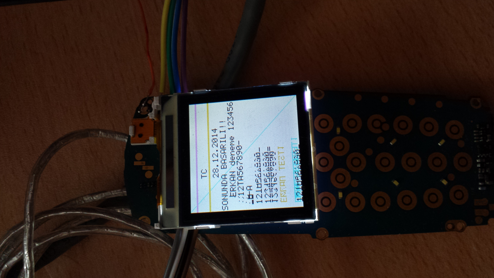
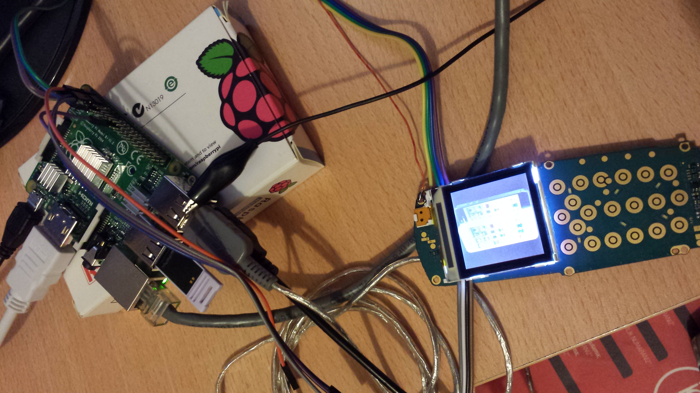

## Nokia 3100 LCD sürme

LCD nette Nokia 6610 diye geçiyor. İki çeşidi var. EPSON ve PHILIPS chipsetli. Benim eski nokia 3100 inki Philips chipsetli LCD. Sürmek için nete baktığımda engpedro rafael isimli kişi birşeyler yazmış onu kullandım. O da wiringPi kütüphanesini kullanmış, raspberry'ye önce onu yükle;

```sh
git clone git://git.drogon.net/wiringPi
cd wiringPi/
./build
```

Ardından rafaelin projesini github dan çek,

```sh
git clone https://github.com/engpedrorafael/pcf8833.git
```

ardından repoda anlatılan şekilde kurulumu yap. Kurulumu yaparken bi dosyayı bulamayacak. Bu sürümde klasör şurası; (/usr/local/lib/python2.7/dist-packages/pcf8833/) Kurulum sonrası examples klasörü içindeki pyhton script'i çalıştırıp (sudo ./loadImage.py) ekranda resmi görmen lazım. Bu arada LCD ye raspinin 5V u yetmiyor. 6-8 Volt arası harici bir güç kaynağı lazım. Sonuç;





## Philips Web Cam bağlama

Raspian in Whezzy sürümünde gspca modülü hazır geliyor. Gspca çoğu webcam için kullanılan standart bir sürücü. Benzer sürücü ilgini linux distroda yok ise projeyi çekirdekten derlemek gerekiyor. Çogu sürümde kernel a gömülü geliyor. Diğer proje ise UVC dir. 

Kameradan görüntü almak için webcam'i usb ye bağla (dmesg ile kontrol et). Şu programlar ile resim çekebilirsin.

```sh
streamer  -t  10  -r 2  -o  erkan01.jpeg (saniyede 2 adet 10 resim çeker)
fswebcam  –r  640x480 –d  v4l2:/dev/video0  test.jpg
```
(sudo apt-get install streamer)

## Infrared PIR Motion Sensor Detector Module( HC-SR501 )

Odada genel olarak hareket eden bir cisim olduğunda çalışıp hareketi algılayan sensor. Cisim algılanınca ilgili port HIGH oluyor(+3.3 Volt). Sonra hazır olana kadar bekliyor ve portu LOW (0 Volt) a çektiği anda algılamaya tekrar hazır oluyor. Bu single trigger modu. PDF de ayrıntılı bilgi var.

##  TCRT5000 Infrared Tracking Sensor Module

Cihazın "D0" portundan önünde cisim olduğunda 5V veriyor. Ayrıca siyah rengi algılamıyor. Beyazı algılıyor. 5V ile çalışıyor.

## Raspberry pi portlar

Raspberry Pi nin GPIO portları 3.3 Volt çıkış veriyor. Girişler de aynı şekilde 3.3 Volt Max.  5V veren sensörleri girişe bağlamak için "Voltage divider" kullanmalısın. Portları programlamak için;

```python
import RPi.GPIO as GPIO

def fonksiyon (PIR_PIN):
   print "Hareket!"

def __init__(self):
    GPIO.setmode(GPIO.BCM)
    GPIO.setup(23, GPIO.IN, pull_up_down = GPIO.PUD_DOWN)
    GPIO.add_event_detect(23,GPIO.RISING,callback=self.fonksiyon, bouncetime=300)
```

Edge dedection;
```python
GPIO.wait_for_edge(24, GPIO.FALLING)
GPIO.wait_for_edge(24, GPIO.RISING)
```

## Thinker
Python'da birçok GUI framework vardır. Tkinter ise Python standard library içine entegre edilmiştir. Label, Button, Entry, Text, Frame gibi basic nesneleri en çok işime yarayanlardı. Ekrana bir yazı yazdırmak şöyledir;

```python
import tkinter as tk

window = tk.Tk()

label = tk.Label(text='Hello world',fg ="white",bg="#0084AA",font=(font, 180))
label.pack(fill=BOTH, expand=YES)

window.mainloop()

```

Ekran çözünürlüğü;

```python
screen_width = window.winfo_screenwidth()
screen_height = window.winfo_screenheight()
window.geometry(str(screen_width) + 'x' + str(screen_height))
```


	
## Pi' ye Uzak Masaüstü

http://sourceforge.net/projects/xming/ adresinden xming programını indiriyoruz. Kurdukdan sonra masaüstündeki kısayola sağ tıklayıp özelliklerinden

“C:\Program Files (x86)\Xming\Xming.exe” :0 -clipboard –rootless 
Kısayolunu işaret etmesini sağla. Daha küçük bir ekran için 
“C:\Program Files (x86)\Xming\Xming.exe” :0 -clipboard -screen 0 800×600+100+100@1

Ardından putty yi aç, bağlanmadan önce özelliklerinde "Enable X11 forwarding" i işaretle. Bağlandıktan sonra komut satırına "startlxde" yaz ve uzak masaüstü çalışması lazım.

## Otomatik login olmak
Sistem açıldığında otomatik login olmak için;

```sh
sudo nano /etc/inittab
```
Bu dosyanın içinde aşağıdaki satırı bul ve # yazarak yorumla;
1:2345:respawn:/sbin/getty 115200 tty1

Aşağıdaki satırı ekle ve işlem tamamdır.
1:2345:respawn:/bin/login -f pi tty1 </dev/tty1 >/dev/tty1 2>&1

## Sistem açıldığında LXDE ekranını(startx) otomatik çalıştımak 
Aşağıdaki komut ile rc.local dosyayı edit edilmek için açılır.
```sh
sudo nano /etc/rc.local
```
Bu dosyanın içinde exit 0: satırının önüne aşağıdaki komut eklenerek işlem tamamlanır.
```sh
su -l pi -c startx
```

## LXDE(startx) çalıştığında bir program başlatmak 
Bir baslatıcı program vasitasi ile istediğimiz programı, programları başlatacağız. Önce başlatıcı dosyamızı aşağıdaki gibi oluşturup, adına launcher.sh diyelim.

```sh
cd /
cd home/pi/bbt
sudo python testProgrami.py
cd /
```

Ardından bu komut ile dosyamızı çalıştırılabilir yapalım. (chmod 755 launcher.sh)
Bu komut ile istediğimiz programın çalıştığını önce test edelim. (sh launcher.sh)
Bu programı gui yüklendiğinde çalıştırmak için ise home klasöründe gizli olan ve (ls -a) komutu ile görebileceğimiz ".profile" dosyasını açalım nano ile ve en sonuna bu yazdığımız .sh dosyasını verelim.

```sh
cd
nano .profile
sudo sh /home/pi/Desktop/otomatikBaslat/ launcher.sh
```

Bu işi yapmanın 2 yöntemi daha var. Onlar da; (How To Autostart Apps In Rasbian LXDE Desktop)
http://www.raspberrypi-spy.co.uk/2014/05/how-to-autostart-apps-in-rasbian-lxde-desktop/


