[7 Java I/O Fundamentals](#java-io-fundamentals)

[7.1 Introducing Java I/O: WARM-UP](#introducing-java-io-warm-up)

[7.1.1 Understanding streams](#understanding-streams)

[7.1.2 Understanding multiple flavors of data](#understanding-multiple-flavors-of-data)

[7.2 Working with class java.io.File](#working-with-class-java.io.file)

[7.2.1 Instantiating and querying File instances](#instantiating-and-querying-file-instances)

[7.2.2 Creating new files and directories on your physical device](#creating-new-files-and-directories-on-your-physical-device)

[7.3 Using byte stream I/O](#using-byte-stream-io)

[7.3.1 Input streams](#input-streams)

[7.3.2 Output streams](#output-streams)

[7.3.3 File I/O with byte streams](#file-io-with-byte-streams)

[7.3.4 Buffered I/O with byte streams](#buffered-io-with-byte-streams)

[7.3.5 Primitive values and strings I/O with byte streams](#primitive-values-and-strings-io-with-byte-streams)

[7.3.6 Object I/O with byte streams: reading and writing objects](#object-io-with-byte-streams-reading-and-writing-objects)

[7.4 Using character I/O with readers and writers](#using-character-io-with-readers-and-writers)

[7.4.1 Abstract class java.io.Reader](#abstract-class-java.io.reader)

[7.4.2 Abstract class java.io.Writer](#abstract-class-java.io.writer)

[7.4.3 File I/O with character streams](#file-io-with-character-streams)

[7.4.4 Buffered I/O with character streams](#buffered-io-with-character-streams)

[7.4.5 Data streams with character streams: using PrintWriter to write to a file](#data-streams-with-character-streams-using-printwriter-to-write-to-a-file)

[7.4.6 Constructor chaining with I/O classes](#constructor-chaining-with-io-classes)

[7.5 Working with the console](#working-with-the-console)


# Java I/O Fundamentals

Java I/O API bize raw bytes, characters ve nesne gibi çeşitli dataları okuma ve yazma kütüphaneleri sunar. Bu dataları çeşitli kaynaklara(files, network sockets, and memory arrays) yazıp okuyabiliriz.

## Introducing Java I/O: WARM-UP

Java bütün veri kaynaklarını ve veri hedeflerini "stream" ler olarak soyutlar.(abstract eder.)

### Understanding streams

A stream is a sequence of data. The Java I/O stream is an abstraction of a data source or a data destination. It represents an object that can produce data or receive data. An input stream is used to read data from a data source. An output stream is used to write data to a data destination.

- An input stream enables you to read data from a data source to a Java application.
- An output stream enables you to write data from a Java application to a data destination.

Bir suyun akışı gibi stream'ler datanın java programı ile data kaynakları arasında akışını sağlar.

Streamler kullanılarak çeşitli kaynaklara yazılabilir. Sınavda sadece "file" kaynağı sorulacaktır.

### Understanding multiple flavors of data

Java dosya okuyup yazmak için 2 temel sınıf kullanır. Data binary ve character olarak iki sınıfa ayrılır. Zip, video, pdf gibi (aslında hepsi) dosyaları okumak için "Byte Streams", character data okumak ve yazmak için ise "Character Streams" kullanılır.

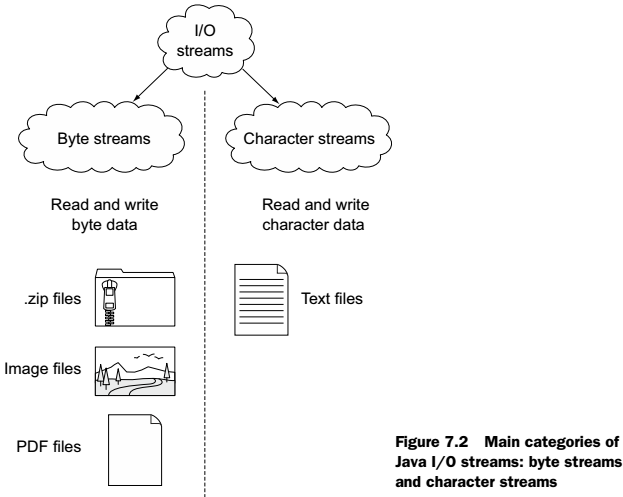{width="4.326388888888889in"
height="3.451388888888889in"}

Aslında bütün byte data'lar Byte Stream'ler ile okunup yazılabilir ama bu işi kolaylaştırmak için genelde bu iş için oluşturulmuş API'ler kullanılır.

Bir bilgisayar temelde sadece binary data okuyup binary data yazar. (1 ve 0 lar) Byte stream ise kaynak ve hedeflerden 8 bit data okuyup yazar. Bütün I/O sınıfları byte strem'ı kullanarak çalışır. Mesela karakter streams de 16 bit Unicode data okuyup yazar. Ama arka planda yine byte stream kullanır. Bir java uygulaması dosyaya byte stream şeklinde yazmak için FileOutputStream sınıfını, dosyadan okumak için ise FileInputStream sınıfını kullanır. Aynı şekilde bir text dosyasından Unicode text okumak için FileReader sınıfını, yazmak için ise FileWriter sınıfını kullanır.

Flush -- akma,boşalma, hızlı ani su akıntısı

Datayı bu şekilde 8 bit okumak hiç verimli değildir. "Buffered Streams" diğer streamlere datayı ön belleğe alarak yardım eder. "Buffered Streams" buffer'dan ( memory veya internal array de denebilir) okur ve boşalınca Native API çağrılır. Aynı şekilde veriyi buffer'a yazar ve output stream dolunca onu boşaltır. Buffered streams başka bir streamin giriş çıkışını buffer eder! Aşağıdaki şekil BufferedInputStream, BufferedOutputStream, BufferedReader, ve BufferedWriter sınıflarının
byte ve character streams lere yazıp okur.

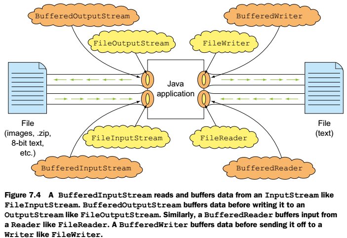{width="4.881944444444445in"
height="3.3472222222222223in"}

As shown in figure 7.4, a Java application communicates with an object of a buffered stream (like BufferedInputStream), which interacts with the underlying InputStream (like FileInputStream). Notice how figure 7.4 shows that the buffered stream.

BufferedInputStream nesnesi yaratmak için bunun constructor'ına başka bir InputStream(e.g. FileInputStream) geçilmesi gerekir.

Buffered stream sınıfları altındaki stream sınıfları için filtre görevi görürler. Altındaki stream'in davranışını datayı buffer'layarak değiştirir. BufferedInputStream ve BufferedOutputStream sınıfları "decorator" sınıflardır. Bu sınıflar altındaki Base sınıflarlara fonksiyonellik eklerler.

DataInputStream ve DataOutputStream sınıfları primitive ve string veri okuyup yazmak için metodlar tanımlarlar. Örneğin int okumak için gerekli olan readInt fonksiyonu 4 byte okur ve 4 byte yazar.

ObjectInputStream ve ObjectOutputStream sınıfları ise Object yazıp okumak için metodlar tanımlarlar. (Object streams). Burada sadece Serializable interface'ini implemente eden sınıflar stream olarak okunup yazılabilir.

Fiziksel olarak bir dosyayı okuyup yazmak için java.io.File nesnesine ihtiyacımız vardır. Dosya işlemi yapan sınıfı ya File dosyası ile ya da bu sınıfın Path ve dosya ismini kullanan constructorları ile oluşturulabiliriz. (Java 7 de File sınıfı için yeni bir sınıf oluşturuldu. java.nio.file.Path Sınavda olduğu için File'ı biraz işleyeceğiz.)

## Working with class java.io.File

File sınıfı bir klasörün veya bir dosyaya olan yolun abstract sunumudur. Bu kesin veya göreceli olabilir.(absolute or relative) Kesin demek dosyanın tam yolu, göreceli ise başka bir Path'a göre yolu demektir. File sınıfının ismi yanıltmasın, bu sınıf bir klasörü veya bir dosya hakkında bilgileri tutan bir nesneyi de işaret edebilir. File sınıfı dosya veya klasör oluşturmak, düzenlemek veya özelliklerini değiştirmek için kullanılabilir.

File nesnesi aşağıdaki şekillerde oluşturulabilir. Tek dikkat edeceğimiz bu sınıf klasör de saklayabileceği için datamızı yazmadan evvel File sınıfının dosya mı yoksa klasör mü tuttuğuna dikkat etmemizdir.

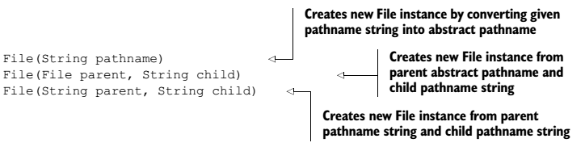{width="5.027777777777778in"
height="1.2638888888888888in"}

### Instantiating and querying File instances

File nesnesi yaratınca sistemimizde fiziksel bir dosya oluşmaz! File nesneleri immutable'dır. Nesne içinde path değişkeni değiştirilemez. Örnek kodlar chapter7.s2 içindedir.

New File("sadece path alır, veya sadece dosya ismi alır")

Sadece dosya ismi yazarak tanımlarsak, path olarak içindeki .class file'ın bulunduğu konumu arar.

File.isDirectory(); 		Boolean döner

File.isFile(); 				Boolean döner

File.list(); 					Klasör içindeki dosya ve klasör isimlerini String\[\] olarak döndürür.

File.exists(); 				Boolean döner

### Creating new files and directories on your physical device

Dosya sisteminde gerçek bir dosya oluşturmak için aşağıdaki metodlar kullanılır.

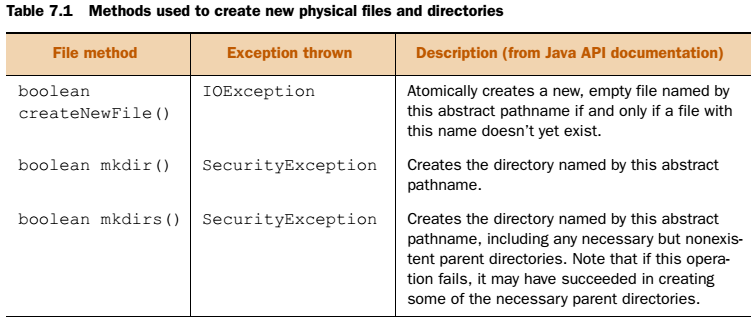{width="5.25in" height="2.236111111111111in"}

Burada önemli olan File nesnesi oluşturulurken saçma bir path'e hata alınmaz ama yukardaki metodlarda hata fırlatır. Ayrıca işletim sistemine göre dosya oluşturma işlemi değişebilir. Bu sebeplerden dosya oluşturulurken dikkatli olunmalıdır. Mesela java programının ilgili klasöre yazma yetkisi bile olmayabilir. Örnek kodlar chapter7.s2
içindedir.

## Using byte stream I/O

Bütün byte stream'ler byte data okur ve yazar. Bunu genel olarak input ve output stream'ler ile yaparlar. Bütün input stream'ler java.io.InputStream base abstract Class ından, bütün output stream'ler ise java.io.OutputStream base abstract Class'ından extend olurlar.

### Input streams

Javadaki bütün input stream'ler java.io.InputStream base abstract Class ından extend olurlar. En önemli metodu read() 'dir. Bir kaynaktan veri okumaya yarar.

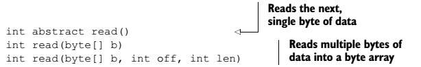{width="4.263888888888889in" height="0.6875in"}

Bu metodun birçok override edilmiş versiyonu bulunur. InputStream abstract sınıfını extend eden FileInputStream sınıfı read() metodunu override eder.

NOT: InputStream sınıfının read metodu varsa bir sonraki byte datayı döndürür, yoksa -1 döndürür. Hiçbir zaman EOFException hatası fırlatmaz.

InputStream sınıfının diğer önemli metodu close() 'dur. Çağrıldığında bu stream ile alakalı sistem kaynaklarını serbest bırakır.

NOT:Bu anlatılan iki metodda direk çağrılamaz çünkü InputStream sınıfı abstract'dır.Abstract sınıflar instantiane edilemediği için sadece bu sınıfı extend eden sınıflarda bu metodları çağırabiliriz.

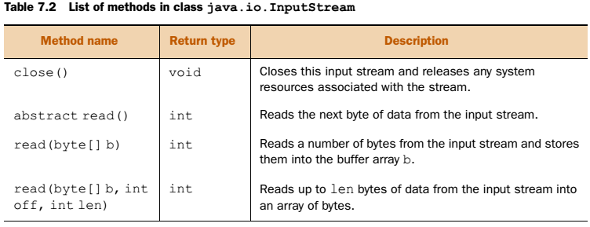{width="5.222222222222222in"
height="2.0069444444444446in"}

Abstract olan InputStream sınıfını extend eden sınıflar aşağıdadır. İsminde InputStream olan bütün sınıflar direk veya dolaylı olarak InputStream sınıfından extend olmuşlardır.

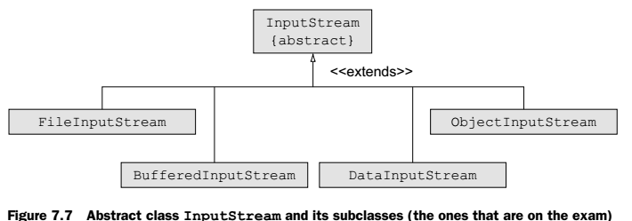{width="4.930555555555555in"
height="1.7291666666666667in"}

### Output streams

Javadaki bütün output stream'ler java.io.OutputStream base abstract Class ından extend olurlar. En önemli metodu write() 'dir. Bir kaynaka veri yazmaya yarar.

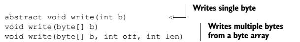{width="4.229166666666667in"
height="0.6041666666666666in"}

OutputStream sınıfının diğer önemli metodu close() ve flush() 'dur. Kaynakların verimli kullanımı için data genellikle önce buffer'a yazılarak ilgili kaynağa yazılır. Buffer'ın dolmasını beklemeden veriyi ilgili kaynağa hemen yazmak ister isek flush() metodu kullanılır. Close metodu ise çağrıldığında bu streami kullanan sistem kaynaklarını serbest bırakır.

Bu metodun birçok override edilmiş versiyonu bulunur. OutputStream abstract sınıfını extend eden FileOutputStream sınıfı write() metodunu override eder.

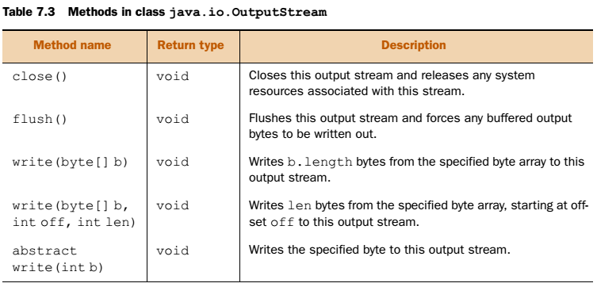{width="5.229166666666667in"
height="2.513888888888889in"}

Abstract olan OutputStream sınıfını extend eden sınıflar aşağıdadır. İsminde OutputStream olan bütün sınıflar direk veya dolaylı olarak OutputStream sınıfından extend olmuşlardır.

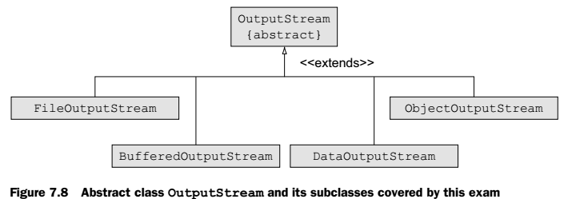{width="4.895833333333333in"
height="1.7291666666666667in"}

### File I/O with byte streams

Byte herhangi bir veri tipini temsil edebilir.(Character Data da dahil). Herhangi bir dosya tipindeki(pdf, zip, text) veri byte olarak yazılıp okunabilir. FileInputStream sınıfını şöyle oluşturabiliriz;

```java
FileInputStream(File file) throws FileNotFoundException {}
FileInputStream(String name) throws FileNotFoundException {}
```

FileOutputStream sınıfı ise;

```java
FileOutputStream(File file) throws FileNotFoundException
FileOutputStream(File file, boolean append) throws FileNotFoundException
FileOutputStream(String name) throws FileNotFoundException
FileOutputStream(String nm, boolean append) throws FileNotFoundException
```

Bu sınıflar ile text içeren dosyalarda açılabilir ama tavsiye edilmez. Text verileri için Character Classes kullanılmalıdır, çünkü bu sınıflar kullanıcı charset'ini ve Unicode değerleri de hesaba katarlar.

Bir pdf dosyası kopyalama örneği chapter7.s3 package'ı içinde var. Kod okunan byte -1 olana kadar dosyayı okuyup yazıyor. Her okuduğu değeri int olarak saklıyor. Bunun sebebi -1 değerinin byte değişkeninde kullanılamayacak olmasıdır!

**NOT:** Bu şekilde kopyalama tavsiye edilmez. Onun yerine java.nio.file.Files sınıfının copy metodunu kullanınız.

Yukarıdaki örnekte dosyayı byte byte kopyaladık. Bu maliyetli bir iştir. Genellikle Byte array olarak kopyalamak daha az maliyetlidir. Örneği chapter7.s3 package'ı içinde var. Burada dikkat edilecek husus read(byte\[\]) bize int olarak okunan byte sayısını döndürür, okunan veriler parametre olarak geçilen array içine yazılır.

**NOT:** Ayrıca byte array ile yazma yapılır iken eğer array'i çok uzun tutarsak dosya bittiğinde geri kalan byte'lar 0 olarak yazılır. Örnegi chapter7.s3.DosyaOkuYazByteArrayBuyukse sınıfı

FileOutputStream sınıfının int yazan write metodu'da vardır. Fakat write 1 byte yazar. Fakat int 4 byte'dır. Bu durumda en alttaki byte değeri yazılır geri kalan 3 bayt ignore edilir. Örnegi chapter7.s3.DosyaIntYaz sınıfı

### Buffered I/O with byte streams

Eşyaları yan odaya teker teker mi taşımak yoksa bir container'a yükleyerek mi taşımak daha az zaman alır? Tabiiki ikinci seçenekte. I/O işlemleri yaparken de datayı memory'de tutup toplu şekilde transfer etmek şiddetle daha az zaman alır! Javada bu işlemlerimizi BufferedInputStream ve BufferedOutputStream sınıfları yapar. Constructor'lar önemli !

```java
public BufferedInputStream(InputStream in)
public BufferedInputStream(InputStream in, int size)
public BufferedOutputStream(OutputStream out)
public BufferedOutputStream(OutputStream out, int size)
```

Buffered sınıflar non-buffered sınıflara göre daha hızlı I/O işlemleri yaparlar!

FileInputStream ve FileOutputStream sınıfları sadece BYTE data okuyup yazarlar. Primitive ve object type okuyup yazamazlar. Bu tipleri okuyup yazmak için DataInputStream ve DataOutputStream sınıfları kullanılır.

### Primitive values and strings I/O with byte streams

DataInputStream ve DataOutputStream sınıfları primitive type veri ve object veri yazıp okumak için kullanılır. DataOutputStream sınıfı ile yazılan veri DataInputStream ile okunabilir. Constructor'ları;

```java
DataInputStream(InputStream in)
DataOutputStream(OutputStream out)
```

İlk örnek chapter7.s3.DataOkuYaz sınıfındadır.

Bu sınıfların writeInt, writeChar, readInt, readChar gibi metodları vardır. Bunlar veri tipine göre alan kaplarlar. Okurken yazdığımız sıra önemlidir. Aksi taktirde farklı uzunlukta veri okunacağı için veriler karışabilir. DataInputStream tarafından okunan veriler eğer dosyanın sonunu geçer ise EOFException fırlatılır. Mesela önce char yazdık, sonra 2 adet boolean yazdık, toplam 4 byte etti. Bunu readInt ile 4 byte okur isek karşımıza bambaşka bir sonuç çıkar. DataOutputStream ile yazılan veri sırası DataInputStream ile okur iken aynı sırada okunmalıdır.

writeBoolean metodu 		1 bayt yazar değeri, 00000001 veya 00000000

writeInt 								4 bayt yazar

writeLong 							8 bayt yazar

writeFloat 							4 byte yazar. Diğerleri gibi okunamıyor. Float'un
floatToLongBits metodu ile sayıyı int olarak saklıyormuş.

writeDouble 						8 byte yazar. Diğerleri gibi okunamıyor. Double'ın
doubleToLongBits metodu ile sayıyı int olarak saklıyormuş.

writeUTF 							önce 2 byte'lık okunacak veri uzunluğunu byte cinsinden
yazar, sonra string'in kendisini yazar. UTF'e göre yazar.

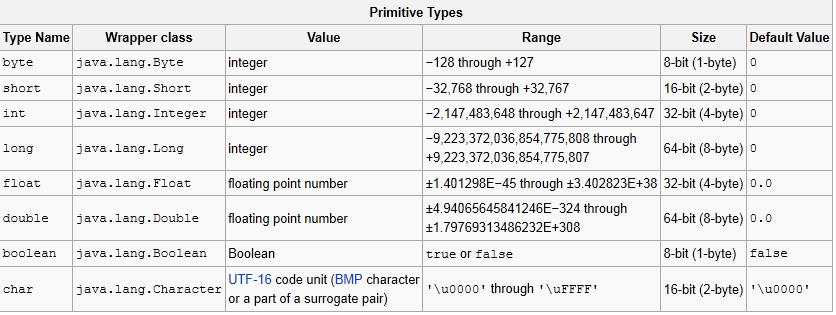{width="6.3in"
height="2.3744958442694664in"}

### Object I/O with byte streams: reading and writing objects

Nesne okuyup yazmak için Object stream'ker kullanılır. ObjectOutputStream sınıfı ObjectInputStream tarafından okunabilen primitive değerler ve nesneler yazmak için OutputStream kullanır. Serializable interface'inin implemente eden sınıflar yazılıp okunabilir. Bu işlem bir nesneyi içindeki instance variable'ları ve bu değişkenler diğer nesnelere refere ediyor ise onları(referans edilen sınıflarda Serializable implemente etmeli) ve onlarında refere ettiklerini serializable eder. Default olarak serializable işlemi static ve transient değişkenleri serialize etmez. ObjectInputStream ve ObjectOutputStream sınıfları primitive değişkenleri ve serializable nesneleri okur ve yazar. Constructor'ları;

```java
public ObjectInputStream(InputStream in)
public ObjectOutputStream(OutputStream out)
```

Bir sınıfı serialize etme ilk örneği chapter7.s3.DosyayaObjectYaz dosyasında vardır. Eğer bir sınıf serializable interface'ini implemente etmeden yazılmaya çalışır ise runtime'da java.io.NotSerializableException hatası fırlatılır.

- Eğer bir sınıfın base sınıfı serializable interface'ini implemente etmiyor ise ilgili sınıf bir dosyaya serializable edilebilir. Yani Car sınıfı Vehicle'dan extend olsa ve Vehicle da implemente etmese yine de serializable çalışır.
- Serializable bir sınıfın, serializable implemente etmeyen herhangi bir object field alanı var ise ilgili sınıfı yazmaya çalışır iken runtime da java.io.NotSerializableException hatası fırlatılır. Bir sınıfı serializable etmek için bütün değişkenlerinin de serializable implemente etmesi gerekmektedir.
- ObjectInputStream sınıfı kullanılarak hem nesne hemde primitive bir dosyaya yazılabilir. Ama okur iken bunları yazdığımız sırada okumalıyız. Eğer okumaz isek runtime'da OptionalDataException hatası alabiliriz.
  - ClassNotFoundException---Class of a serialized object cannot be found
  - OptionalDataException---Primitive data was found in the stream instead of objects.
  - IOException---Any of the usual input-/output-related exceptions
- Dosyaya yazar iken sınıfımızda static ve transient değişkenler var ise bunlar serializable olmaz. Dosyaya yazılmaz. Okur isek bu değişkenlerin default değerleri bize döner.

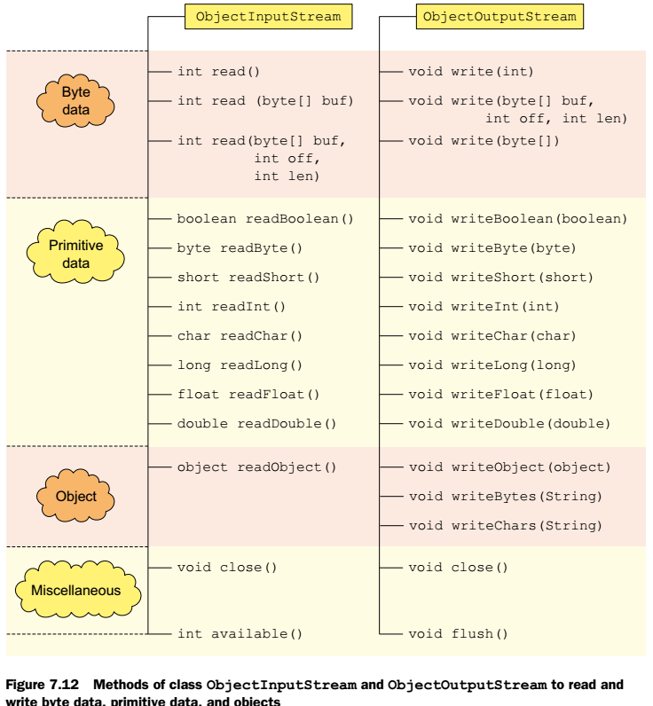{width="5.111111111111111in"
height="5.527777777777778in"}

## Using character I/O with readers and writers

Reader ve Writer sınıfları, Unicode karakter okuyup yazmak için abstract base sınıflardır. OutputStream sınıfları da 16 bit Unicode datası okuyup yazabilirler ama internationalization destekleri yoktur. Bu sebepten karakter okuyup yazmak için Reader ve Writer sınıflarını kullanınız.

### Abstract class java.io.Reader

Reader sınıfı character data okumak için read() metodunun overloaded halini içerir.

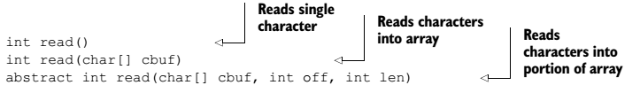{width="5.020833333333333in"
height="0.7291666666666666in"}

Reader sınıfı AutoCloseable interface'inin implemente eder. Bu sayede bu sınıfın nesneleri try-with-resources cümleleri ile kullanılabilir. Bu sınıf abstract olduğundan direk olarak kullanamayız. Aşağıdaki 2 sınıf bu sınıfdan extend olmuşlardır. Bu sınıfları kullanabiliriz. (Dikkat eder isek InputStream sınıfı gibi read metodu var. InputStream parametre olarak byte veya byte array işler, Reader sınıfı ise char veya char array işler.)

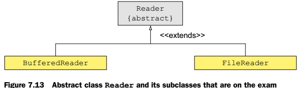{width="4.270833333333333in"
height="1.2569444444444444in"}

### Abstract class java.io.Writer

Writer sınıfı character data yazmak için write() metodunun overloaded halini içerir.

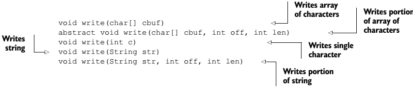{width="5.916666666666667in" height="1.3125in"}

Writer sınıfı AutoCloseable interface'inin implemente eder. Bu sayede bu sınıfın nesneleri try-with-resources cümleleri ile kullanılabilir. Bu sınıf abstract olduğundan direk olarak kullanamayız. Aşağıdaki 3 sınıf bu sınıfdan extend olmuşlardır. Bu sınıfları kullanabiliriz.

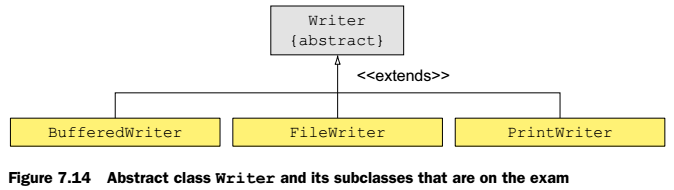{width="4.680555555555555in"
height="1.3194444444444444in"}

### File I/O with character streams

FileReader ve FileWriter sınıfları aksi belirtilmedikçe işletim sisteminin default character set'i ile dosyalara character data okuyup yazarlar. FileReader sınıfı constructor'ları;

```java
FileReader(File file)
FileReader(String fileName)
    
// Bu writer sınıfının append özelliği vardır. FileWriter sınıfı constructor’ları ise;
FileWriter(File file)
FileWriter(File file, boolean append)
FileWriter(String fileName)
FileWriter(String fileName, boolean append)
```

Örnek kullanım chapter7.s4.DosyayaObjectYaz içinde vardır. Dikkat edilir ise DosyaOkuYaz ile benzerdir.

### Buffered I/O with character streams

Gerçak hayatta yukarıdaki gibi buffer'sız I/O işlemi yapmak çok maliyetlidir. Bu sebepten yukardaki sınıfların buffered hali
BufferedReader and BufferedWriter sınıflarıdır. Constructor 'ları;

| Metod |  |
|---|---|
| public BufferedReader(Reader in) |  |
| public BufferedReader(Reader in, int sz) |  |
| public BufferedWriter(Writer out) |  |
| public BufferedWriter(Writer out, int sz) |  |

BufferdReader sınıfının readLine() metodu bir satır okur ve başka satır yok ise null döndürür! BufferedWriter ise line-feed (\\n) and carriage-return (\\r) karakterlerini dikkate almaz. BufferedWriter.newLine() metodu ile yeni satıra geçilir. Örnek kod chapter7.s4.DosyayaObjectYazBuffered içinde vardır. BufferdReader sınıfının da read() ve read(char\[\]) metodları bulunur. Fakat fileReader'dan biraz daha farklı çalışır.

### Data streams with character streams: using PrintWriter to write to a file

PrintWriter sınıfı nesnelerin formatlanmış hallerini dosyaya yazmak için kullanılır. Bu sınıf PrintStream sınıfı içindeki bütün metodları implemente eder. System.out.print de kullandığımız bütün metodlar buradan gelir. Örnek kullanım chapter7.s4.DosyaPrintWriter içinde vardır. PrintWriter constructor'ları;

```java
PrintWriter(File file)
PrintWriter(File file, String charset)
PrintWriter(String fileName)
PrintWriter(String fileName, String charset)
PrintWriter(Writer out, boolean autoFlush)
```

Genel olarak PrintWriter metodları 'ları;

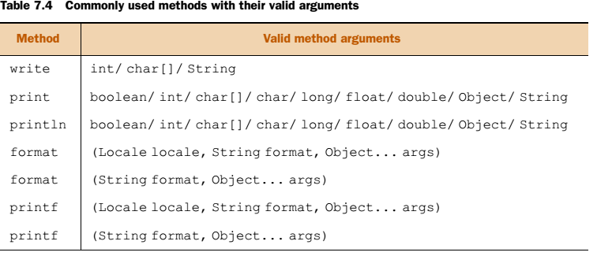{width="5.25in" height="2.2569444444444446in"}

### Constructor chaining with I/O classes

Constructor'ları birbiri ile zincir halinde kullanmak yaygın bir sınav sorusudur. Aşağıdaki satır geçerlidir.

```java
BufferedReader br = new BufferedReader(new FileReader(new File("ab.txt")));
```

Bu yapıyı aşağıdaki tabloda görebiliriz;

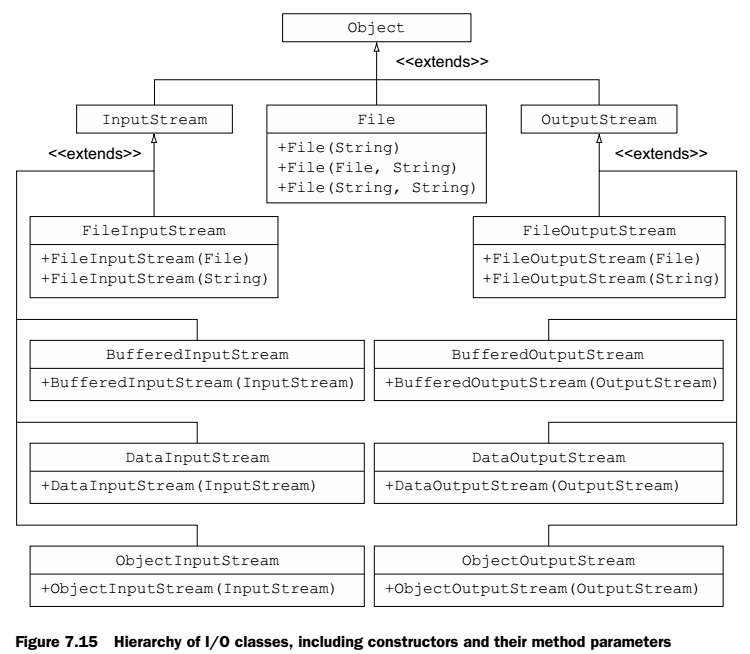{width="5.208333333333333in"
height="4.541666666666667in"}

## Working with the console

java.io.Console sınıfı JVM ile ilişkilendirilmiş olan karakter tabanlı konsol cihazına ulaşmamızı sağlar. JVM'in başlangıç durumuna göre veya altındaki platforma göre consola ulaşamayabiliriz. Eğer JVM'i komut satırından standart giriş ve çıkışları yönlendirmeden ulaşır isek klavye ve monitöre erişebiliriz. Bir program çalışmasının sonucuyla JVM otomatik olarak başladıysa consola ulaşamayabiliriz. Ayrıca eclipsede de kod çalıştırmak için consola ulaşamayız. Consola interaktif ulaşma örneği chapter7.s5.Console içinde vardır. Çalıştırmak için ;

```sh
cd D:Java\\workspaces\\JEE\\OCP\\bin

java chapter7.s5.ConsoleTest

// veya tek satırda

java -cp D:Java\\workspaces\\JEE\\OCP\\bin chapter7.s5.ConsoleTest
```

(javaw ile java'nın farkı, javaw da Console yoktur. Biri Console Subsystem, diğeri Windows subsystem için yazılmıştır. Javac ise .java dosyasını .class olarak derler.)

komutları ile consoldan çalıştırabiliriz. Projenin bulunduğu klasördeki bin klasörü içine girilir, ardından package name ile sınıf adı yazılarak program çalıştırılır.

System.console() komutu eğer JVM consola ulaşamaz ise null döndürür. Ulaşır ise Console sınıfından yeni bir nesne döner. Console sınıfının bir de readPassword() metodu vardır. Bu metod da mutable char\[\] döndürür. Console sınıfının bazı önemli metodları şunlardır;

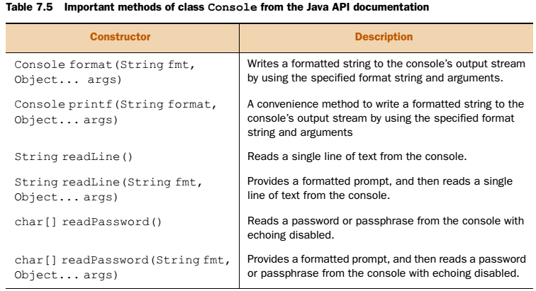{width="5.25in" height="2.8541666666666665in"}

