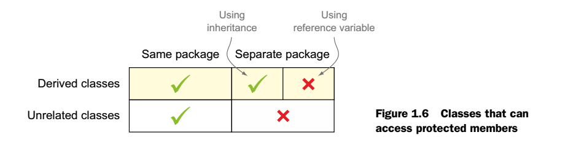
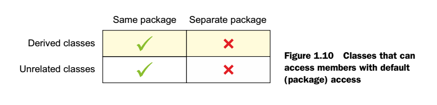
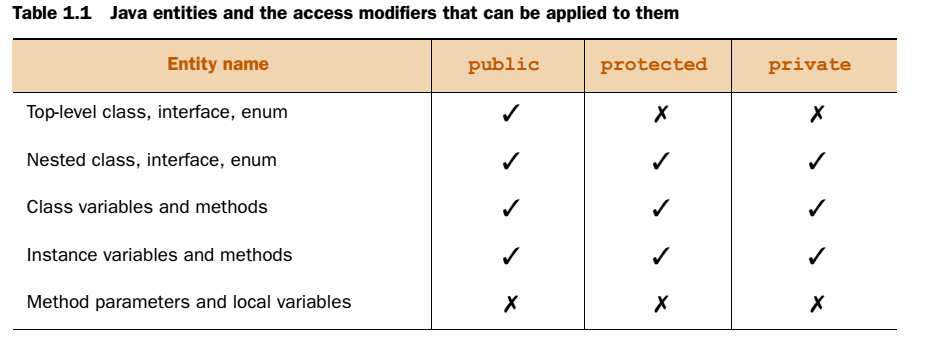
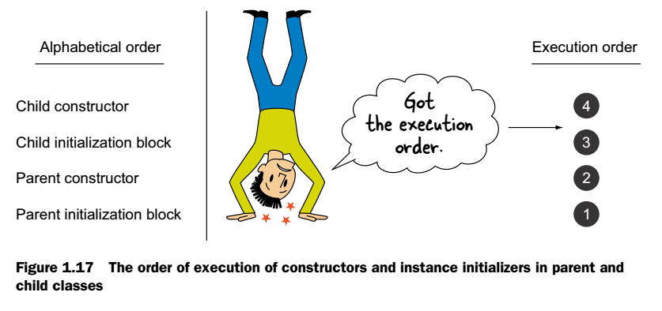
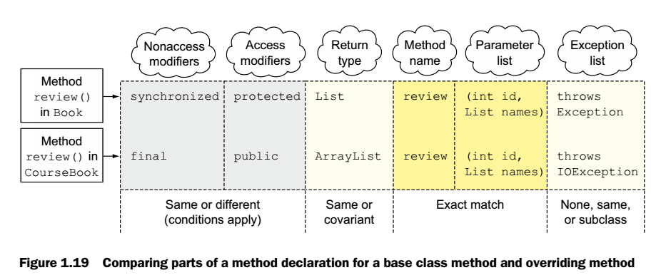
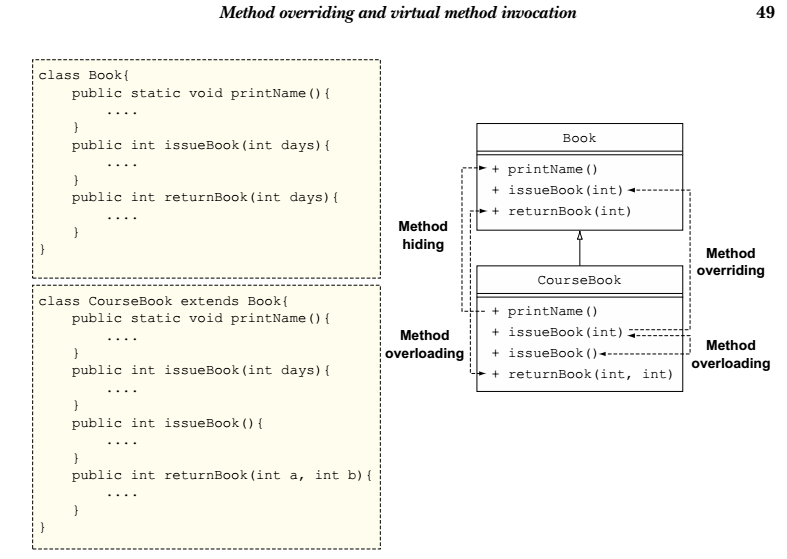
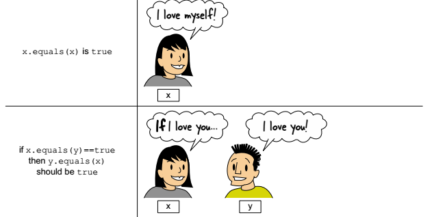
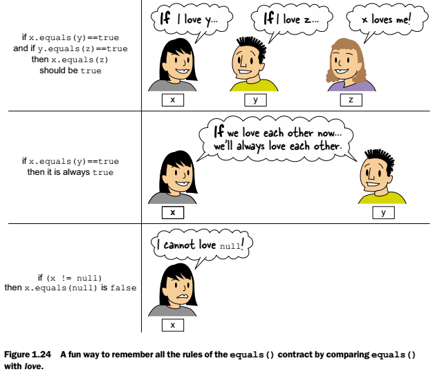
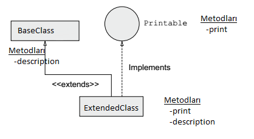
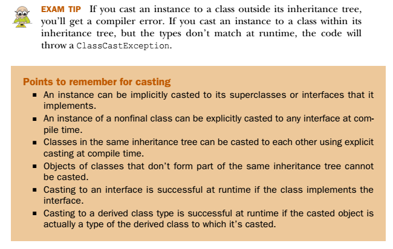

[1 Java Class Design](#java-class-design)

[1.1 Java'da değişken türleri;](#javada-değişken-türleri)

[1.2 Java Access Modifiers](#java-access-modifiers)

[1.2.1 Overloaded Methods and constructors](#overloaded-methods-and-constructors)

[1.2.2 Overloaded Constructors](#overloaded-constructors)

[1.2.3 Initializers](#initializers)

[1.3 Method Overriding and Virtual Method Invocation](#method-overriding-and-virtual-method-invocation)

[1.3.1 Need of overridden methods](#need-of-overridden-methods)

[1.3.2 Correct Syntax of overriding methods](#correct-syntax-of-overriding-methods)

[1.4 Overriding methods of class object](#overriding-methods-of-class-object)

[1.5 Casting and the instanceof operatör](#casting-and-the-instanceof-operatör)

[1.6 Package](#package)


# Java Class Design

## Java'da değişken türleri;

1. **Local Variables =** Bir metod içinde veya bir süslü parantez bloğu içindeki değişkenlerdir.
2. **Class variables** (Static Variable) = Değeri her sınıf üyesinde aynı olan değişkenler.
3. **Instance variables** (Instance Attributes, Instance Field, Object Field) = Class içinde tanımlanıp, bir metodun içinde yer almayan değişkenlerdir. Değeri her sınıf instance nda farklı olan üyeler.
4. **Method Parameters(Command-line paramethers, Command-line values)** = Metod tanımındaki değişken tipleridir. **Method Arguments** ise tanımdaki değişkene gönderilen literal değerlerin kendisidir.

## Java Access Modifiers

Public \> Protected \> Default(Package) \> Private

{width="6.3in" height="1.8388888888888888in"}

{width="6.3in" height="1.5263888888888888in"}

- Bu listedeki ulaşılıp ulaşılamama durumları hem inheritance hemde referance variable kullanarak ulaşılabilmeyi kapsar. Protected da o yüzden alan ikiye ayrılmıştır.
- Interface'in hiçbir üyesi protected veya private olamaz!!
- Farklı bir paketteki base class'ı extend eden bir sınıftan protected üyelere sadece inheritance kullanılarak ulaşılabilir. Referance variables ile ulaşılamaz!
- Access Modifier' lar aşağıdaki tablodaki entity lere uygulanıp uygulanamayacağı durumlar şöyledir;
  - Local variables and method parameters can't be defined using access modifiers.
  - Top-level class'lar, Top-level interface'ler, Top-level enum'lar protected ve private Access Modifier alamazlar. Wont compile.

> {width="6.3in" height="2.3506944444444446in"}


### Overloaded Methods and constructors

Bir sınıf kendi metodunu veya base class'ından inherit ettiği metodları Overload edebilir. Bir metodu overload etmek için parametre listesi değiştirilir. Bunlar;

1. **Parametre sayısını değiştirerek,**
2. **Parametrenin tipini değiştirerek,** (Burada parametre olarak nesne alan fonksiyonlarda şöyle bir durum vardır. Eğer bu nesneler arasında inheritance ilişkisi var ise şu kural geçerlidir. "The overloaded methods are bound at compile time and not runtime." Yani her zaman overladed metodlar **compile time da bağlanır**. Bu sebepten overload edilmiş bir fonksiyona parametre olarak inheritance bağı olan bir nesne yollanırken tanımlanan referans değişkeninin tipine bakılır. Referans değişken tipi ne ise o overload edilmiş fonksiyon çağrılır.)
3. **Parametrelerin sırasını değiştirerek,** (Burada dikkat edilecek nokta birbiri yerine kullanılabilecek değişkenlerin yerleri değiştirilir ise compiler hangisini çalıştıracağını bilemez ve compile edilemezler.)

Overloaded sayılmayan durumlar ise;

a)  **Return Type** (Sadece dönüş tipi farklı 2 metod tanımlarsak "Duplicate method" hatası alırız. Bu durum metodlar aynı sınıf içinde veya biri base class'da diğeri extended class'da olduğu durumlarda geçerlidir.)

b)  **Access Modifier**

c)  **Nonaccess Modifier**

### Overloaded Constructors

Constructor'lar da overload edilebilir. Özellikleri yukardakiler ile aynıdır. Tek fark "Using nonaccess modifiers with constructors is illegal---the code won't compile." Overload edilen constructor'lar ise sınıfın kendisini temsil eden "this" keyword ile çağrılabilir. Ayrıca bu keyword constructor içindeki ilk cümle olmak zorundadır. This ile çağrılabilen constructor'lar sınıftaki başka metodlardan çağrılamaz, sadece contructorlardan çağrılabilir. Ayrıca sadece access modifier değiştirerek overloaded constructor yazılamaz. Yukardaki kuralın aynısı. Fakat farklı Access modifier kullanılarak overloaded constructor yazılabilir. 

Ayrıca bir yapıcı kendini çağıramaz. Çağırırsa compiler "recursive constructor invocation" hatası verir ve derlenmez. Aynı şekilde bir yapıcı diğerini çağırır diğeri de onu çağıranı çağırırsa buna da izin vermez ve aynı hatayı verir.

### Initializers

Sınıf hafızada yaratılırken initialize olma sırası aşağıdaki gibidir. En alta "Child Static initialization" ve onun da altına "Parent Static initialization" yazılabilir. Bütün sıra bu şekildedir. Sıra;

```
Parent Static initialization

Child Static initialization

Parent instance initialization

Parent constructor

Child instance initializer

Child constructor
```

{width="6.3in" height="2.9652777777777777in"}

## Method Overriding and Virtual Method Invocation

Bir sınıf inherit ettiği sınıftaki bir metodu yeniden tanımlayabilir. Bu yeniden tanımlamaya "Method Overriding" denir. Overriding methods =Polymorphic methods. Override etmek için method imzasının aynı olması gerekmektedir.(method name, method parameder number and method parameter type) Instance methodlar override edilir. [Static metodlar override edilemez!] İstenirse Derivated da saklanabilir. 

Base class method = Overridden method

Derived class method = Overriding method

Bu base class'daki yeniden tanımlanabilen methodlar "virtual method" olarak adlandırılır.(A method that can be overridden by a derived class is called a virtual method) "Virtual method invocation" ise override edilen doğru methodu çağırma işidir. Bu ise nesnenin referansı ile değil, bu referansın gösterdiği nesnenin bellekteki gerçek tipi ile yapılır. Bu sebepten doğru metodu çağırma işi [Runtime da belirlenir], Compile time'da değil!

### Need of overridden methods

Overriden metodlar şu ilkelere göre çalışır;

- Step 1: The compile time uses the reference type for the method check.
- Step 2: The runtime uses the instance type for the method invocation.

Yani sınıf derlenirken metodu kontrol etmek için referans tipe bakarak bu referans tipinin geçilebileceği metod varmı diye bakar. Runtime da ise hangi metodun çağrılacağını referans tipinin gösterdiği gerçek objenin tipine bakarak karar verir. Eğer override edilmiş bir method var ise bunu bilir ve objenin sınıfındaki metodu çalıştırır!

### Correct Syntax of overriding methods

Method override etmek için bazı kurallar vardır.

{width="6.3in" height="2.6534722222222222in"}

- **Access Modifier** Base Access Modifier =\< Derivated Access Modifier.
  Derivated Class, Base'deki class'ın Access modifier'ından daha dar
  bir Access modifier kullanamaz.
- **Nonaccess Modifier**  Herhangibir nonaccess modifier kullanılabilir.
  Sadece Final ve static override edilemez. Compile olmaz. Nonabstract
  metod abstract metoda override edilebilir.
- **Return Type** Base in dönüş tipinin aynısı veya subClass'ı gelebilir.
  (Covariant Return Type)
- **Exception List** Base in aynısı veya subClass'ı gelebilir. Veya hiç
  yazılmasada olur! (Bu kural sadece checked exceptions için
  geçerlidir.) Base hata fırlatsada fırlatmasada, Derivated Error veya
  RunTime Exception fırlatabilir. Base hiçbirşey fırlatmadığında
  derivated Checked Exception fırlatamaz.

Overloading - Referance Variable - Type Compile Time'da metodu belirler.

Overriding - Variable Type - Runtime'da metodu belirler.

Override etmek için metodun derivated tarafından ulaşılabilir olması ve static olmaması gerekmektedir. Eğer Static metod override edilir ise derivated base deki metodu saklar. Ayrıca static metodlar compile time da bağlandığı için referans variable type a bakar ve ref. Var. Type daki metodu çalıştırır. (Base de static metod derivated da instance metod
veya tam tersi derlenmez.) Ayrıca Constructor lar inherit edilmediğinden override edilmezler!!

Bu 3 konsept şu şekilde özetlenebilir;

{width="6.3in" height="4.475in"}

## Overriding methods of class object

**toString() =** default olarak sınıf Adı @ işareti ve hasCode fonksiyonu değerini gösterir. Bu metodu düzgün override etme kuralları;
Herhangi bir sınıfa ait herhangi bir text döndürmemelidir.(Mesela sınıfın ismi veya sınıftaki statik bir değişken) Mesela instance değişkenin ismini yazdırabilir.

```java
Public String toString()
```

**equals() =** default olarak bellekteki aynı objeyi gösterirse iki referans variable, o zaman true döndürür.

```java
Public boolean equals(Object obj)
```

{width="6.3in" height="3.15in"}

{width="6.3in" height="5.309027777777778in"}

**hashCode() =** Bu metod nesnenin hash kodunu döndürür. HashCode fonksiyonu özellikle Collection sınıflarında değerleri bulmak için kullanılır. İyi yazılmış bir hashCode fonksyonu nesneleri eşit olarak farklı kovalara koyar. Kova kavramı şudur: Bir map yapısı var. Bir değeri bulmak için nesnenin önce hashKodu bulunur. Her nesne hashCode'un
gösterdiği değere ait kovada bulunur. Aynı hashCode lu nesneler aynı kovada durur. Aynı koadaki nesneler ise equals fonksiyonu ile birbirinden ayrılır ve dopru değer bulunur. Kuralları şu şekildedir;

- Eğer iki nesne equals metodu sonucunda eşit ise bu nesneler üzerindeki hashCode fonksiyonları değerleri birbirine eşit olmak zorundadır.
- Eğer iki nesne equals metodu sonucunda eşit çıkmaz ise hashCode fonksiyonları sonucu farklı olmak zorunda değildir. Yani aynı olabilir.

HashMap de arama yaparken override edilen hashCode metodu kullanılır. Bu metod çok iyi override edilmelidir. Yoksa derleme hatası alınmaz ama kod doğru çalışmaz. Yukardaki kurallar uygulanmalıdır. Mesela aynı nesne üzerinde birden fazla hashCode çağırıldığında da aynı sonuç alınmalıdır. Ayrıca hashCode sabit değer döndürmemeli, mümkünse farklı değerler döndürmelidir. Ayrıca Collection keyleri immutable(değişmez) olmalıdır. Yoksa aynı nesneyi tekrar bulmak imkansız olur.

```java
public native int hashCode();
```


## Casting and the instanceof operatör

Implicit = Üstü kapalı, ima edilen

Explicit = Açık, belirgin

{width="4.35592738407699in"
height="2.3968022747156605in"}

```java
BaseClass b = new ExtendedClass(); 		//Bu satırlar Implicit Casting
Interface i = new ExtendedClass();
```

SubClass'ların nesneleri base class'larının veya base interfacelerinin referance variable'larına cast edilebilir.

Yukardaki örnekte i.description() çalışmaz. Çünkü compiler referans değişken tipine bakar ve interface de description metodu olmadığını görür.(print dese ne oldurdu?) Kod compile olmaz. Bunu aşmak için (ExtendedClass)i diyerek aşabiliriz.

```java
((Extended)i).description 			//Bu satır Explicit Casting
```

Burada compilera bu referans tipi değişkeni içindeki tipi biliyorum ve git o class'ın metodlarına bak demek anlamına geliyor.

**Casting**


|     | Implicit Casting    |  Explicit Casting    |
| ---- | ---- | ---- |
| Upcasting    | Yukarıdaki örnek    | Yukardaki örnek ((ExtendedClass)i).description()     |
| Downcasting      | ExtendedClass e = new Base(); Yukardaki satır hatarlıdır, derlenmez. Tersi ise çalışmaz.     |BaseClass b = new BaseClass();ExtendedClass e = (ExtendedClass) b ;AnotherInterface a = (AnotherInterface) b ;Yukardaki 3 satırda derlenir ama runtime’da ClassCastException fırlatır. Son satırda interface implemente edilmese bile hata vermez!!!|
|      |      | Her zaman ClassCastException fırlatır |

İmplement etmeyen final class'lar explicitcast yapılamaz. 

Null ile compilation ve runtime hatası almadan explicit cast yapılabilir. (BaseClass)null gibi.

{width="6.3in" height="3.9930555555555554in"}

**instanceof ()**

Öncelikle bu keyword deki o harfi küçük, buna dikkat et.

null instanceof Class 	Her zaman false döndürür.

Buradaki null ile Class sınıfları birbirlerine "inconvertible" ise kod derlenmez.

Instanceof asla runtime exception fırlatmaz. True yada false döndürür. Uyumlu değil ise compile olmaz zaten.

\<referanceVariable\> instanceof \<ClassName\>


## Package

Package keyword'ü her zaman sınıfın/interface 'in ilk satırıdır(Yorumlar hariç) ve bir tanedir. (Anlaşma olarak hepsi küçük harf olmalıdır.)

ClassPath = JRE'nin bir sınıfı çalıştırmak için arayacağı klasörlerdir.(Bir txt ile mutlaka dene)

import kelimesi sadece farklı paketteki sınıfı classımıza kolayca, kısa şekilde temsil etmemizi sağlar. İçeriğini sınıfımıza import etmez.

java.lang paketi bütün sınıflara otomatik olarak eklenir.

Aynı sınıf isimli iki farklı package'daki sınıflar aynı sınıfa import edilemez. Edilirse kod derlenmez. (java.util.Date ve java.sql.Date gibi)

Her sınıf ayrı ayrı import edilebildiği gibi \* koyularak hepsi de import edilebilir.(Alt package'lar hariç. Sub package sınıfları import olmaz.)


