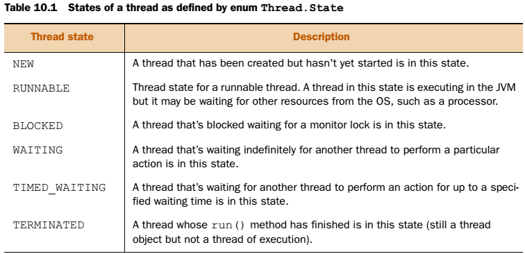
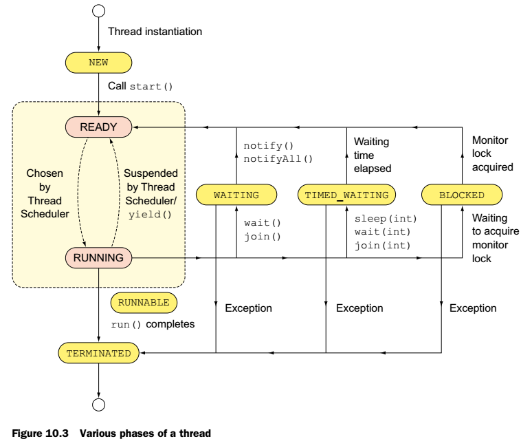

[10 Threads](#threads)
  - [10.1 Create and use threads](#create-and-use-threads)
  - [10.1.1 Extending class Thread](#extending-class-thread)
  - [10.1.2 Implement interface Runnable](#implement-interface-runnable)

[10.2 Thread lifecycle](#thread-lifecycle)
  - [10.2.1 Lifecycle of a thread](#lifecycle-of-a-thread)
  - [10.2.2 Methods of class Thread](#methods-of-class-thread)
  - [10.2.3 Start thread execution](#start-thread-execution)
  - [10.2.4 Pause thread execution](#pause-thread-execution)
  - [10.2.5 End thread execution](#end-thread-execution)

[10.3 Protect shared data](#protect-shared-data)
  - [10.3.1 Identifying shared data: WARM-UP](#identifying-shared-data-warm-up)
  - [10.3.2 Thread interference](#thread-interference)
  - [10.3.3 Thread-safe access to shared data](#thread-safe-access-to-shared-data)
  - [10.3.4 Immutable objects are thread safe](#immutable-objects-are-thread-safe)
  - [10.3.5 Volatile variables](#volatile-variables)

[10.4 Identify and fix code in a multithreaded environment](#identify-and-fix-code-in-a-multithreaded-environment)
  - [10.4.1 Variables you should care about](#variables-you-should-care-about)
  - [10.4.2 Operations you should care about](#operations-you-should-care-about)
  - [10.4.3 Waiting for notification of events: using wait, notify, and notifyAll](#waiting-for-notification-of-events-using-wait-notify-and-notifyall)
  - [10.4.4 Deadlock](#deadlock)
  - [10.4.5 Starvation](#starvation)
  - [10.4.6 Livelock](#livelock)
  - [10.4.7 Happens-before relationship](#happens-before-relationship)


# Threads

- Multithreading  (Aynı anda birden fazla işin yapılması)
- Concurrency     (Bu işlerin eşzamanlı yapılması)

Multithreading OS tarafından çeşitli algoritmalardan(round-robin, high priority first, preemptive) yararlanılarak yapılan CPU zamanının aynı anda kullanılmasıdır.

Bir uygulama bir veya daha fazla "process" çalıştırabilir. Her process'in kendi çalışma alanı ve kaynakları vardır. Her bir process de birden fazla thread (lightweight process) çalıştırabilir. Çogu JVM tek bir process de çalışır. Process içindeki thread'ler ise bu process'in kaynaklarını paylaşarak kullanabilir. Yalnız bu paylaşım beraberinde başka sorunlarıda getirir. İşlemlerin karışması(*thread interference*) veya çelişkili nesne değerleri(*memory inconsistency*) oluşabilir. Bunları engellemek için veriler senkronize edilebilir ama bu da *deadlock*, *starvation*, ve *livelock* gibi sorunlara yol açar.

Multithreading kapsamlı bir konudur. Önemli olan Thread'ler tarafından neyin garanti edildiğini ve neyin garanti edilmediğini kavramaktır. Garanti edilmenin dışında şu kavramlar da önemlidir.

- Expected 		Beklenen, umulan
- Probable 		Muhmemel, olası
- Assured 		Emin olmak


## Create and use threads

- Thread sınıfını extend ederek,
- Runnable interface'ini implemente ederek

 yeni thread'ler oluşturulur. JVM multithreading'i destekler. Bu da altındaki işlemcinin multithreading'i çeşitli yöntemlerle desteklemesinden ötürü oluşur.


( You’ll often hear about thread objects and threads of execution in a multithreaded or concurrent application. Though related, a Thread instance and a *thread of execution* aren’t the same. A Thread instance is a Java object. The implementation of Java threads is JVM-specific. A JVM implementation might even choose not to map Java threads to native threads at all! Creation of a thread of execution is passed to the OS by a JVM implementation. A thread of execution has its own set of program counter (PC) registers to store the next set of instructions to execute. It also has its own *stack* that stores *method frames* to store the state of a method invocation. The state of a method invocation includes the value of local variables, method parameters, method return values, exception handler parameters, and intermediate values. A process like JVM's can create multiple threads of execution to execute multiple tasks simultaneously. A Thread instance and a thread of execution are depicted in figure 10.1 )


Bir java uygulaması en az bir thread ile çalışır. Bu thread main thread dir ve kodun içindeki main() metodunu arar ve çalıştırır.

### Extending class Thread

Thread sınıfı yeni bir "Thread of execution" oluşturmak ve çalıştırmak için kullanılır. Yeni bir "Thread instance" oluşturmak için;

- Thread sınıfını extend etmeli,
- Run() metodunu override etmeliyiz

Yeni bir "Thread of execution" oluşturmak için ise;

- Thread instance'ı üzerinde start() metodunu çağırmamız gerekmektedir.

Uygulamızda "Thread of execution" başlayınca, Thread instance'daki run metodunu çağırır. Böylece start metodu yeni thread oluşmasını tetikleyecek ve ona yine kaynaklar atanmasını sağlayacaktır.

Örnek kodumuz chapter10.s1.HelloThread package'ı içinde bulunur. Buradaki en önemli husus Dancing mi yoksa singing mi önce yazılır hiçbir zaman bilemeyiz. Tamamen OS ve JVM'e bağlıdır. Burada Thread sınıfının start metodunu çağırıyoruz. Peki bu metodu biz Sing sınıfımızda override etseydik ne olurdu? Normal metod gibi çalışırdı, hiçbir zaman Thread oluşmazdı!(Örnek chapter10.s1.ThreadStart)

Thread sınıfını extend ederek projemindeki diğer sınıflardan miras alma özelliğinden vazgeçmiş oluruz. Bunu önlemek için Runnable interface'i ile çalışabiliriz.

### Implement interface Runnable

Runnable interface'ini implemente eden sınıfların instance'ları "Thread of execution" tarafından çalıştırılabilen kodlar tanımlayabilirler. Bu interface'in aşağıdaki sadece run metodu vardır.

```java
public interface Runnable {
	public abstract void run();
}
```

Örnek kullanımı chapter10.s1.HelloThreadByRunnable sınıfında bulunmaktadır. Thread sınıfı constructor'ları;

```java
Thread()
Thread(String name)
Thread(Runnable target)
Thread(Runnable target, String name)
```

Bu constructor'larda name parametresi, thread'e bir isim atamak için kullanılır. Eğer atamaz isek Java kendisi otomatik olarak bir isim atar. Thread sınıfı içinde bir adet Runnable instance variable saklar. Start metodu çağrıldığında bu referansı kullanarak çalıştırır.

(Purpose: When you instantiate a thread, say, A, passing it another Thread instance, say, B, calling A.start() will start one new thread of execution. Calling A.start() will execute B.run.

Explanation: Class Thread defines an instance variable target of type Runnable, which refers to the target object it needs to start. When you instantiate newThread by passing it a Sing instance, sing, newThread.runnable refers to sing. When you call newThread.start(), newThread() checks if its target is null or not. Because it refers to sing, calling newThread.start() starts a new thread of execution, calling target.run().)

Her Thread'in priority si vardır. 1 ile 10 arasında değişir. 1 en önemsiz, 10 en önemlidir. Bir thread yaratılırken kensinin priority'si ile aynı değerde üretir. Sonra setPriority(int) metodu ile ayarlanabilir. Fakat bununda kesinliği yoktur. Hiçbir zaman önceliği yüksek olanlar önce çalıştırılacağının garantisi yoktur.

### Thread or Runnable?

- When extending the Thread class, we're not overriding any of its methods. Instead, we override the method of Runnable (which Thread happens to implement). This is a clear violation of IS-A Thread principle
- Creating an implementation of Runnable and passing it to the Thread class utilizes composition and not inheritance – which is more flexible
- After extending the Thread class, we can't extend any other class
- From Java 8 onwards, Runnables can be represented as lambda expressions


# Thread lifecycle

Bir Thread instance'ında start metodu yeni bir "Thread of execution" başlatır. " A Thread of execution" bir yaşam döngüsü vardır. Durmuş, tamamlanmış vb gibi durumlarda olabilir. Bu durumları metodlar ile kontrol edebiliriz. Durum geçişi zamanları "Thread scheduler" ile kontrol edilir.

### Lifecycle of a thread

Bir thread'in birçok durumu vardır. Bunlar Thread sınıfı içindeki "State" enumu içinde tanımlanmışlardır;



Thread'in çeşitli durumları;



### NEW
"new Thread" ile thread nesnesini oluşturduğumuz anda durumu NEW dir.

### RUNNABLE
Bir thread'in start fonksiyonu çağrıldığında, run metodu çağrılır ve bu aşamada Thread durumu NEW den RUNNABLE'a geçer. Bu durum READY ve RUNNING durumlarını kapsar, fakat işlemcinin ne zaman threadi çalıştıracağını(Ready den running'e geçme durumunu) bilemeyiz. Bunu Thread scheduler belirler. READY durumundaki thread çalışmak için Thread Scheduler tarafıdan seçilmeyi ve ona bir processor time atanmasını bekler.

### TIMED WAITING
Çalışan bir thread içinde sleep(int), join(int), veya wait(int) metodları çağrılır ise thread TIMED_WAITING durumuna geçer. Bu durumda thread durur ve belirlenen zaman sonunda çalışmasına devam eder.(Devam etme isteği gönderilir, Thread schuler ne zaman uygun görür ise tekrar başlar)
- thread.sleep(long millis)
- wait(int timeout)
- thread.join(long millis)
- LockSupport.parkNanos
- LockSupport.parkUntil

Örnek: chapter10.s2.ThreadTimedWaiting

### WAITING
Çalışan bir thread içinde join() veya wait() metodları çağrılır ise thread WAITING durumuna geçer. Devam etmesi için(RUNNABLE durumuna geçmesi için) notify() veya notifyAll() metodlarının çağrılması gereklidir.
- object.wait()
- thread.join()
- LockSupport.park()

Örnek: chapter10.s2.ThreadWaiting

### BLOCKED
Çalışan bir thread her an BLOCKED durumuna geçebilir. Bir network bağlantısını beklerken, bir sistem kaynağını beklerken veya syncronized durumdaki bir metodu beklerken. Bağlantı geldiğinde veya monitör lock elde ettiğinde tekrar RUNNABLE durumuna gelir.

It enters this state when it is waiting for a monitor lock and is trying to access a section of code that is locked by some other thread.
Örnek: chapter10.s2.ThreadBlocked

### TERMINATED
Run metodu başarıyla biterse thread TERMINATED duruma geçer. Veya çalışması esnasında herhangi bir hata alırsa TERMINATED durumuna geçer.

- Bir thread NEW durumunda join çağrılabilir. Hiçbir etkisi olmaz.

### Methods of class Thread

Thread sınıfı metodları şöyle sınıflandırılabilir.


### Start thread execution

Bir thread instance tanımlandıktan sonra NEW konumunda olur. Bu konumda iken start metodu çağrılır ise Thread RUNNABLE konumuna geçer. Start'ı diğer bütün durumlarda çağırır isek "IllegalThreadStateException" hatası alırız. Mesela yeni tanımlanan bir thread'i 2 defa start eder isek 2. de IllegalThreadStateException fırlatılır.

Bunun 2 örneği chapter10.s2.ThreadStart sınfında var. İlk örnekte start ile başladığı için Thread RUNNABLE konumuna geçer ve ikinci start hata verir. Konsola yazabilirde yazmayabilirde çünkü işlemci çok hızlı davranıp main'de 2. Komutu çalıştırabilir. İkinci örnekte ise doğrudan run metodu çağrıldığı için yeni bir thread of execution oluşturulmaz, normal bir metod gibi çalışır.

Thread in start metodu sadece NEW durumdaysa çalıştırılabilir, diğer durumlarda hata fırlatır.

Thread'ler Exception fırlatır ise; her thread farklı bir programmış gibi düşünebiliriz. Her biri birbirinden bağımsız çalışır ve her biri farklı Exception fırlatıyor ise her thread de ayrı ayrı ve sırası tamamen tahmin edilemez bir şekilde fırlatılır.


### Pause thread execution

Threadler 2 şekilde duraklar, birincisi harici bir fonksiyon çağrılmasıyla veya işlemcideki time slice ın expire olmasıyla.

**THREAD SCHEDULING**

İşlemci zamanı aynı anda birden fazla uygulama çalıştırmak için genellikle zaman dilimlerine ayrılmıştır. Her bir thread bir veya daha fazla zaman dilimi kullanır. Thread scheduler bu threadleri suspend edip, ready durumdaki başka bir thread'i çalıştırabilir.(READY den RUNNING'e veya tam tersi) Bu tamamen programcının kontrolü dışındadır ve bu işlemi OS belirler.

**METHOD THREAD.YIELD()**

Bir kod test ederken birden fazla thread çalıştığını düşünelim. Aynı durumu yaratmak için threadlerden birini suspend etmek isteyebiliriz. Bu durumda Thread sınıfının statik metodu olan yield çalıştırılabilir. Ama bu metod thread'in suspend olacağını asla garanti etmez. Schuler'a sadece bir tavsiyedir, bunu ignore bile edebilir. Bu metod kodun herhangi bir yerinden çağrılabilir. Bu metod statiktir ve hiçbir hata fırlatmaz. 

Örneği chapter10.s2.Yield


Bu metod peki neyi garanti eder, hiçbirşeyi garanti etmez! Aslında CPU ya, git diğer önemli thread ler varsa onları çalıştırabilirsin anlamına gelir. 

**METHOD THREAD.SLEEP(time)**

Statik metod Thread.sleep() bir threadin çalışmasını en azından belirtilen zaman kadar durmasını garanti eder ve READY state e geçirir. Mesela ekrandaki topun hareketini yavaşlatmak için kullanılabilir. Örneği kodda chapter10.s2.ThreadSleep sınıfıdır.

```java
public static native void sleep(long milli) throws InterruptedException;
public static void sleep(long milli, int nanos) throws InterruptedException
```

Görüldüğü gibi bu static metod mili saniye ve nano saniye mertebesinde thread çalışmasını durdurabilir. Nano saniye kesinliği alttaki OS'a bağlıdır. Ayrıca durdurulmadığı sürece sleep metodu en azından belirtildiği süre kadar thread'i durdurur. Sonra thread'in çalışması Thread Scheduler'a bağlıdır. Sadece thread'in RUNNABLE konumuna geçmesi tam olarak belirtilen süre kadardır.

*** A thread that's suspended due to a call to sleep doesn't lose ownership of any monitors.

Sleep metodu nereden çağrılabilir? Sleep metodu onu çağıran thread'i sleep konumuna geçirir. Eğer Runnable 'ın run metodu içine konarsa thread'in uyumasını sağlar.

**METHOD JOIN()**

Bir thread kendini başka bir thread'in işinin bitmesi için bekletebilir. Bunu join() metodu ile yapar. Mesela uygulama geliştirme takımı ekran dizaynı bitmeden kodlama işine geçemez, bu sebepten dizayn takımını beklemek zorundadır.

Örnek kod; chapter10.s2.ThreadJoin
Örnek kod; chapter10.s2.ThreadJoin2

 Yukardaki kodun muhtemel çıktıları aşağıdadır. Join metodu diğer thread işini bitirince çalışmasına kaldığı yerden devam eder!


Join metodu beklediği thread'in işi bitmeden çalışmamayı garanti eder! Metod tanımı şöyledir.

```java
public final void join() throws InterruptedException
public final synchronized void join(long milli) throws InterruptedException
public final synchronized void join(long millis, int nanos) throws InterruptedException
```

Yukardaki metodlar [InterruptedException] hatası fırlatır ve çağıran threadin en az bu süreler kadar bekleyeceğini garanti eder.(Tabii thread sonlandırılmazsa) join aslında arka planda wait(), isAlive() ve notifyAll() metodlarını kullanır.

*** join metodunun çağıran thread WAITING durumuna geçer. join metodunu hangi thread nesnesi üzerinde çağırdıysa, o thread 'in bitmesini bekler.
*** The join() method may also return if the referenced thread is interrupted. In this case, the method throws an InterruptedException.
*** If the referenced thread was already terminated or hasn't been started, the call to join() method returns immediately.

***** join() creates a happens-before relationship! "All actions in a thread happen-before any other thread successfully returns from a join() on that thread." This means that when a thread t1 calls t2.join(), all changes done by t2 are visible in t1 on return.

**METHODS WAIT(), NOTIFY(), AND NOTIFYALL()**

Bir server'ın istekleri karşılaması gibi bir thread de bir nesneyi bekleyebilir. Wait() metodu bir nesneyi notify veya notifyAll çalıştırılana kadar bekleyebilir. Bu metodlar bütün java nesneleri üzerinde çalıştırılabilir çünkü bu metodlar Object sınıfının üyeleridir. Bu metodlar [senkron metodlardan] ve nesne monitörü olan thread'lerden çağrılabilir.

Örnek; chapter10.s2.ThreadNotify

**Sleep and Wait**
In general, we should use sleep() for controlling execution time of one thread and wait() for multi-thread-synchronization

### End thread execution

Bir thread çalışmasını run metodu bitince durdurur. Deprecate olmuş stop metodunun çağrılmasına gerek yoktur. Bu metod tamamlanınca thread durumu TERMINATED olur.

# Protect shared data

Thread'ler memory'nin bazı kısımlarını paylaşan lightweight process'lerdir. Bu threadleri verimli yapar ama yanında memory sorunları da getirir. Hafıza çeşitli tekniklerle threadler tarafından paylaşılarak kullanılabilir. Bunlar;

- Tek seferde değişkeni tek bir threadin okuyup yazmasına izin vererek,
- Değişmez sınıflar tanımlayarak
- Volatile değişkenler tanımlayarak

### Identifying shared data: WARM-UP

Bir JVM instance'ı sadece bir java uygulamasını taşır. Java uygulaması da birden fazla thread oluşturabilir. JVM runtime bellekte bazı bölümlerinin threadler tarafından paylaşılmasına izin verir. Aşağıda JVM runtime'ın kısımları yer almaktadır. Bunlar method area, the heap, Java stacks, ve PC registers dır.

- [Method area], Class bilgileri vardır, mesela değişkenler ve metodlar gibi. Burada static değişkenler de yer alır. Bu statik değişkenlere JVM içindeki bütün threadlerden ulaşılabilir. Bu değişkenleri "class loader" tarafından paylaştırılır. Her class loader kendi statik değişkenlerine sahiptir.
- [The heap], uygulama çalıştığı sürece oluşturulan nesnelerdir ve yine bütün threadler tarafından ulaşılabilir.
- [PC registers and Java stacks] aren't shared across the threads. On instantiation, each thread gets a PC register, which defines the next set of instructions to execute. Each thread is also assigned a Java stack. When a thread begins execution of a method, a method frame is created and inserted into the java stack, which is used to store the local variables, method parameters, return values, and intermediate values that might be used in a method. Of all this data, the method area and heap are shared across threads.


### Thread interference

Birden fazla thread'in değişkenlere ulaşımı thread karışmasına yol açar. Mesela bir toplama işlemi bile atomik olarak gözükse de arkada bir sürü iş yapılır ve karışıma sebebiyet verebilir.

**NOT:**  ++ , \--, +=, -=, \*=, ve /= işlemleri atomik değildir. Bu operatörleri kullanan birden fazla thread karışıma sebebiyet verebilir.

Aşağıdaki kitaptaki örneğin çizimi vardır. Sonuç olarak bu operatörler atomik olmadığı için thread inteference yaşanabilir.


Race Condition: Aynı nesne üzerinde çalışan threadlerde meydana gelir. Bir thread nesneyi alıp, bir alanının değerini değiştirirken thread suspend olabilir. Bu sırada başka bir thread aynı alanın değerini değiştirir. Yarın kalan işine devam ederse eski veri ile işlem yapmış olur. Bu duruma race condition denir.

### Thread-safe access to shared data

Yukardaki örnekte paylaşılan bir değişkeni üstünde işlem yaparken kilitleyebilseydik(başka thread'lerin ulaşmasını engellemek), o zaman bu soruna bir çözüm olurdu. Bu şekilde kodumuzu "thread safe" yapabilirdik. Uygulamamızı "thread safe" yapmak paylaşılan verilerimize birden fazla thread ulaşsa bile değerini doğru bir şekilde tutmaktır. Değeri güvene almaktır.

Nesnelerimizi [synchronized methods] ve [synchronized statements] lar tanımlayarak kilitleyebiliriz. Java implements synchronization by using monitors.

**OBJECT LOCKS AND MONITORS: WARM-UP**

Her java nesnesi bir thread tarafından kilitlenebilen ve açılabilen bir monitör ile ilişkilendirilmiştir. At a time, only one thread can hold lock on a monitor and is referred to as the monitor owner. Owning the monitor is also referred to as acquiring the monitor. If another thread wants to acquire the monitor of that object, it must wait for it to be released.

"synchronized" keyword can never be applied to a class. Bu keyword sadece method veya bir blok'a gelebilir.

Bir metoda Syncronized keyword ü eklenir ise, o metodu aynı anda sadece bir thread çalıştırabilir. Eğer bir thread syncronized bir metodu çalıştırmak isterse metodun olduğu nesnenin monitörünü elde etmesi gerekir. Mönitörü elde eder ise(lock) başka hiçbir thread [o nesnedeki hiçbir syncronized metodu] çalıştıramaz. Kitlendikten, elde ettikten sonra bir thread 3 şekilde monitör üzerindeki kiliti bırakır. Çalışması tamamlanınca, başka bir işlemin bitmesini beklemesi gerekiyorsa veya çalışırken bir hata fırlatır ise. Bu durum aşağıdaki şekilde görülmektedir. Bir thread bekleme durumuna yield veya wait metodlarını kullanarak girer. Tekrar monitörü notify veya notifyAll metodları çağrılınca alabilir.


**SYNCHRONIZED METHODS**

Bi metod, tanımına syncronized keyword'ü eklenerek SYNCHRONIZED metod olur. İnstance ve statik metodların ikiside syncronized olabilir. Bir thread synchronized metod çağırır ise onun monitörüne otomatik olarak sahiplenir. Çağrılan metod instance metod ise thread monitör çağrıldığı sınıfın instance'ına kitlenir. (this) Çağrılan metod statik metod ise çağrıldığı sınıfı temsil eden Class nesnesine kilitlenir. 

Bir önceki karışan örnekteki metodları syncronized yaparak sorunu ortadan kaldırırız.

SYNCHRONIZED keyword'ü datanın değiştiği yere konması gerekmektedir. Yoksa işe yaramaz.

**SYNCHRONIZED STATEMENTS**

Senkron cümleleri çalıştırmak için Thread object monitöre kitlenmelidir. Bir instance metodu için instance'ın kendine kitlenmek gerekmez. İnstance içindeki herhangi bir nesneye de kilitlense olur. Mesela;

```java
Object objSale = new Object();
Object objPos = new Object();

public void newSale() {
	synchronized(objSale) {
		++copiesSold;
	}
}

public void rankImprove() {
	synchronized(objPos) {
		--rank;
	}
}
```

Görüldüğü gibi herhangi bir nesneye kilitleniliyor. Burada bu iki metod farklı iki nesneye kilitleniyor. Bu sayede bir thread ilk metodu çalıştırır iken aynı anda ikinci bir thread ikinci metodu çalıştırabilir!

OBJECT LOCKS
- Her nesnesin kendisine ait bir kilidi bulunur.
- Bir sınıfa ait bir nesne oluşturulunca bu kilit otomatik olarak oluşur.
- Bu kilidi eline geçiren iş parçacığı, kritik alan üzerinde işlem yapmaya hak kazanır.
- Kritik alan, birden fazla iş parçacığının aynı anda üzerinde işlem yapmaması gereken bölgedir.

Object's monitor
- Her nesnenin bir kilidi olduğu gibi bir de bekleme havuzu(object's monitor)bulunur.
- Bu bekleme havuzuna iş parçacıkları atılır -wait()-veya bu havuzdan dışarı çıkartılır - notify()/notifyAll()
- Bu beş yordam (wait()yordamının iki de adaş yordamı bulunur), java.lang.Object nesnesinin içerisinde bulunur.

### Immutable objects are thread safe

Immutable nesneler(String Class, Wrapper Classes) thread safe'dir. Çünkü içerikleri değiştirilemez. Sınavda, thread senkronizazyonu olmadan bir sınıfın bütün instanlarını aynı anda okuma ve yazmadan koruyabiliriz diye bir soru çıkabilir. Cevabı immutable nesnelerdir. Paylaşılan immutable nesneler asla karışıma sebep olmaz çünkü değerleri atandıktan sonra değiştirilemez. Aşağıdaki örnekte birth değişkeni dışardan hiçbirşekilde değeri değiştirilemez.

```java
import java.util.Date;
final class BirthDate {
	private final Date birth;
	public BirthDate(Date dob) {
		birth = dob;
	}
	public Date getBirthDate() {
		return (Date)birth.clone();
	}
	public boolean isOlder(Date other) {
		// calculate 'other' with 'birth'
		// return true is 'birth' < 'other'
		return true;
	}
}
```

### Volatile variables

Concurrent erişimde değişken değelerinin güvende tutmak için bir diğer yol ise volatile değişkenler kullanmaktır.Syncronied bloklara göre dezavantajlıdırlar. Atomik işlemleri desteklemezler. Kullanmamızın tek amacı basitlik ve bazı durumlarda daha iyi performans.

# Identify and fix code in a multithreaded environment

Bu bölümde birden çok thread'in paylaştığı verilerin neden olduğu threading sorunlarından bahsedilecektir. Önce thread'lerin hangi dataları birbirleri arasında paylaşabileceğini öğreneceğiz, ardından düzeltmek için yapabileceklerimizi.

### Variables you should care about

Thread'ler heap de bulunan Class variables ve Instance variables'ı paylaşabilirler. Her thread ise local variables, method parameters, ve exception handler parameters'ı içeren kendi Stack Memory'sine sahiptir. Aşağıdaki sekilde de gösterildiği üzere thread'ler static and instance variables or attributes 'u koruması gerekmektedir. Diğerlerine gerek yoktur. (Static ve instance kelimeleri aynı anlamda kullanılıyor!)


### Operations you should care about

Paylaşılan verileri değiştiren metodları değil, sadece bu değişkenleri okuyan metodlarıda güvene almalıyız. Mesela bir kitap satım uygulamasında, bir thread kitap satıyor, diğeri de sadece satılan kitap sayısını döndürüyor. Eğer sadece kitap sayısını okuyan Thread diğerinden önce çalışır ise yanlış bir bilgi(dirty value) döndürme olasılığı vardır. Bu şekide inconsistent memory oluşur.

### Waiting for notification of events: using wait, notify, and notifyAll

Birbirine bağlı 2 thread düşünelim. Eğer birinin işi bitmeden diğeri değer okumaya kalkarsa yanlışlık olabilir. bu durumda bunların birbiriyle işinin bittiğini haberleşmesi lazımdır. Mesela bir arkadaşınız ile dışarı çıkacaksınız. Evde bekleyen arkadaş her dakika dışarı çıkıp bakması zor bir durumdur. Onun yerine karşıdaki kişi gelince haber verebilir ve dışarı çıkabilirler. Java da bu haber verme işi wait ve notify metodları ile yapılır. Bu metodlar Object sınıfında tanımlandığı için her Java nesnesi üzerinde çağrılabilir!

Wait, notify ve notifyAll metodların birbiri ile haberleşmesi için kullanılır ve bunlar Thread sınıfının değil Object sınıfının üyeleridir!!!

Bir thread wait ve notify metodlarını çağırmak için nesnesinin monitörüne kitlenmesi gereklidir. Ve bu metodları çağırma işi syncronized metod veya bloklardan yapılmalıdır. Örneği chapter10.s4.ThreadCommunication sınıfında vardır. Bu sınıf çalıştırıldığında GoRafting thread'i başlar. Bu thread içindeki run metodunda synchronized(friend) satırı bulunur. Bu satır friend nesnesine kitlenir ve ardından friend nesnesi üzerinde wait çalıştırır. Kod burada durur. Kod 2 şekilde devam eder(kilit bıraklılır);

- Başka bir thread aynı friend nesnesi üzerinde notify metodunu çağırır ise;
- Başka bir thread GoRafting thread'ini sonlandırırsa(interrupt)

Diğer taraftan paulthread'i başlatılır. Friend tipinde olan paul nesnesi kilidi elde ettiğinde nofify metodu çağrılmış olur ve kod sonlanır.

Bu 3 metod Syncronized bir kod bloğundan çağrılmalıdır. Aksi taktirde IllegalMonitorStateException hatası fırlatırlar.

notify metodu object monitör üzerinde bekleyen sadece bir thread'i uyandırır. Hepsini uyandırmak istiyor isek notifyAll metodunu kullanmalıyız.

wait checked olan InterruptedException hatası fırlatır, notify ve notifyAll ise hiçbirşey fırlatmaz.

Thead'in join metodu başka bir threadin iş yapmasını bekler, fakat wait ve notify beklemez. wait'i çağıran thread sadece, notify çağrılmasını bekler. Bu metodlar çağrıldığında thread aşağıdaki durumlara geçebilir;


### Deadlock

iki farklı thread birbirinin işlerini bitirmesini bekliyor ise bu durumda "Deadlock" oluşur. Örneği chapter10.s4.DeadLock sınıfında vardır. Bu sınıfta iki nesne üzerinde iki farklı thread çalışıyor. Bu thread ler birbirlerinin nesneleri üzerlerinde kilitlendikleri için sonsuza kadar birbirlerini bekliyorlar ve deadlock oluşuyor.

### Starvation

Starvation 				= açlık

engagements 		  = randevu

Eğer akşam başbakan ile yemeğe gideceksin dense, planlarını değiştirir miydin? Evet. Bunun gibi OS içinde her thread'in bir önceliği vardır. Thread schuler önceliği yüksek olanları seçer. Bu durum düşün öncelikli thread'leri aç bırakabilir. Veya object monitörü almak için bekleyen bir thread'de aç kalabilir. Thread ayarlama OS'un görevidir.

### Livelock

Arkadaşın ile telefonda konuşurken çağrı kesildi. Sen tekrar ararsın ama meşguldür çünkü o da seni aynı şekilde aramaya çalışıyordur. Belli bi süre beklersin ve tekrar denersin yine aynı şekilde meşgul çalar. Bu durumda iki tarafda "livelock" durumundadır. Her iki tarafta ayakta ve tepki verebilmektedir. Aynı şekilde thread'lerde de oluşabilir.

Livelock'daki thread'ler bloklanmamıştır, birbirlerine tepki verirler ama tamamlanamazlar.

### Happens-before relationship

Threadlerde ne zaman başlayacağı, duracağı, ne sıra ile çalışacaklarını asla bilemeyiz. Yani çok az bir durumu garanti olacak diyebiliriz. Sınavda doğru, yanlış veya olası durumlar sorulur. Java dili "happens-before" ilişkisini kullanır.

Yani bir işlemin diğerinden önce olması durumu.. Bu aşağıdaki şekilde belirtilmiştir.


Threading ile ilgili soruları "happens-before" ilişkisi ile çözebilirsin. Örneğin;

- The execution of start()happens-before any action in a thread is started.
- When code is defined in a sequence, step 1 happens-before step 2.
- Unlocking of an object monitor happens-before any other thread acquires a lock on it.
- A write to a volatile field happens-before every subsequent read of that field.
- All actions in a thread happens-before any other thread returns from a join on that thread.

