[11 Concurrency](#concurrency)

[11.1 Concurrent collection classes](#concurrent-collection-classes)

[11.1.1 Interface BlockingQueue](#interface-blockingqueue)

[11.1.2 Interface ConcurrentMap](#interface-concurrentmap)

[11.1.3 Class ConcurrentHashMap](#class-concurrenthashmap)

[11.2 Locks](#locks)

[11.2.1 Acquire lock](#acquire-lock)

[11.2.2 Acquire lock and return immediately](#acquire-lock-and-return-immediately)

[11.2.3 Interruptible locks](#interruptible-locks)

[11.2.4 Nonblock-structured locking](#nonblock-structured-locking)

[11.2.5 Interface ReadWriteLock](#interface-readwritelock)

[11.2.6 Class ReentrantReadWriteLock](#class-reentrantreadwritelock)

[11.2.7 Atomic variables](#atomic-variables)

[11.3 Executors](#executors)

[11.3.1 Interface Executor](#interface-executor)

[11.3.2 Interface Callable](#interface-callable)

[11.3.3 Interface ExecutorService](#interface-executorservice)

[11.3.4 Thread pools](#thread-pools)

[11.3.5 Interface ScheduledExecutorService](#interface-scheduledexecutorservice)

[11.4 Parallel fork/join framework](#parallel-forkjoin-framework)


# Concurrency

Günümüzde uygulamalarımızın aynı anda birçok iş yapabilmesi bir gereklilik haline gelmiştir. Fakat concurrent uygulamalar geliştirmek için Javanın low level kütüphaneleri yeterli değildir. Bu bölümde nasıl concurrent uygulamalar yazacağımızı ve bunları yazarken kullancağımız framework'leri, yaklaşımları göreceğiz. Tabiiki her chapterda olduğu
gibi bu konular sınavla sınırlıdır. (Bunlar java.util.concurrent paketi sınıfları, java.util.concurrent.locks paketi sınıfları, ExecutorService ve parallel fork/join framework)

## Concurrent collection classes

Concurrent collection sınıfları bir collection'a nesne eklerken, diğer taraftan nesne silen bir operasyonu "happens-before" ilişkisi tanımlayarak memory uyumsuzluk sorunlarını giderir. Programcılar java.util sınıfı içindeki collection'lara thread-safe özelliği olan collaction'lar ekliyordu fakat java.util.concurrent paketi içinde java collection sınıflarına birçok ek özellik eklenmiş halleri mevcuttur. Bu sınıflar şunlardır;

- BlockingQueue defines a first-in-first-out data structure that blocks or times out when you attempt to add items to a full queue, or retrieve from an empty queue.
- ConcurrentMap is a subinterface of java.util.Map that defines useful atomic operations. These operations remove or replace a key-value pair only if the key is present, or add a key-value pair [only] if the key is absent. Making these operations atomic helps avoid synchronization. The standard general-purpose implementation of ConcurrentMap is ConcurrentHashMap, which is a concurrent analog of HashMap.
- ConcurrentNavigableMap is a subinterface of ConcurrentMap that supports approximate matches. The standard general-purpose implementation of ConcurrentNavigableMap is ConcurrentSkipListMap, which is a concurrent analog of TreeMap.

Concurrent program yazmak zordur. Hem thread safety ile hem de performans ile baş etmeniz gerekmektedir.  (The individual operations of ConcurrentHashMap are safe---that is, multiple threads can put values into the same map object in a safe manner. But these can be misused by the developers if they try to combine multiple safe operations into a single operation.)

### Interface BlockingQueue

BlockingQueue bildiğimiz bir kuyruk,sıra interface'idir. Birden fazla thread'in kullanacağı bir kuyruğa ihtiyacımız olduğundan kullanılır. Bu arayüzü implemente eden sınıflardan biri ArrayBlockingQueue 'dir. Bu sınıfın constructor'ı initial kapasitesini belirleyen bir metoda sahipdir ve bu değer değiştirilemez! Sıra kapasitesi dolunca yeni eleman eklemeyi bloklar, engeller. Ayrıca boş bir sıradan da eleman çıkarmayı engeller. "*producer*--*consumer*" pattern'inde çalışır. Bir thread elemanları oluşturup sıraya ekler, başka bir thread bunları okur.

Birçok client'ın(producer) bir server'a istek yaptığını düşünün. Server(consumer) ise bütün isteklere sırayla cevap vermelidir. Bunu yönetmek için server bir anda karşılayacağı istek sayınının bir limiti olmalıdır. İstekler bir BlokcingQueqe ya konabilir. Böylece limit fazlası istekler engellenir veya istek hiç yoksa server thread'i engellenmeli ve beklemelidir. Bu örneğin örneği; chapter11.s1.LoadTesting sınıfındadır.

**queue.put(req);** satırı kuyrukda yer varsa ekler, yok ise yer açılana kadar bekler.

**queue.take();** ise kuyruğun başındaki nesneyi getirir ve kuyruktan çıkarır. Eğer kuyrukta nesne yok ise nesne bulunana kadar bekler.

### Interface ConcurrentMap

ConcurrentMap interface'i java.util.Map sınıfını extend eder. Bu interface key var ise bu key-value çiftini silmek veya değiştirmek için metodlar sağlar. Veya key yok ise eklemeyi sağlayan metodları bulunur. Aşağıda bazı metodları listelenmiştir.

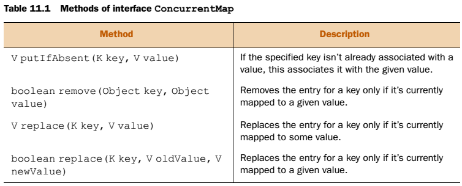{width="5.236111111111111in"
height="2.1180555555555554in"}

### Class ConcurrentHashMap

Önceki bölümdeki ConcurrentMap interface'inin implemantasyonu da ConcurrentHashMap'dir. HashMap'in concurrent versiyonudur. HashMap senkron değildir ve birden fazla thread ile hashMap değerlerini değiştiriyor isek hashMap'e erişimi senkronize etmemiz gerekir. Fakat bütün HashMap'i lock'lamak birden fazla thread ile çalışır iken ciddi performans sorunlarına yol açar.

Bu problemin çözümü ConcurrentHashMap sınıfıdır. Kendisini sadece bir thread'in kitlemesi yerine ConcurrentHashMap birden fazla thread'in erişmesine izin verir. Kensine sınırsız thread'in okumasına izin verirken sınırlı sayıda thread'in değiştirmesine izin verir. Ayrıca içinde dönerken ConcurrentModificationException hatası fırlatmadığı için dönerken kendisini kitlememize gerek yoktur. Peki iterator'a eriştikten sonra yeni eleman eklenir ise ne olur? İterator sadece HashMap oluşturulduğundaki değerleri verir. Her platformada olmamak ile birlikte, yeni değerleri yansıtabilir...

Drawback = sakınca

Avantajları olduğu gibi bazı sakıncaları da vardır. Mesela elemanlarını edit ederken bütün collaction'ı kitlemediği için size metodu her zaman doğru cevabı vermeyebilir !

```java
ConcurrentMap<Integer, String> map = new ConcurrentHashMap<>();
```

map.containsKey(key) 		Bir key 'in ConcurrentHashMap içinde olup olmadığı boolean döner

map.put(key, value) 			Varolan bir key değerini değiştirir.

map.replace(key, value) 	ConcurrentHashMap içinde key varsa atomik olarak değerini değiştirir

Bu metodları kullanan chapter11.s1.UseConcurrentMap sınıfı vardır. Orada thread-safe ile ilgili bir de örnek metin bulunuyor. 3. Metodun önemini anlatıyor.

Aşağıda tekrar java.util.concurrent paketi ve onların java.util paketindeki benzerleri gösterilmiştir.

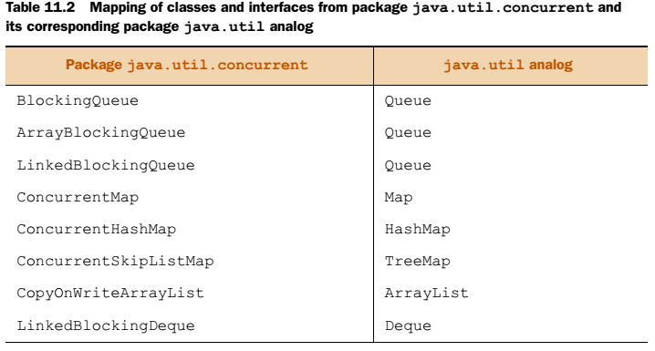{width="4.986111111111111in"
height="2.673611111111111in"}

## Locks

To execute synchronized code, a thread must acquire either an implicit or an explicit lock on an object's monitor. Where no explicit Lockclasses are used, I'll refer to it as an implicit lock. Lock objects offer multiple advantages over implicit locking of an object's monitor. Unlike an implicit lock, a thread can use explicit lock objects to wait to acquire a lock until a time duration elapses. Lock objects also support interruptible lock waits, nonblock-structured locks, multiple condition variables, lock polling, and scalability benefits.

Aşağıda Java API nin Lock interface'inin metodları bulunmaktadır.

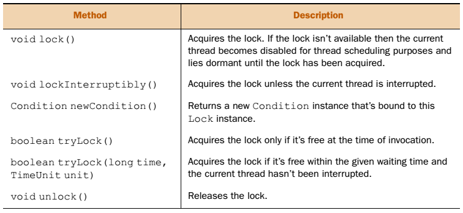{width="5.25in" height="2.4166666666666665in"}

### Acquire lock

Method lock() acquires a lock on a Lock object. If the lock isn't available, it waits until the lock can be acquired. Call method unlock() on a Lock object to release its lock when you no longer need it.

Örnek kod chapter11.s2.LockMethod da var ama bir iş yapmıyor. Sadece lock nesnesi üzerinde lock olana kadar bekliyor o kadar.

### Acquire lock and return immediately

Implicit = Üstü kapalı, ima edilen

Explicit = Açık, belirgin

Bir şarkıcıdan imza almak için bekliyorsun. Eğer çok zaman geçer ise beklemekten vazgeçip dönebilirsin. But threads waiting to acquire implicit object locks can't quit. Once a thread initiates a request to acquire an implicit lock on an object monitor, it can neither stop itself nor can it be asked to do so by any other thread. With explicit locks, you can request a thread to acquire a lock on an object monitor if it's available and return immediately.

Chapter11.s2.Shipment sınıfında bir kod var. Bu kodda 2 senkron işlem var ve iç içe birbirlerini kitliyorlar. Bu kod JVM'in çalıştırmasına göre dead-lock'a girebilir. Bu olasılığı tamamen ortadan kaldırmak için ise yukarda anlatılan şekilde harici lock kullanırız. Bu sayede deadlock'a girmemesini garanti altına almış oluruz. Düzeltilmiş kod Chapter11.s2.ShipmentMod sınıfında vardır. Bu sınıfta Inventory sınıfının içinde bir harici lock(ReentrantLock) tanımlanıyor. Bu lock i kullanarak ( Lock.tryLock() metoduyla ) her iki nesne üzerinde de lock alabilir isek işlemler yapılıyor, yoksa veri değişikliği yapılmıyor. Alamaz isek kod geri dönüyor, lock almayı beklemiyor. Bu şekilde kod
hiçbir zaman deadlock a girmiyor.

Sınavda yanıltmak için acquire(), acquireLock(), release(), ve releaseLock() metodları çıkabilir. Bunların hiçbiri geçerli bir metod değildir. Geçerli olanlar; lock(), unlock(), tryLock(), ve lockInterruptibly()

### Interruptible locks

Doktorda randevunu beklediğini farzet. Bir arama geliyor ve daha önemli bir işin çıkıyor veya şu saate kadar bekleyebilirsin sonra diğer işine gitmen gerekiyor. Bu gibi durumları thread'lerde yapabiliriz. Lock nesnesinin lockInterruptibly() ve tryLock(long time, TimeUnit unit) metodları bu işi yaparlar.

Chapter11.s2.Employee sınıfında bir kod var. İnceler isek lock.lockInterruptibly(); satırı ile lock elde ediliyor fakat dışarıdan bir kesme gelir ise sonlandırılabilme özelliği var. Thread.interrupt() komutu ile lock elde edilen metod kesilebiliyor. Eğer bu komuta kesme gelir ise catch(InterruptedException e) şeklinde yakalanıyor ve Thread.currentThread().interrupt(); komutu ile sonlandırılabiliyor. Burada interrupt komutu çalışması belirsizdir. Thread sonlanmış, bitmiş hiç başlamamış veya yarıda olabilir. kesin olarak sonlandıracak anlamına gelmez.

### Nonblock-structured locking


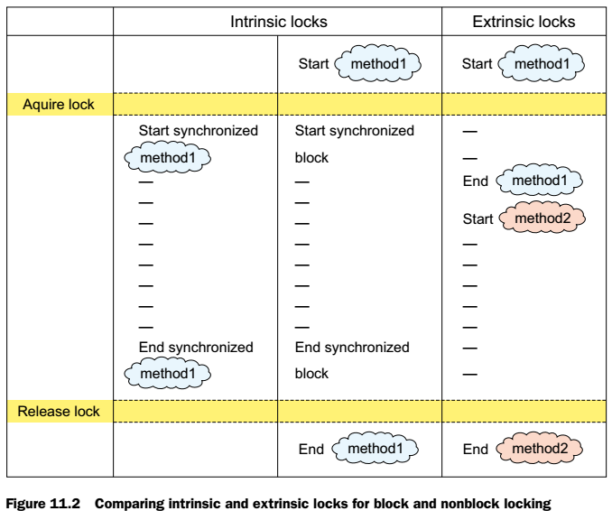{width="4.708333333333333in"
height="3.9305555555555554in"}

### Interface ReadWriteLock

Sadasdas

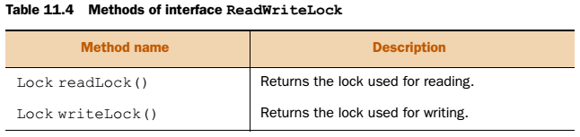{width="4.486111111111111in" height="1.0625in"}

### Class ReentrantReadWriteLock

### Atomic variables

Adsdasd

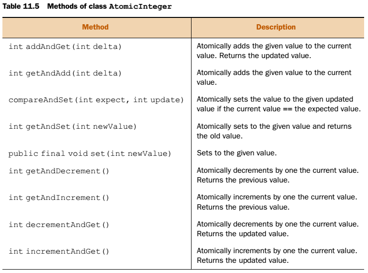{width="5.270833333333333in"
height="3.9166666666666665in"}

## Executors

Chapter 10'da yeni bir thread yaratmak için Thread sınıfını ve Runnable interface'ini öğrendik. Bu yöntemler bir task ile yakın bir ilişki kurarlar ve küçük uygulamalar ile sorun yaratmazlar. Fakat büyük uygulamalar için thread bağımsızlığı ve thread yönetimi için başka bir yol gereklidir.

Executor Framework'ü yukarıda anlatılmaya çalışılan problem için yani bir task oluşturma işi ile task çalıştırma işini birbirinden ayırmamızı sağlar. Bu framework'ü kullanarak Runnable ve Callable interface'lerini kullanarak thread yaratabiliriz. Bu task'ları Executor'a yeni tasklar oluşturmak için iletebiliriz.

- ExecutorService extends Executor, bu sınıf taskın yaşam döngüsünü ve executor'ı yönetmemizi sağlar.
- ScheduledExecutorService extends ExecutorService, bu sınıf taskın ilerde çalışmasını veya pariyodik tekrar çalışmasını sağlar
- Future, aseknkron taskları temsil eder ve onların durumlarını yönetmemizi sağlar.
- Class Executors defines utility and factory methods for interfaces Executor, ExecutorService, and ScheduledExecutorService.

Aşağıda bahsedilen sınıf ve arayüzleri görebiliriz. (java.util.concurrent)

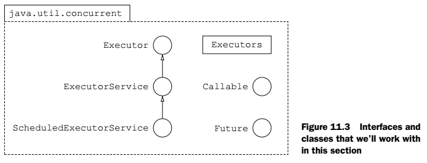{width="5.020833333333333in"
height="1.9166666666666667in"}

### Interface Executor

Thread sınıfını ve Runnable arayüzünü kullanarak task onu çalıştıran thread tarafından çalıştırılmış olur ve yakınen birbirlerine bağlıdırlar. Executor interface'i bir Runnable task'ı nasıl çalıştıracağını bilen sınıfları vardır. Ayrıca task submission 'u ile task execution'u ayırmamızı sağlar. Bu arayüzünü sole(tek, biricik) metodunu implemente ederek bir taskı çalıştırmak için şunları belirleyebiliriz;

- Önce hangi task çalıştırılacak,
- Taskları çalıştırma sırasını
- Aynı anda kaç adet task çalıştırılacak
- Sıraya kaç adet task alınacak

```java
void execute(Runnable)
```

Chapter11.s3.Hotel sınıfında bir kod var. İnceler isek task oluşturulması Hotel sınıfında, task çalıştırılması ise Order sınıfında yapılarak bu iki iş birbirinden ayrılmış oluyor.

Calling start() on a Thread instance starts a new thread of execution. Calling run() on a Runnable instance executes the thread in the same thread of execution.

### Interface Callable

Runnable ve Callable interface'lerini karşılaştıracak olur isek, Runnable'ın run metodu dönüş değeri döndürmez ve checked exception fırlatamaz. Bu iki durum Callable'da handle edilmiştir.

```java
public interface Callable<V> {
   /**
   * Computes a result, or throws an exception if unable to do so.
   *
   * @return computed result
   * @throws Exception if unable to compute a result
   */

   V call() throws Exception;
}

```

Bir önceki örnekteki Orders sınıfı şu şekilde yazılabilidi.


```java
class Order implements Callable<Void> {
   String name;
   Order(String name) {this.name = name;}
   @Override
       public Void call() throws Exception {
     System.out.println(name);
     if (name.equalsIgnoreCase("berry"))
                throw new Exception("Berry unavailable");
     return null;
   }
}

```

Biz burada call değeri dönüş değeri işimize yaramadığı için Void ile tanımlayabiliriz. (If you don't want your Callable to return a value, you can create it using Callable\<Void\>)

### Interface ExecutorService

Bu interdace Executor interface'inden extend olmuştur ve kendine gönderilen task'ların yönetiminden ve sonlandırılmasından sorumludur. Şu metodları tanımlar;

- Submit single Runnable and Callable objects for execution, returning Future objects
- Submit multiple Runnable objects for execution, returning Future objects
- Shut down the ExecutorService, allowing or disallowing submitted tasks to be completed

Aşağıdaki tabloda ise ScheduledService interface'i medtodları bulunur.

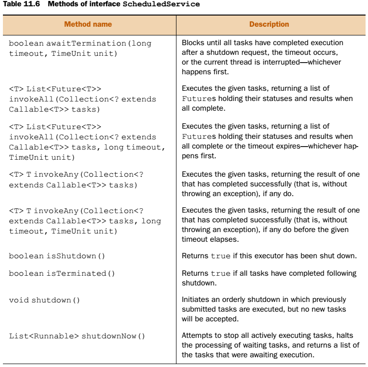{width="5.256944444444445in" height="5.25in"}

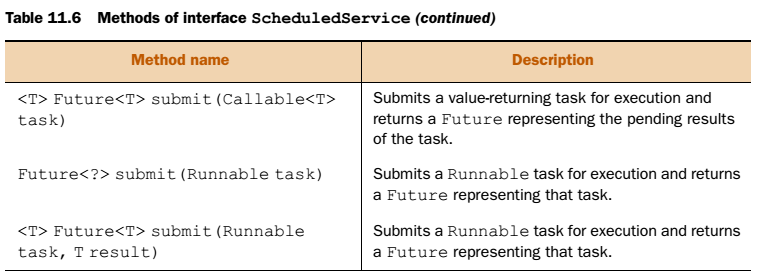{width="5.270833333333333in"
height="1.9097222222222223in"}

### Thread pools

Bir restorantta tek bir aşçı olduğunu düşünelim. Müşteri arttıkça bir aşçı yetişemeyecek ve birden fazla aşkı tutacaksınız. Bazı durumlarda aşçı sayısını arttırmak da soruna çözüm olmayacak çünkü aşçılar aynı kaynakları kullandıkları için onları beklemek zorunda kalabileceklerdir.(Mesela fırını, buzdolabını,vb gibi) Ayrıca aşçılar iş yapmasa bile restoran kaynaklarını tüketeceklerdir.(Mutfakta fiziksel alan, parasal zaman) Eğer mutfağı sürekli bu aşçılar ile doldurur isek
mutfakta yer kalmayabilir. Uygulamalarımızda da "*exhaustion of physical resources*" uygulamamızın crash olmasına sebebiyet verebilir.

Yukarıda tanımlanan durumu önlemek için uygulamamızda aynı anda koşan thread sayısını sınırlamalıyız. Bu problemin çözümü "Thread pools" dur. Amaç schuler'ı doldurmadan ve performansı azaltmadan işlemciyi optimum düzeyde kullanmaktır.

Executors sınıfı birden fazla öntanımlı thread pool alan statik metodlara sahiptir. Bunlar;

- Fixed thread pool, which creates a pool with a fixed number of threads
- Cached thread pool
- Single thread executor
- Scheduled thread pool

Chapter11.s3.Hotel2 sınıfında Thread pool'a gönderilen Callable nesneleri vardır. Burada thread pool'a submit ile yeni işler ekleniyor. shutDown ile yeni iş eklenmesi kapatılıyor ve halihazırda çalışan thread'lerin bitmesi bekleniyor. shutDownNow ise yeni iş eklemeyi kapatırken halihazırda çalıaşn thread'leri bitiriyor. awaitTermination ise shutdown isteğinden sonra bütün threadlerin bitmesini veya timeout bitinceye kadar kodun ilerlemesini durduruyor.

### Interface ScheduledExecutorService

Bu interface gelecek veya periyodik thread çalıştırmamızı sağlar. Bütün çalışanlara hatırlatıcı email'i göndereceğimizi varsayalım. Chapter11.s3.ReminderMgr sınıfında örnek kod vardır. Bu kod çalıştırılınca ve her 24 saatte bir Runnable sınıfında tanımlanan işi çalıştırır. Aşağıda metodları vardır. Mesela örneğimiz scheduleAtFixedRate metodu ile yazılmıştır.

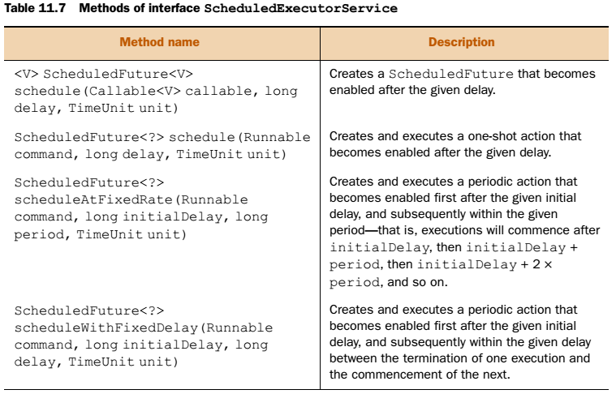{width="5.270833333333333in" height="3.375in"}

## Parallel fork/join framework

Java 7 ile gelen fork/join framework multi-cpu işlemcilerde halihazırdaki Concurrency sınıflarını genişleterek donanımsal olarak paralel işler yapmamızı sağlar. Büyük işlemleri böler, küçük parçaları işler ve sonucu birleştirir.

Bu framework işlemci yoğunluklu uygulamalar ve parçalanarak paralel olarak birbirinden bağımsız çalışabilen uygulamalar için tasarlanmıştır. Blok görevler, I/O kullanan işlemler veya senkronizasyon gerektiren işlemler için uygun değildir.

Aşağıda fork/join framework'ün "divide-and-conquer" algoritması görülmektedir.

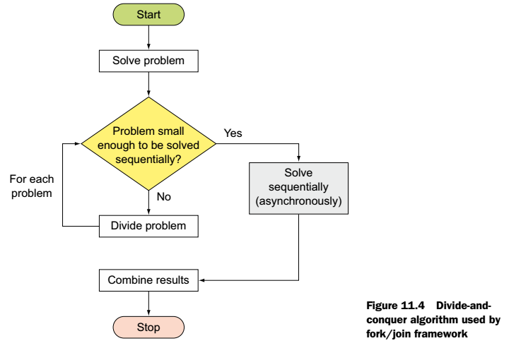{width="5.0in" height="3.423611111111111in"}

Şemadan görüldüğü üzere framework işe başlamadan problemin boyutuna bakar, tanımlanan limitten küçük ise hemen işler, büyük ise problemi parçalara ayırır ve paralel olarak birbirinden bağımsız parçalar olarak sonucu hesaplar ve çıkan sonuçları birleştirerek sonucu elde eder.

ForkJoinPool sınıfı bu framework'ün concrete halidir. Bu sınıf önceki chapter'da işlenen ExecutorService interface'ini implemente eder. ExecutorService'e benzer fakat ForkJoinPool "work-stealing algorithm" kullanır. Bu algoritma = when worker threads run out of tasks, they steal tasks from other worker threads to avoid blocking waiting threads.

Aşağıdaki şemada bu algoritma çalışması gösterilmiştir. Threadler kendi işlerini bir Deque'da tutuyor ve sürekli bu kuyruğu işliyorlar. Eğer kuyruları bitip iş kalmaz ise diğer thread'lerin kuruklarındaki işleri yapıyorlar.

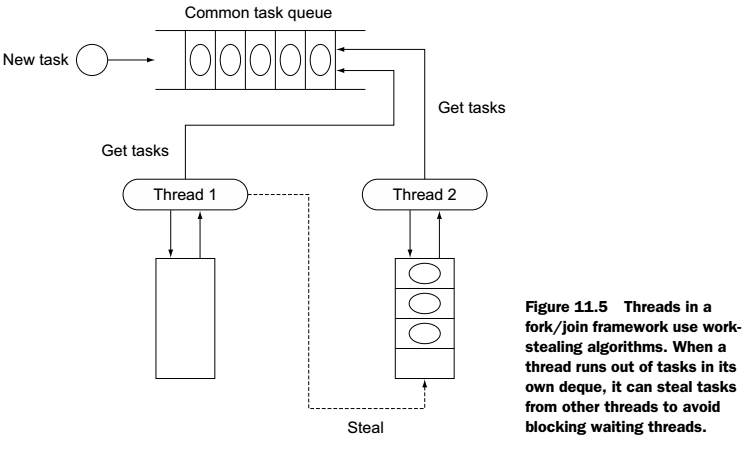{width="5.166666666666667in"
height="3.1180555555555554in"}

ForkJoinPool sınıfı ForkJoinTask türünde olmayan client'lar(management ve monitoring taskları) için giriş noktası sağlar. Problem çözen classımız ForkJoinTask'ın subclass'ı olmalıdır. ForkJoinTask, ForkJoinPool içinde koşan bütün taskların abstract base'idir. ForkJoinTask bir thread'in hafif bir versiyonu gibi düşünebiliriz. Birçok ForkJoinTask, ForkJoinPool içinde çalıştırılır. Aşağıdaki şekilde bu sınıflar ve bu sınıfların 2 alt sınıfı RecursiveTask ve RecursiveAction sınıfları görülebilir. RecursiveAction sonuç döndürmeyen hesaplamaları, RecursiveTask ise sonuç döndüren hesaplamaları yapar.

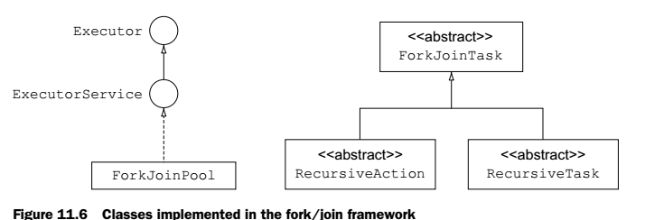{width="4.958333333333333in"
height="1.6944444444444444in"}

Şimdi bu sınıfların bir örneğini yapalım. Chapter11.s4.CalcSum sınıfında 100 adet elemanı olan bir dizi elemanların toplamı dizi parçalara ayrılarak fork/join framework ile hesaplanıyor. Örneğimizde önce CalcSum sınıfı "extends RecursiveTask\<Integer\>" sınıfı ile oluşturuluyor. RecursiveTask içinde override etmemiz gereken "compute" sınıfı
bulunuyor. ForkJoinPool instance'ı üzerinde "invoke" metodu çağrılınca compute metodu çağrılıyor. Bu metod ayrıca RecursiveTask instance'ından fork metodu çağrılıncada çalıştırılıyor. 

( In the preceding code, 1 defines class CalcSum, which extends RecursiveTask <Integer>. This parameter, Integer, is the type of the value returned by method compute(). Method compute(), defined at 2, is called once for the main task when invoke() is called on a ForkJoinPool instance, passing it an object of CalcSum. It also gets called when fork() is
called on a RecursiveTask instance. Method compute() calculates the size of an array and compares it with a unit size (15 in this case). If it’s less than this unit size, it computes the sum of its array elements using computeSum() 5. If the array size is greater, it creates an instance of CalcSum, passing it the left half of the array, and the code at 3 calls fork() on it. Calling fork executes a RecursiveTask asynchronously. Then method compute() creates another instance of CalcSum, passing it the right half of the array. At 4, it calls compute() on the right part and join() on the left part. Calling compute() will recursively create (left and right) CalcSum objects, if it still needs to be divided into smaller tasks. Calling join() will return the result of the computation when it’s done. Method main() creates an array intArray and initializes it by generating random integer values using class Random. The code at 6 creates a ForkJoinPool. The code at 7 calls invoke(), which executes the given task, returning its result on completion. )