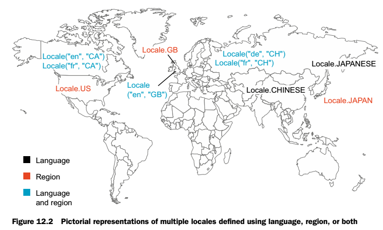
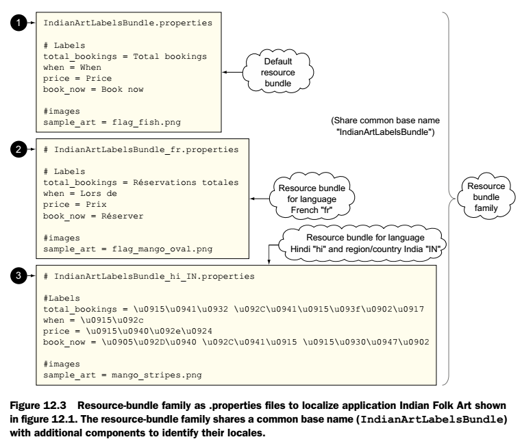
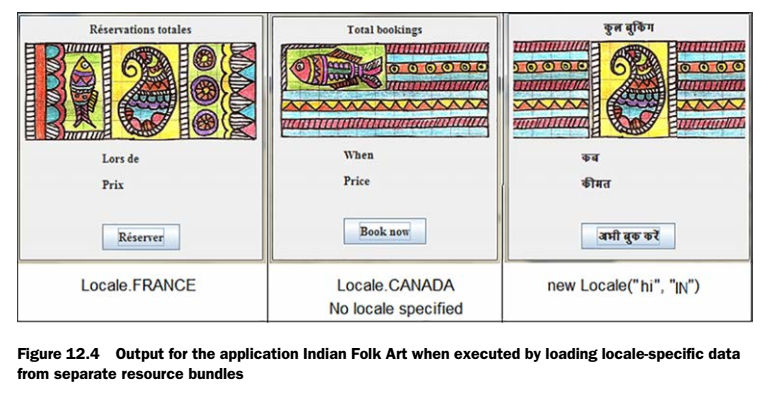
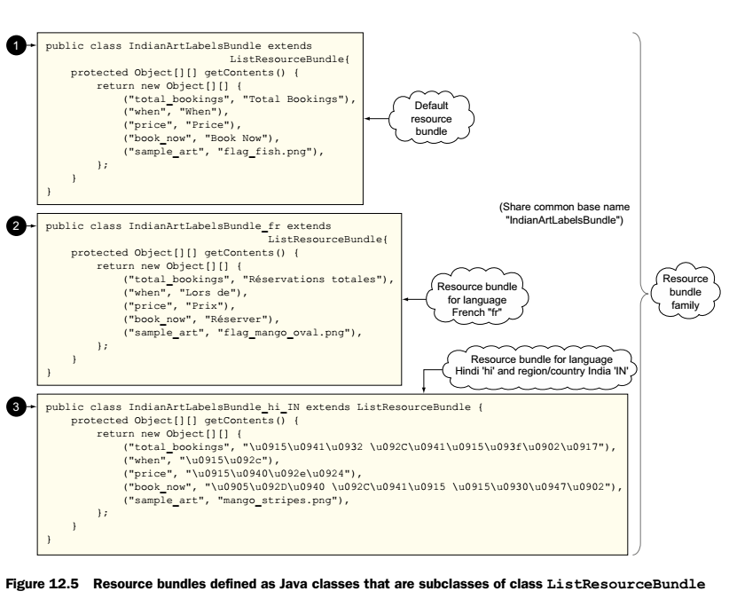
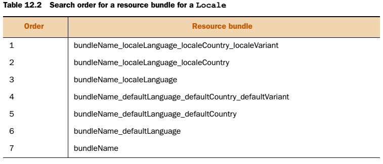
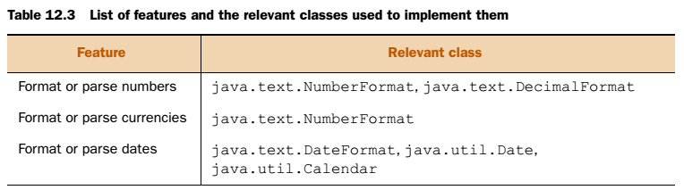
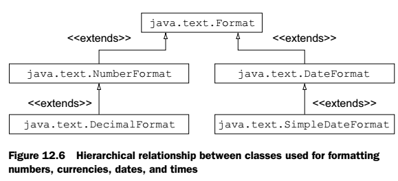
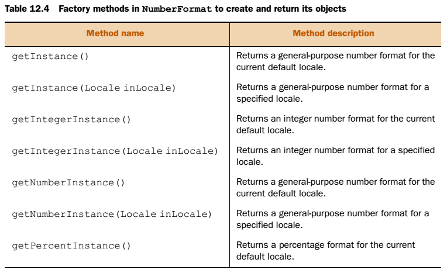
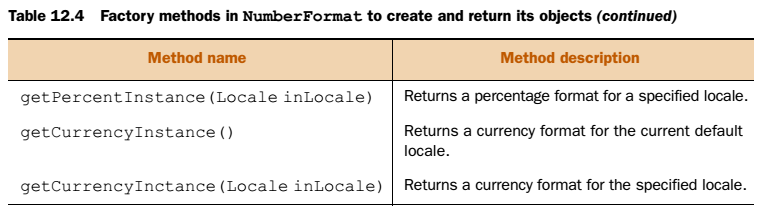
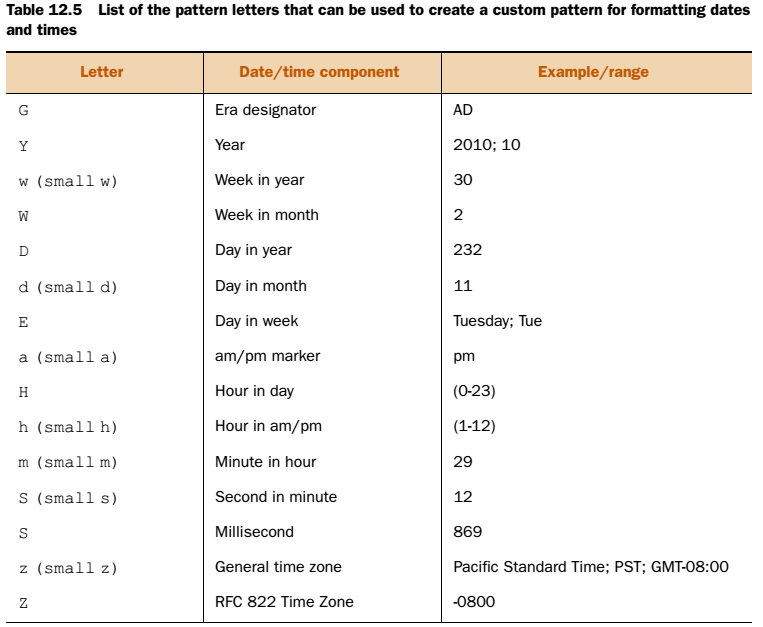

[12 Localization](#localization)

[12.1 Internationalization and localization](#internationalization-and-localization)

[12.1.1 Advantages of localization](#advantages-of-localization)

[12.1.2 Class java.util.Locale](#class-java.util.locale)

[12.1.3 Creating and accessing Locale objects](#creating-and-accessing-locale-objects)

[12.1.4 Building locale-aware applications](#building-locale-aware-applications)

[12.2 Resource bundles](#resource-bundles)

[12.2.1 Implementing resource bundles using .properties files](#implementing-resource-bundles-using-.properties-files)

[12.2.2 Implementing resource bundles using ListResourceBundle](#implementing-resource-bundles-using-listresourcebundle)

[12.2.3 Loading resource bundles for invalid values](#loading-resource-bundles-for-invalid-values)

[12.3 Formatting dates, numbers, and currencies for locales](#formatting-dates-numbers-and-currencies-for-locales)

[12.3.1 Format numbers](#format-numbers)

[12.3.2 Format currencies](#format-currencies)

[12.3.3 Format dates](#format-dates)

[12.3.4 Formatting and parsing time for a specific locale](#formatting-and-parsing-time-for-a-specific-locale)

[12.3.5 Formatting and parsing date and time together for a specific locale](#formatting-and-parsing-date-and-time-together-for-a-specific-locale)

[12.3.6 Using custom date and time patterns with SimpleDateFormat](#using-custom-date-and-time-patterns-with-simpledateformat)

[12.3.7 Creating class Date object using class Calendar](#creating-class-date-object-using-class-calendar)


# Localization

Locale 				Yerel

Localization 		Yerelleştirme

## Internationalization and localization

Yazdığımız programların kullanıcı deneyimlerini maksimum düzeyde tutmak için kullanıcı ülkesine göre değişiklikler yapılabilir. Bunlar yazıların dili, tarihlerin formatı, ücret tutarlarının biçimi ve numaraların formatlanma şekli olabilir.

Internationalization ve localization kavramları bu anlamda devreye girer. Internationalization, bir uygulamanın farklı yerel bölgelere adapte olma yeteneğidir. localization ise yazılımımızı yerel bölgeye göre özelleştirmemize denir, mesela text leri o dile çevirmek. Bu iki kavramı abstraction ve bir nesneyi özelleştirmeye benzetebiliriz.

Internationalization 	*i18n* 				(i ve n harfleri arasında 18 harf var)

Localization				 *l10n* 				(l ve n arasında 10 harf var)

### Advantages of localization

Dünya üzerindeki birbirinden farklı cografi yerler farklı tarih, saat, sayı ve para birimi kullanırlar. Mesela tarihler United States (8/30/73), United Kingdom (30/08/73), Germany (30.08.73) şeklinde gösterilir. Aynı şekilde para birimleri ise, United States (\$), the United Kingdom (£), France (€), ve Germany (€) şeklindedir. David Brower'ın "Think globally, act locally." sözü bu durumu açıklar. Programcının yazılımı dünyanın herhangi bir yerinde kullanılabilir. Bu yüzden localization\'ı iyi kullanmalıdır. Localization yararları şunlardır:

- Daha iyi kullanıcı deneyimi,
- Bilgiyi doğru durumlarda çevirmek(Yukardaki tarih formatlama örneği)
- Kültürel hassas bilgiler(Bayram tarihleri)

### Class java.util.Locale

Locale Java\'da belirli coğrafi, politik veya kültürel bölge olarak tanımlanmıştır. Aşağıdaki harita locale\'i dile, ülkeye veya hem dile hemde ülkeye göre sınıflandırmıştır.

{width="5.361111111111111in"
height="3.2222222222222223in"}

Bu iş için \"Locale\" sınıfı kullanılır. bU SINIF NUMARALARI, TARİHLERİ VE PARA BİRİMLERİNİ FORMATLAMAK İÇİN HİÇBİR METOD SUNMAZ! sadece kullanıcı bölge bilgisini encapsule eder(Bölgeye özel verileri sağlar.),
formatlama işini locale\'e göre NumberFormat veya DateFormat gibi sınıflar üstlenir.

### Creating and accessing Locale objects

Locale sınıfını 4 şekilde olşturur ve kulanırız;

- Constructors of class Locale
- Locale methods
- Locale constants
- Class Locale.Builder

**1- Locale sınıfının Constructor kullanarak**

```java
Locale(String language)
Locale(String language, String country)
Locale(String language, String country, String variant)
// Bazı örnekleri
Locale french = new Locale("fr");
Locale germany = new Locale("de", "DE");
Locale japan = new Locale("ja", "JP", "MAC");

```

NOT: Language en önemli parametredir ve overloaded metodlarında bile ilk parametredir! bunu unutma, sınavda ikinci parametre yazarak şaşırtma yapılabilir! Ayrıca bu 3 parametreye geçersiz bir değer girer isek hiçbir hata fırlatmaz !!!

Language 					2 harf 								   küçük harf

Country or region 		2 harf veya 3 rakam 			büyük harf

Variant vendor veya browser özel kod, WIN veya MAC

Aşağıda listeyi görebiliriz, sınav ezberlememizi istemez sadece en, US, and fr bilsek kafidir.

**Commonly used country and region codes (ISO-3166)**

| Tanım | A-2 code |
|---|---|
| United States of America | US |
| United Kingdom  | GB |
| France  | FR |
| Germany  | DE |
| Italy | IT |
| Spain | ES |
| Japan | JP |
| Korea | KR |
| China | CN |


**2-Locale sınıfı static metodları ile**

JVM\'in default locale değerine şu metodla ulaşabiliriz;

```java
public static Locale getDefault()
```

NOT: Locale.getDefault-Locale(), System.getLocale(), and System.getDefaultLocale() hepsi yanlış!!!

**3-Locale sabitleri kullanarak**

Locale sınıfı bir bölge,dil veya her ikisine ulaşmak için sabitler içerir. Örneğin Locale.US, Locale.UK, Locale.ITALY, Locale.CHINESE, Locale.GERMAN gibi.

NOT: Eğer Locale sınıfını dil sabiti ile tanımlarsak, bölge sabiti tanımsız kalır. Buna dikkat edilmelidir. Mesela
(Locale.FRENCH)Locale.***ITALIAN*** ile tanımlarsak locale içinde sadece language parametresi fr bulunur, counrty bulunmaz. (region bulunmaz). Ama ***(***Locale.FRANCE) Locale.***ITALY*** ile tanımlar isek hem language hem de country alanları tanımlıdır. Yazdırır isek fr\_FR yazar.)

chapter12.s1.LocaleClass() sınıfında örnek kod vardır.

**4-Locale.Builder kullanarak**

Java 7 ile birlikte Locale nesnesi oluşturmak için Locale.Builder sınıfı kullanılabilir. Şu şekilde oluşturulur;

```java
Locale.Builder builder = new Locale.Builder();
builder.setLanguage("fr");
builder.setRegion("CA");
Locale locale = builder.build(); 
```

**5-Locale nesnesi hakkında bilgi almak**

chapter12.s1.LocaleMethods() sınıfında örnek kod vardır. Locale.getDefault u yazdırır isek JVM'in default Locale'ini tr\_TR olarak yazar. Locale in setDefault metodu ile JVM'in default Locale'ini set edebiliriz.

Sistemde tanımlı bütün Locale 'leri listelemek için ise;

```java
Locale[] all = Locale.getAvailableLocales();
```

kullanılır.

NOT: Locale sınıfını yazdırır isek doğal olarak toString metodu çağrılır. Locale sınıfının toString metodu language + "_" + country + "_" + (variant + "_#" | "#") + script + "-" + extensions  şeklinde değişkenleri yazar.

Locale sınıfının equals fonksiyonu ise bu alanları karşılaştırarak locale'in aynı olup olmadığına karar verir. Eğer Locale'i yazdırınca aynı çıkıyor ise nesnelerde aynıdır.

### Building locale-aware applications

Bölge farkında programlar yazmak için öncelikle programda bölgeye göre değişiklik gösteren verinin tespit edilmesi lazımdır. İkinci aşama bölgeye göre değişecek data ile çalışan kod parçalarını tespit etmek ve buna uygun sınıflar yazmaktır. Üçüncü olarak ise uygulamanın destekleyeceği bölgeleri belirlemek ve bu bölge ayarlarını resource bundle'larda saklamak gerekir.

## Resource bundles

Uygulamamızın birden fazla Locale'i desteklemesi için locale ile ilgili bilgileri "Resource Bundle" larda tutarız. Bu dosyaları oluşturmak için Java API bize java.util.ResourceBundle abstract sınıfını sunar. Locale specific datalar(metin, icon, etiket, resim vs.) bu dosya içinde tutulur. Birden fazla resource bundle birleşerek resource bundle ailesini oluşturur. Bu ailenin ortak bir ismi ve Locale'i belirten dil, bülge ve variant isimleri vardır.

Bu arayüzü implemente eden ListResourceBundle ve PropertyResourceBundle sınıfları bulunur. Uygulamamızı .property veya iki boyuntlu Object sınıfları kullanarak localize edebiliriz.

### Implementing resource bundles using .properties files

Örnek olarak bir uygulamayı farklı dillerde yazacağız. Aşağıda bu uygulamaya ait .properties dosyaları ve ilgili key-value çiftleri görünmektedir. Bu dosyada keyler sabit olup value'lar değişmektedir.

{width="5.291666666666667in"
height="4.541666666666667in"}

Yukarıda 3 adet .properties dosyası vardır. Bunların herbiri "resource bundle" ve bu 3'ü ise "resource bundle family" dir. Bu ailenin adı IndianArtLabelsBundle'dır.

- IndianArtLabelsBundle.properties (1 in figure 12.3)
- IndianArtLabelsBundle\_fr.properties (2 in figure 12.3)
- IndianArtLabelsBundle\_hi\_IN.properties(3 in figure 12.3)

Bu 3 resource'da aynı keyler, farklı value'lar vardır. Bundle dosyalarının ve sınıfların proje içinde doğru yerleştirilmesi
gerekmektedir. Bundle dosyaları src klasörü [içine] veya bin klasörü [içine] konur!

chapter12.s2.ResourceBundleClass sınıfı içinde örnek vardır.

```java
ResourceBundle labels = ResourceBundle.getBundle("resource-bundle.IndianArtLabelsBundle", new Locale("hi", "IN"));
```

Yukarıdaki satır bundle'ı yükler. Bu satırda "resource-bundle" klasörü içinde IndianArtLabelsBundle common name'inin Locale'de belirtilen dil paketi yüklenir. Yani IndianArtLabelsBundle_hi\_IN.properties dosyasını yükler. İlk parametre dosya yeri, ikinci parametre de aile içinde hangi versiyonun seçileceğini belirler. İkinci parametreyi almayan hali sadece IndianArtLabelsBundle.properties dosyasını yükler. İkinci parametre yazılımda tanımlanmayan bir locale belirtseydi yine default olan yüklenirdi! Eğer Locale.CANADA\_FRENCH seçilseydi yine uzantısı fr olan yüklenirdi. Aşağıda bazı Locale
ayarlarına göre oluşabilecek ekranlar gösterilmiştir.

{width="5.326388888888889in"
height="2.7291666666666665in"}

getBundle metodu ResourceBundle arayüzünden türetilen PropertyResourceBundle tipinde sınıf döndürür. Şimdi ise
ListResourceBundle sınıfı ile bu işi yapacağız.

### Implementing resource bundles using ListResourceBundle

Yukarıda .properties dosyaları ile yaptığımız işi Java class'ları ile de yapabiliriz.

chapter12.s2.ResourceBundleClassWithoutProperties sınıfı içinde örnek vardır. 

{width="5.708333333333333in" height="4.75in"}

### Loading resource bundles for invalid values

Eğer resource-bundle family ismi yanlış olursa veya dosyayı bulamaz ise getBundle metodu şu hatayı fırlatır;

Exception in thread \"main\" java.util.MissingResourceException: **Can\'t find bundle for base name XYBundle**, locale ja\_JP

Eğer belirttiğimiz Locale kod içinde yok ise, aşağıdaki tablodaki sıraya göre Locale aranır.

{width="5.256944444444445in"
height="2.2569444444444446in"}

Mesela; sistemimizin default Locale i en\_US. Aşağıdakilerden hangisi Locale.FRANCE için yüklenir ? (Fransa için bölge FR ve dil fr 'dir.)

- MyResourceBundle\_de\_DE.properties
- MyResourceBundle\_de.properties
- MyResourceBundle\_FR.properties
- MyResourceBundle.properties

Fransa için kod tam olarak MyResourceBundle\_fr\_FR.properties dosyasını arar. Bu olmadığı için MyResourceBundle\_fr.properties dosyasını arar. Bu da olmadığı için JVM default'u olan MyResourceBundle\_en\_US.properties arar. O da olmadığı için sistem MyResourceBundle.properties dosyasını yükler.

Not: Eğer hiçbiri bulunamaz ise MissingResourceException hatası fırlatılır.

Diğer örnek ise; sistem Locale'i Locale.JAPAN olsun. de\_DE için sırayla şu Locale'ler aranır.

> MessagesBundle\_de\_DE.properties\
> MessagesBundle\_de.properties\
> MessagesBundle\_ja\_JP.properties\
> MessagesBundle\_ja.properties\
> MessagesBundle.properties

## Formatting dates, numbers, and currencies for locales

Belirli bir Locale'e göre formatlama yapmak için aşağıdaki Class'lar kullanılır.

{width="5.305555555555555in"
height="1.4791666666666667in"}

NumberFormat ve DateFormat sınıfları Abstract sınıflardır ve bu static metodlar içerirler. Bu metodlarla(getInstance()) bu sınıf nesnelerinden oluşturulur. Aşağıda bu sınıflar arası ilişkiler vardır.

{width="4.020833333333333in"
height="1.8333333333333333in"}

### Format numbers

NumberFormat sınıfı sayıları belirli bir Locale'e göre formatlar. İki metodla instance'ını oluştururuz. getInstance() ve getInstance(Locale) kullanarak. Bu sınıf abstract olduğu için bize concrete sınıfının nesnesini döndürür. Bu sınıfı elde ettikten sonra parse ve format metodları ile istediğimiz şekilde formatlama yapabiliriz.

chapter12.s3.FormatNumbers sınıfı içinde örnek vardır. Önemli olan NumberFormat.getInstance() metodudur. Ona geçilen default veya specific locale bilgisine göre sayıları formatlar. Aşağıda NumberFormat sınıfının factory metodları listelenmiştir.

Format metodu Double,long formatlar

Parse metodu String formatları

{width="5.305555555555555in"
height="3.2430555555555554in"}

{width="5.305555555555555in"
height="1.4652777777777777in"}

Melesa getPercentInstance() metoduna 0.98 verir isek bize Locale'e göre %98 olarak yazdırır. Örnek kod chapter12.s3.FormatNumbers içinde vardır. Eğer 1 den büyük sayı formatlamak için verirsek %100'ün üstündeki
değerleri gösterir. 3.5 in değeri %350 olarak görünür.

**getPercentInstance** 		sayıyı "% 365" olarak formatlar.

**getCurrencyInstance** 	sayıyı "3,65 TL" olarak formatlar.

**getIntegerInstance** 		sayıyı "4" olarak sadece tamsayıya yuvarlar(buçuğun altı aşağıdaki sayıya, üstü yukardaki sayıya yuvarlanıyor.)

**getNumberInstance** 		sayıyı "3,647" olarak formatlar.

**getInstance** 					yukardakinin aynısı


(Sayı 3.647342 ise her zaman 2 haneye yuvarlar)

(Hepsi nin Locale parametresi alan overloaded halleri vardır.)


### Format currencies

**NumberFormat.getCurrency()** seçilen Locale deki para birimini yazdırır. **"TRY"**

**NumberFormat.getCurrencyInstance()** yukarıdaki chapterdaki gibi sayıyı para biriminde formatlar.

Bu formatlar Locale de tanımlı para simgesini sayının sağına veya soluna o ülkede nasıl yazılıyor ise o şekilde ekler. Örnek kod chapter12.s3.FormatCurrency içinde vardır.

Buradaki örnekte japon yen simgesini konsolda yazdırınca çıkmaz. Ama swing uygulamasında yazdırsaydık çıkardı. Sebebi Windows consolunda kullanılan font'ların, swing kadar çok Unicode seti desteklemiyor olmasıdır.

Bu iki chapter'da önemli olan verilen senaryoya göre ihtiyaç olan metodları bulmaktır. Numaraları ve para birimlerini formatlamak için NumberFormat sınıfına ihtiyacımız vardır. Default locale kullarak formatlamak için bu arayüzün instance'ını NumberFormat.getInstance() veya getNumberInstance() ve getCurrencyInstance() metodlarıyla elde
ederiz. Specific locale için ise bu metodların Locale parametresi alan overloaded hallerini kullanırız.

### Format dates

Tarih ve zamanı formatlamak için DateFormat abstract sınıfı kullanılır. Bu sınıfı oluşturmak için ise sınıf bize birçok statik metod sunar. Bu statik metodlar bize bu abstrack sınıfın alt sınıfı olan SimpleDateFormat sınıfında instance'lar oluşturur. Bu instance'ı kullanarak format ve parse metodları ile istediğimiz şekilde formatlama yapabiliriz.

DateFormat sınıfında tanımlanan static factory metodlar şu şekildedir;

```java
static DateFormat getInstance()
static DateFormat getDateInstance()
static DateFormat getDateInstance(int style)
static DateFormat getDateInstance(int style, Locale aLocale)
static DateFormat getDateTimeInstance()
static DateFormat getDateTimeInstance(int dateStyle, int timeStyle)
static DateFormat getDateTimeInstance(int dateStyle,int timeStyle, Locale aLocale)
static DateFormat getTimeInstance()
static DateFormat getTimeInstance(int style)
static DateFormat getTimeInstance(int style, Locale aLocale)
```

aLocale 									 A specific locale for which you need to format your date value
style, dateStyle, timeStyle 		One of the following integer constant values defined in DateFormat

- DateFormat.SHORT: is completely numeric, such as 31.07.20 or 10:30 pm
- DateFormat.MEDIUM is longer, such as Jul 31, 2020 or 10:30:17 pm
- DateFormat.LONG is longer, such as July 31, 2020 or 3:30:32 pm PST
- DateFormat.FULL is pretty completely specified, such as Saturday, July 31, 2020 AD or 10:30:32 pm PST

getDateTimeInstance metodunda eğer dataStyle parametresi timeStyle parametresinden daha ayrıntılı ise dataStyle baskın çıkar ve çıktı FULL olarak formatlanır.

Örnek kod chapter12.s3.FormatDates içinde vardır. getDateInstance() şu şekilde formatlar;

> Default Locale:
>
> FULL :14 Ekim 2017 Cumartesi
>
> LONG :14 Ekim 2017 Cumartesi
>
> MEDIUM :14.Eki.2017
>
> SHORT :14.10.2017

Sadece getInstance() parametre almaz çünkü tarih ve zamanı SHORT olarak formatlar.

Aynı şekilde konsolda çince karakterler çıkmaz. Çünkü konsolun kullandığı Font çince harflerin bulunduğu Unicode karakter setini desteklemez.

### Formatting and parsing time for a specific locale

Yukarıdaki örnekte Tarihleri fotmatladık. Zamanı formatlama için aşağıdaki metodlar kullanılır.

```java
static DateFormat getTimeInstance()
static DateFormat getTimeInstance(int style)
static DateFormat getTimeInstance(int style, Locale aLocale)
```

Örnek kod chapter12.s3.FormatTimes içinde vardır. Örnek çıktı,

> Default Locale:
>
> FULL :14:13:25 EET
>
> LONG :14:13:25 EET
>
> MEDIUM :14:13:25
>
> SHORT :14:13

### Formatting and parsing date and time together for a specific locale

Tarih ve zamanı beraber formatlamak için ise;

```java
static DateFormat getDateTimeInstance()
static DateFormat getDateTimeInstance(int dateStyle, int timeStyle)
static DateFormat getDateTimeInstance(int dateStyle, int timeStyle, Locale aLocale)
```

Örnek kod chapter12.s3.FormatDateAndTimes içinde vardır. Örnek çıktı,

> Default Locale:
>
> FULL :14 Ekim 2017 Cumartesi 14:16:13 EET
>
> LONG :14 Ekim 2017 Cumartesi 14:16:13 EET
>
> MEDIUM :14.Eki.2017 14:16:13
>
> SHORT :14.10.2017 14:16

getDateTimeInstance() metodunda dateStyle parametresi daha ayrıntılı ise sonuç ayrıntılı yazılır, ikinci parametre ignore edilir.

Liberal 		Genel

Eleborate 	Ayrıntılı

### Using custom date and time patterns with SimpleDateFormat

Hazır sunulan DateFormat parametreleri(FULL,LONG vs) yerine kendi formatımızı yaratabiliriz;

```java
SimpleDateFormat()
SimpleDateFormat(String pattern)
SimpleDateFormat(String pattern, Locale locale)
```

Mesela gün,ay ve yılı sayılar halinde tire kullanarak yazdırmak istiyor isek;

```java
Date date = new Date();
SimpleDateFormat defaultFormatter = new SimpleDateFormat("yyyy-MM-dd");
System.out.println(defaultFormatter.format(date));
```

Bu kodun çıktısı 2 agustos 2020 yılı için "2020-08-02" olur. Eğer formatlar iken MM yerine şunları kullanır isek;

|  |  |
|---|---|
| new SimpleDateFormat("yyyy-M-dd"); | Prints   “2020-8-02”  |
| new SimpleDateFormat("yyyy-MMM-dd"); | Prints   “2020-Aug-02” |
| new SimpleDateFormat("yyyy-MMMM-dd"); | Prints   “2020-August-02” |
| new SimpleDateFormat("'Day' EE', 'dd'th' MMM yyyy") | Prints   “Day Sun,02th Aug 2020” |


Yukarıdaki bütün formatlamalar ikinci parametre olarak Locale girilerek istenilen Locale'de formatlanabilir. Aşağıdaki tabloda format için kullanabileceğimiz kısaltmalar mevcuttur.

{width="5.298611111111111in"
height="4.354166666666667in"}

Burada büyük ve küçük harfler yanıltıcı olabilir. Mesela "m" harfi saatin dakikasını gösterir, yılın ayını değil!

### Creating class Date object using class Calendar

DateFormat ve SimpleDateFormat sınıfları format metodunu kullanır iken Date sınıfını kullanırlar. Fakat date sınıfının birçok metodu deprecate olmuştur. Bu sebepten Date sınıfını sadece günün tarihi ve zamanını almak için kullanınız! Diğer tarihleri yaratmak için;

1. Günün zamanı ile Calendar sınıfı nesnesinden oluştur.
2. Calendar sınıfını set metodlarından biri ile istediğin zamanı set et.
3. Calendar sınıfının getTime() metodu ile Date objesini elde et.

Calendar sınıfının bazı set metodları;

- set(int year, int month, int date)
- void set(int year, int month, int date, int hourOfDay, int minute)
- void set(int year, int month, int date, int hourOfDay, int minute, int second)

Örneğin;

```java
Calendar cal = Calendar.getInstance();
cal.set(1973, Calendar.AUGUST, 30, 14, 10, 40);
Date date = cal.getTime();
```

NOT: Gerçek projelerde hiçbir zaman ay ve günü elle vermeyin, bunun için sabitleri kullanınız! Çünkü ay olarak sabitler kullanılıyor ve bunlar 0'dan başlıyorlar. Elle yazar isek bir ay sonrasını belirtmiş olabiliriz ve bu da yanlışlığa sebebiyet verir.(Calendar.JANUARY nin indeksi = 0 dır.) Gün olarak da aynı şekilde.(Calendar.SUNDAY in indeksi=1 'dir.)

Calendar.getTime() Date nesnesi döndürür.

> Date.getTime() long değer döndürür. (January 1, 1970, 00:00:00 GMT tarihinden beri geçen milisaniyeyi)

Örnek kod chapter12.s3.CalendarClass içinde vardır.