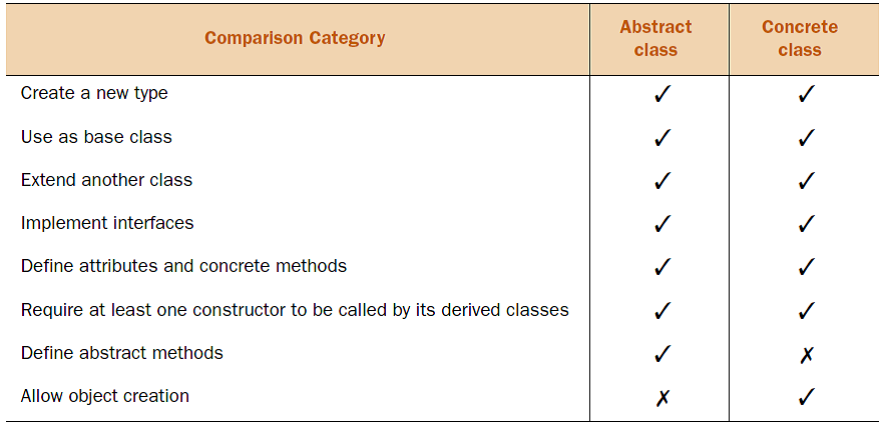
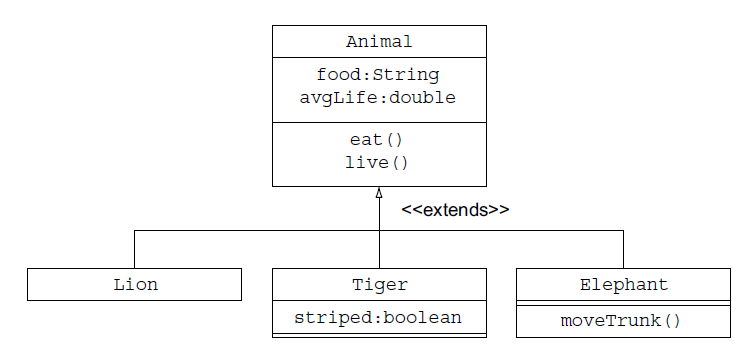

[2.1 Abstract Classes](#abstract-classes)

[2.2 Static and Final](#static-and-final)

[2.2.1 Nonaccess Modifier -- Final](#nonaccess-modifier-final)

# Advanced class design

## Abstract Classes

Soyut sınıfları bir örnek ile açıklayalım. Eşin senden bir demet çiçek getirmeni istedi. Burada istediğin tür çiçeği getirebilirsin. Çiçeği abstract class'a benzetebiliriz. Flower temel özellikler ve davranışları temsil eder. Fakat her çiçeğin kendine has kokusu, şekli, boyu vardır.

Abstract Class cant instantiate but abstract başka bir sınıf yaratmak veya derivated concrete class yapmak için extend edebilirsin.



Abstract metodlar implemente edilmelidir. ÖRNEk sınıf yapımız şu şekildedir;




Animal sınıfı abstract olmalı mıdır? Karar verirken şu 2 sorunun birinin cevabı evet ise olmalıdır.

1. Uygulamam animal sınıfının instance'larını yaratmaya izin veriyor mu?
2. Animal sınıfı bütün derivated'larında genelleştirilemeyen ortak bir davranış içeriyor mu?

Bu örnekte Animal'a ihtiyacımız yok çünkü bize spesifik bir türü lazım. Yani Animal'ı sınıf olarak abstract seçmek gerekmektedir. Yeme(eat) davranışıda her hayvana göre değişir. O zaman eat metodu da abstract olmalıdır. Burada da yeme davranışı genelleştirilemeyen ortak bir davranış olduğundan abstract yapılabilir.

Abstract Class'lar instantiate edilemezler ama constructor'larını ve overloaded constructor'larını tanımlayabiliriz. En az bir constructor derivated'den çağrılmalıdır. Base constructor derivated'dan çağrılmalıdır. Yoksa hata verir.

Abstract metodlar olmasada bir sınıf abstract olabilir.

Fakat;

```java
Animal[] animals = new Animal[2];
```

Satırı çalışır. Ama Animal sınıfı abstract'dır. Dikkat ediniz!

Abstract metod sadece abstract class içinde tanımlanabilir. Concrete Class içinde tanımlanamaz.

Need of Abstract : Aslında abstract class bir nesnenin kısmi tanımıdır. Concrete base class gibi ortak özellikleri ve davranışları gruplar. Fakat nesne instante edilmesi istenmiyorsa base abstract yapılır. Base'in kendi başına nesne yaratmak için yeterli ayrıntıya sahip olmadığını düşünebilirsin. Abstract metodlarile de bu eksik tanımları derivated'da her sınıfın kendi özelliğine göre tamamlatabilirsin.

**Abstract dos and dont's**

- Sadece sınıf instantenelerini engellemek için abstract kullanma. Bunun için class constructorlarının hepsini private yapman yeterlidir.

- Interface'de aynı abstract class method ismiyle implemente etme! Kod derlenmez.

- Abstact Class FINAL ile tanımlanamaz. Çünkü final class extend edilemez ama abstract class edilebilir. Bu yüzden kod derlenmez.

- Abstract class'ı interface'indeki bütün metodları implemente etmesi için zorlama. Bunlar abstract'ı extend eden nonabstract tarafından implemente edilebilir.

- Abstract instante edilemez ama ref. Variable olarak kullanılabilir.
- 

```java
Animal animal = new Deer();
```


## Static and Final

Static non-access modifier

| OK   | 1.Variables         |
| ---- | ------------------- |
|      | 2.Methods           |
|      | 3.Nested Classes    |
|      | 4.Nested Interfaces |

| NOK  | 1.Top-level Classes    |
| ---- | ---------------------- |
|      | 2.Top-level Interfaces |
|      | 3.Enums                |


Static değişkenler, Class JVM tarafından belleğe yüklendiği anda yaratılırlar. Genelde sınıf ismi ile ulaşılmalıdır, nesne ile ulaşırsan instance variable sanılabilir.

Static metodlar nonstatic değişken ve metodlara ulaşamaz. Genellikle utility metodlar tanımlamak için kullanılır. Veya static class variable'larını manipüle etmek için kullanırız.

Nonstatic değişken veya metodlar ise static değişken ve metodlara ulaşabilir.

Static initalizer kullanımının amacı;

1. Bir static değişken initalize ederken bir metod kullanılıyorsa ve bu method bir checkedException fırlatıyorsa, bu değişkeni static initializer method ile

### Nonaccess Modifier -- Final

  Class      	Sınıfın extend edilmesini istemiyorsak
  Method     	Subclass'ların override etmesinin istemiyorsak.
  Variable   	İnitalize olduktan sonra yeniden bir değer atanmasını istemiyorsak.

Variables

Bütün tipdeki değişkenlerin önüne final gelebilir. (Aşağıdaki 4 tip)

İnitalizing final variables

| **Static variables**                                         | **İnstance variable**                                        | **Local variable**                                           | **Method parameter**                                         |
| ------------------------------------------------------------ | ------------------------------------------------------------ | ------------------------------------------------------------ | ------------------------------------------------------------ |
| at declaration-OK / static initializer-OK / static method-NOK / at constructor-NOK | at declaration-OK / static initializer-OK / static method-NOK / at constructor-OK | Kullanmaz isen initialize etmene gerek yok. Kullanırsan kod derlenmez. | Method parametreleri method çağrılınca initialize olurlar. Primitive tipdeki method parametresi önüne final alırsa method içinde o değere tekrar değer atanamaz. Eğer object tipindeki method parametresi önüne final alırsa object değiştirilemez(new metodu ile) fakat object.add gibi metodlar çağrılıp değişiklik yapılabilir. |
|                                                              |                                                              |                                                              |                                                              |


Conditional assiment of final variables