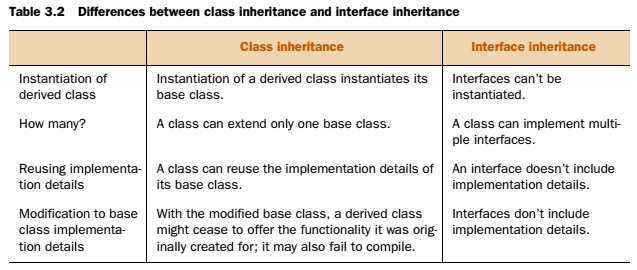
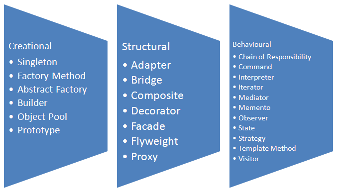
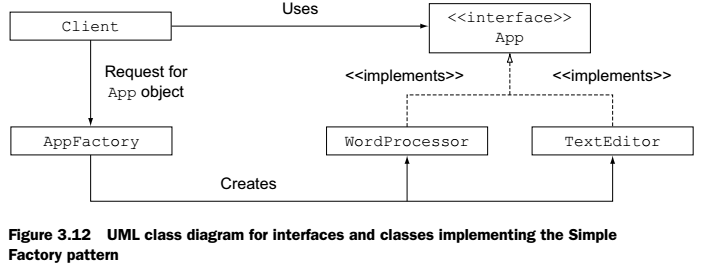
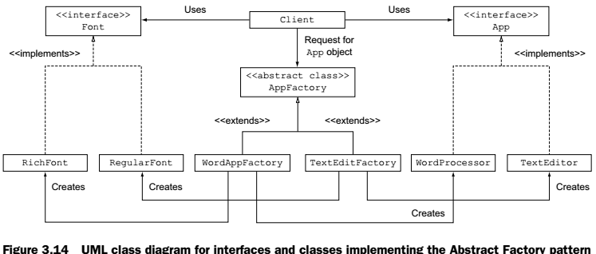
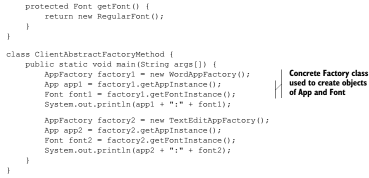
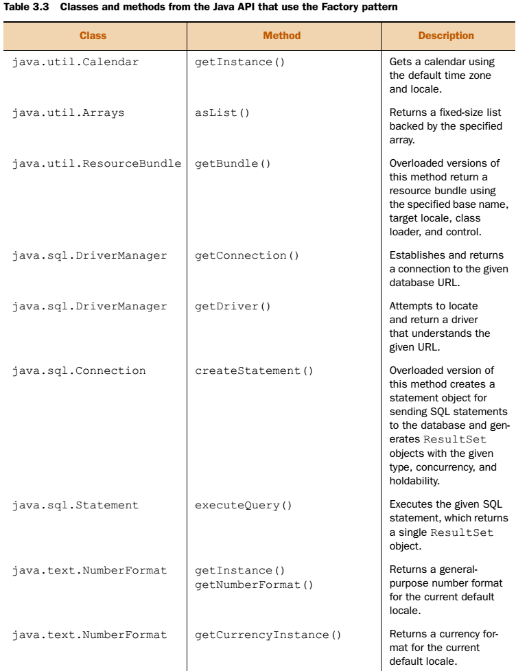

[3 Chapter-3 (OO Design Principles)](#chapter-3-oo-design-principles)

[3.1 Interfaces](#interfaces)

[3.1.1 Declaring interfaces](#declaring-interfaces)

[3.1.2 Implementing Interfaces](#implementing-interfaces)

[3.2 Class inheritance versus interface inheritance](#class-inheritance-versus-interface-inheritance)

[3.3 IS-A and HAS-A relationships in code](#is-a-and-has-a-relationships-in-code)

[3.4 Cohesion and low coupling (Uyumluluk ve düşük bağlılık)](#cohesion-and-low-coupling-uyumluluk-ve-düşük-bağlılık)

[3.5 Object composition principles](#object-composition-principles)

[3.6 Introduction to design patterns](#introduction-to-design-patterns)

[3.7 Singleton pattern](#singleton-pattern)

[3.8 Factory pattern](#factory-pattern)

[3.8.1 Simple Factory Pattern (or Static Factory Pattern)](#simple-factory-pattern-or-static-factory-pattern)

[3.8.2 Factory Method Pattern](#factory-method-pattern)

[3.8.3 Abstract Factory Pattern](#abstract-factory-pattern)

[3.8.4 Benefits of the Factory Pattern](#benefits-of-the-factory-pattern)

[3.9 DAO pattern](#dao-pattern)

[3.9.1 Using the Simple Factory Pattern with the DAO Pattern](#using-the-simple-factory-pattern-with-the-dao-pattern)

[3.9.2 Using the Factory Method or Abstract Factory Pattern with the DAO Pattern](#using-the-factory-method-or-abstract-factory-pattern-with-the-dao-pattern)

[3.9.3 Benefits of the DAO Pattern](#benefits-of-the-dao-pattern)

# Chapter-3 (OO Design Principles)

Başarılı insanların 3 önemli özelliği vardır. Yapacaklarını ertelemez,
yapacaklarını önem sırasına koyar ve hayatta yapmaktan hoşlandığı
şeyleri/işleri yapar. Aynı şekilde OOD(Object-oriented Design) da
yazılımcıya daha iyi uygulamalar yazmasını sağlar.

## Interfaces

Interface in 2 anlamı vardır. Birincisi bildiğimiz type, ikincisi ise
bir sınıfın public metodları demektir. Interface anlamı; Mesala yarış
yapıyoruz ve bize bazı koşucular lazım. Koşucularda aradığımız tek
özellik koşabilmesi. Bu kişilerin kim olduğu, anne, baba, veya ırkı
önemsizdir. Bizim için sadece koşabilme davranışı önemlidir. Bu davranış
yazılımda interfaceler ile sağlanır. Interface'ler onu implemente eden
sınıfın bu davranışı uyguladığını gösterir. Bunu sözleşme veta kontrata
da benzetebiliriz.

Benzer şekilde interface kullarak uygulama dizayn edersek, interfaceler
ile nesnelerin yapmasını istediğimiz özelliklerini nesne türünden
bağımsız bir şekilde uygulanmasını garanti edebiliriz. Gerekli
davranışları sınıfın uygulamasından ayırmanın bazı faydaları vardır.
Bunlar promoting flexibility. Interface'ler uygulamayı yönetilebilir,
genişletilebilir ve hali hazırdaki değişikliklerin çıkardığı hataları
azaltabilir.

### Declaring interfaces

Interface'ler instantiate edilemez! (new ile oluşturulamaz.)

**[Access Modifier,]** Top-level interface'ler sadece public
veya no modifier olabilir. Aslında bütün top-level
type'lar(class,interface,enum) sadece bu iki Access modifier ile
tanımlanabilir. (Inner veya nested class'lar herhangi bir acceess
modifier ile tanımlanabilirler.)

**[Nonaccess Modifier,]** Top-level interface'ler sadece
abstract veya strictfp alabilir. Diğerlerini alamaz. Diğerleri final,
static, transient, synchronized ve volatile. (Sadece nested interface
static ile tanımlanabilir, diğerlerinin hiçbiri ile tanımlanamaz.)

Üyelerindeki kurallar ise;

{width="6.3in" height="1.4666666666666666in"}

Interface'in metodları abstract dır çünkü onu uygulayan nesneler bu
metodları tanımlasın diye.

Interface'in değişkenleri static ve final dır çünkü interface bir
kontrattır ve değerleri sonradan değişmemelidir ayrıca static dir çünkü
instantiate edilemediği için değişkenlere statik yoldan ulaşmamız
gerekir. (final olduklarından ötürü de initalize etmemiz lazım. Yoksa
derlenemez.)

Interface'in bütün üyeleri(Değişken, metod, inner interface ve [inner
class]) varsayılan olarak public 'dir. Diğer Access modifier
ler derlenmez. Yazmaz isen zaten önüne public kendi ekliyor.

### Implementing Interfaces

Interface implemente etmek kontrat imzalamaktır. Bir sınıf bir
Interface'i implemente eder ise onun bütün metodlarını yazmak
zorundadır. Yani kontrata uymak zorundadır. [Ayrıca bir sınıf birden çok
sınıfı da implemente edebilir.] Bu durumda da yine aynı
şekilde bütün interfacelerdeki metodları implement etmemiz
gerekmektedir.

{width="3.7708333333333335in"
height="0.17708333333333334in"}

Metodları implement etmedeki tek istisna abstract class'lardır. Bir
sınıf abstract ise interfacedeki metodları implemente etmemeyi
seçebilir. Implemente etmesi şart değildir. A concrete class must
implement all methods, but an abstract class can choose not to
implement.

Bir sınıf interface'indeki değişken isimleri ile aynı isimde değişken
tanımlayabilir. Eğer ismi yazılmaz ise class'daki değişkenlerin değerini
alır. Interface içindeki değişkenler static olduğu için interface adı
nokta değişken ismi ile ulaşabiliriz.

Interface deki bütün metodlar public olduğu için implement eden sınıfta
daha düşük bir Access modifier ile mettod override edilemez. Default
Access olursa ilgili sınıf derlenmez.

Eğer bir sınıf farklı 2 adet interface'i implemente ediyor ise;

- Metodlar aynı isimde ve aynı parametreliler ise tekini implement
  etmesi yeterlidir.
- Metodlar aynı isimde ve farklı parametreliler ise her iki metodu
  implement etmelidir.
- Metodlar aynı isimde fakat Access modifier veya return type'ları
  farklı olur ise implemente eden sınıf compile olmaz.

> Sonuç olarak bir sınıfın farklı iki interface'deki aynı isimli
> metodları override edebilmesi için, bu iki interface'deki metodlar
> overload kurallarını sağlamalıdır. Yoksa sınıf derlenmez.

Bir interface birden çok interface'i extend edebilir. Interface'deki
bütün metodlar da public olduğundan bütün derivated interface'ler
super'inin metodlarını miras alır. Dolayısıyla bir sınıf extend etmiş
bir interface'i implement ederse, o interface'in extend ettiği
interface'deki metodları da override etmelidir. Tek istisna o sınıf
abstract değil ise.

## Class inheritance versus interface inheritance

Kod yazarken kalıtımı hangi yönteme göre yapmalıyız? Bu sorunun cevabı
gereksinimlere göre değişir. Aşağıda iki yöntemin farkları görebiliriz.

{width="6.3in" height="2.670138888888889in"}

Class inheritance base'e tanımlanan fonksiyonaliteyi yeniden kullanmak
istediğimizde daha iyi sonuç çıkarır. Ayrıca halihazırdaki base'den
bütün derivated sınıflara yeni bir davranış eklemek istediğimizde de
daha iyi sonuç çıkarır.

Interface inheritance ise halihazırdaki kodu bozmadan yeni özellikler
eklememizi sağlar. Bunu seçme amacımız ise bir sınıf için birden fazla
kontrat yapmak istememiz olabilir. Böylece bu interface'i implement eden
bütün sınıflar sınıfımızı kullanabilir.

**[Class Inheritance]**

- Base kodun yeniden kullanımı
- Yeni özellik ekleme avantajı

**[Interface Inheritance]**

- Birden fazla kontrat yapmak için(davranış belirlemek için)
- Hali hazırdaki sınıfı bozmadan yeni davranış(kontrat) eklemek için
  (AutoClosable interface'i)

Class Inheritance her zaman iyi bir şeçim değildir. Çünkü derived
class'lar kırılgandır. Base sınıf başka bir package'da ise veya iyi
dökümante edilmemiş bir sınıf ise bu sınıflar Class Inheritance için iyi
birer aday değillerdir.

Fakat bu savaşta belrgin bir kazanan yoktur. Gereksinimlere göre cevap
değişir.

## IS-A and HAS-A relationships in code

**[IS-A]**

- A class extends another class (derived class IS-A base class)
- An interface extends another interface (derived interface IS-A base
  interface)
- A class implements an interface (class IS-A implemented interface)

> (Bu ilişkilerin tersi doğru değildir. )
>
> Bu soruları kolay çözmek için mutlaka UML diagramı çizilmesi tavsiye
> edilir. Örnek bir çizim,
>
> {width="5.697916666666667in"
> height="4.791666666666667in"}

**[HAS-A]** This relationship is implemented by defining an
instance variable. If a class---say, MyClass---defines an instance
variable of another class---say, YourClass---MyClass HAS-A YourClass. If
MyClass defines an instance variable of an interface---say,
YourInterface---YourClass HAS-A YourInterface.

HAS-A relationship sadece ilgili sınıfta "instance variable" var ise
olur. Burada da bu kuralların tersleri yanlıştır.

- A class inherits another class by using the keyword extends.
- A class implements an interface by using the keyword implements.
- An interface inherits another interface by using the keyword
  extends.

## Cohesion and low coupling (Uyumluluk ve düşük bağlılık)

**Cohesion** Her bir sinifin iyi tanimlanmis bir amaci bulunmalidir.
Yani bir sinif icerisinde birbirinden farksiz isleri yapmak uygun bir
davranis olmayacaktir. Her sinifin sorumlulugu ve rolu net ve iyi
tanimli olmalidir. Cohesion ile sınıf iç yapısı esnek hale getirildi,
metodlar daha ayrıldı ve modüler oldu.

High Cohesion her sınıf adından anlaşılacağı gibi belirli bir iş yapar,
low cohesion ise sınıf adı A'dır fakat içinde birbirinden alakasın
metodlar vardır. Her zaman high cohesion olmasını isteriz.

**Coupling** ise bir sınıfın diğer sınıflar hakkında ne kadar bilgi
bildiğidir. Bir sınıf diğer sınıfa public metodları üzerinden ulaşıyorsa
bu sınıflar loosely coupled(low coupling) 'dır. Fakat public olmayan
üyelerine ulaşıp değiştirseydi bu sınıflar tightly coupled olurdu. Buna
en güzel örnek sınıfın instance variable'larını direk olarak
değiştirmeyip, get ve set metodları kullanarak kontrollü bir şekilde
değiştirmektir. Mesela bu instance variable'ın adını değiştireceğiz.
Eğer dış sınıflar direk erişseydi adı değiştiği anda diğer sınıflar hata
verirdi. Ama get metodunun adını değiştirmedikçe değişken ismini
istediğimiz gibi değiştirebiliriz. Loosely Coupled sınıflar oluşturmak
için bir diğer yöntem de interfaceleri kullanmaktır. Interface'ler
sınıflar ve modülleri arasında loose coupling dağıtır. Sonuç olarak
buradaki amaç da sınıfların birbirlerine bağımlılığı azaltmakdır.

## Object composition principles

Javada halihazırdaki bir sınıfın fonksiyonalitesini nasıl kullanırız?
İki şekilde, bunlar;

- Object Composition
- Inheritance

Object Composition halihazırdaki sınıfların fonksiyonalitesini onları
extend etmeden kullanmamızı sağlayan yaklaşımın adıdır. Yapacağımız
sadece yeni bir sınıf yaratıp içine kullanmak istediğimiz sınıflardan
nesneler yaratmaktır. Composition sınıfı kullanma yöntemidir.
Inheritance ise yeni sınıf base'in tipinde bir sınıf ise
kullanılmalıdır. Sınılar birbiri arasında ilişki yoksa interit
edilmemelidir. (araba-yarış arabası gibi, ama araba-motor gibi değil)
Inheritance yerine composition kullanılmasının diğer avantajı ise base
class'ın kırılgan olmasıdır.

## Introduction to design patterns

Çok kar yağan şehirde oturanların sorunu çatılarda biriken karlar ve
onların akmasıdır. Bu problemin çözümü ise eğimli çatılar yapmaktır.
Diğer yeni yetme ustalar da bu problemin çözümünü öğrendiklerinden hepsi
eğimli çatı yapar. İşte eğimli çatı yapmak önceki soruna bulunan çözümün
herkes tarafından ullanılması, deneyimin tekrar kullanılmasıdır. Design
patterns da aynı şekilde genel programlama sorunlarına çözümler sağlar.
Size kodu vermez, sadece nasıl çözüleceğinin tanımını yapar. Bu fikri
ilk defa GoF ortaya koymuştur. "Gang of Four (GoF) book Design Patterns:
Elements of Reusable Object-Oriented Software by Gamma et al.
(Addison-Wesley, 1995). DAO is an integration-tier core J2EE pattern;
see Core J2EE Patterns: Best Practices and Design Strategies, Second
Edition, by Deepak Alur, John Crupi, and Dan Malks (Prentice Hall,
2003)"

{width="6.3in"
height="3.6368055555555556in"}

## Singleton pattern

Singleton pattern, bir sınıfın sadece bir kez instantiate olmasını
garantileyen Creational tipde bir tasarım kalıbıdır. Ayrıca ilgili
sınıfa global bir erişim noktası tanımlar. Bu tasarım kalıbını mesela
print spooler sadece bir tane olmalı ki bütün yazıcı işlerini sırayla
yapsın.

Bu tasarım kalıbını uygulamak için;

- Sınıfın constructor'ını private tanımla. Başka hiçbir sınıf
  yaratamasın.
- Sınıfın tek bir instance'ını temsil eden bir private static değişken
  tanımla. Böylece tek bir instance olsun.
- Sınıfa sadece yukardaki değişkene ulaşabilecek bir public static
  method yaz.(getInstance()) Bu metodun içinde yukardaki nesneyi
  oluştur.

Bu şekilde bir tane sınıf yaratılmasını tam olarak garantilemiş
olamayız.(Mesela multi-threaded ortamlarda, nesne yaratılma aşaması veri
tabanı bağlantılarının açılması ve diğer bu gibi işler olup uzun zaman
alabilir.) Aynı anda iki farklı sınıf istek yaparsa 2 nesne oluşma
ihtimali vardır. Bunu engellemek için birçok yol vardır. Biz "Eager
Initialization" ve "Synchronized Lazy Initialization" inceleyeceğiz.

[Eager Initialization:] Sınıfı temsil eden private static
değişken final yapılarak ve daha tanımlama satırında new ile
tanımlanarak oluşturulur. Bu kod parçası Java Class Loaderları sınıfı
yüklerken çalıştırdığı için herhangi bir sınıf request etmeden önce
nesne bellekte oluşturulur. Böylece sınıfın sadece bir kez oluşturulması
garanti altına alınmış olur.

[Synchronized Lazy Initialization:] Eager Initialization'da
sınıf kullanılmasa bile bellekte bir nesne oluşturulur. Bunun yerine
getInstance metodumuzu "syncronized" olarak tanımlayarak bu yöntemi
gerçekleyebiliriz. Bu da nesnenin birden fazla oluşturmamızın kesin
çözümüdür.

[Partial Synchronized Lazy Initialization:] Senkronize etmek
Java da performans sorunlarına yol açabilir. Biraz zaman kazanmak için
bütün method yerine sadece nesne yaratılan kod bloğunu da syncronized
yapabiliriz.

{width="4.5625in" height="1.375in"}

[Using Enums:] Enum'larla singleton pattern thread-safe bir
yolla gerçeklenebilir. ENUM instance'ları başka bir sınıf tarafından
yaratılamadıkları için sınıfın sadece bir kez yaratıldığını garanti
altına alırlar. Single-element ENUM bu patterni uygulamanın en iyi
yoludur!

## Factory pattern

Bu tasarım kalıbı sınıflar arasında "Tight Coupling" i engeller ve
method çağırırken direk yapıcı çağrılmasını elimine eder.

### Simple Factory Pattern (or Static Factory Pattern)

Bu tasarım kalıbı, ortak bir sınıfı extend eden veya ortak bir
interface'i implemente eden sınıfların nesnelerini döndürür. Nesneler
çağıran sınıfa iç yapısını açığa çıkarmadan sadece nesneleri oluşturup
verir. Çağıran sınıf instantiate edilen sınıfın gerçek ismini bilmekten
ayrılmıştır.

{width="4.888888888888889in"
height="1.8333333333333333in"}

Yukarıdaki örnekte Client sınıfı kelime işlemci ve metin editörünü
sınıflarını bilmeden sadece dosya açma işlevini kullanır. Burada
AppFactory sınıfının getAppInstance metodunu açmak istediği dosya
uzantısı ile çağırır. AppFactory de ilgili sınıfın nesnesini döndürür.
Daha sonra buraya xml açmak için yeni bir sınıf yapılabilir.

{width="5.638888888888889in"
height="4.819444444444445in"}

Eğer burada açmak istediğimiz dosya türü çok fazla artsaydı ne olurdu?
Kod yönetilemez hale gelebilirdi. Bu sorunun çözümü sıradaki pattern ile
yapılır.

### Factory Method Pattern

Factory Method Pattern'in amacı nesne yaratırken alt sınıfların hangi
sınıfın instantiate edileceğine karar verdiği bir interface
tanımlamaktır. Yani yukarıdaki örnekteki if'in yerini bir sınıf alır, bu
sınıf hangi türde nesne yaratılacağına karar verir.

{width="5.104166666666667in"
height="2.736111111111111in"}

Bu kodda Client sınıfı Word veya Text türünde bir belge açmak istiyor.
Burada ortak olan App interface'inden yararlanılıyor. Yukardaki UML
diagramına göre sınıflar ve nesne fabrikaları oluşturuluyor. Nesne
fabrikaları ortak bir abstract nesne fabrikası kullanıyor. Client
nesnesi getAppIntance() metodu ile ilgili factory'yi çağırıyor. Kodu
inceleyiniz;

{width="5.576388888888889in"
height="1.8541666666666667in"}{width="6.118055555555555in"
height="3.7777777777777777in"}

Bu şekilde Client nesnesi WordProcessor ve TextEditor sınıflarının
ismini bilmiyor, bu sayede bu sınıflar decoupled oluyor. Bu düzenleme
esneklik dağıtıyor. Peki bu şekilde benzer nesneleri gruplamamız
gerekseydi ne olurdu. Bu durumda da sıradaki pattern yardımımıza
koşuyor.

### Abstract Factory Pattern

Bu pattern benzer ürünler ailesi oluşturmak için kullanılır. (Factory
Method Pattern sadece bir tip nesne oluşturmak için kullanılır.)
Amacımız ayrıca nesne yaratırken alt sınıfların hangi sınıfın
instantiate edileceğine karar verdiği bir interface tanımlamaktır.

{width="5.1875in" height="2.2083333333333335in"}

Örnek kod ise ;  

{width="5.125in"
height="4.694444444444445in"}{width="5.125in"
height="2.4722222222222223in"}

### Benefits of the Factory Pattern

Sınav her bir factory pattern'ının avantajını sormayacaktır. Java
API'deki bu patterni kullanan sınıfları soracaktır. Genel olarak bütün
Factory Pattern'lerinin yararları şunlardır;\

- Prefer method invocation over direct constructor calls\
- Prevent tight coupling between a class implementation and your
  application\
- Promote creation of cohesive classes\
- Promote programming to an interface\
- Promote flexibility. Object instantiation logic can be changed without
  affecting the clients that use objects. They also allow addition of new
  concrete classes.

Here's a list of what doesn't apply or isn't related to the Factory
pattern:\

- It doesn't eliminate the need of overloading constructors in class
  implementations.\
- It doesn't encourage the use of any particular access modifier. It
  isn't compulsory to define private members to use this pattern.\
- It won't slow your application.\
- It isn't related to how to monitor objects for change.\
  The exam will question you on the classes from the Java API that use
  this pattern. Let's\
  cover them in the next section.
  {width="5.222222222222222in"
  height="6.791666666666667in"}{width="5.270833333333333in"
  height="1.0833333333333333in"}

## DAO pattern

DAO pattern bir data kaynağına erişimi soyutlar ve encapsule eder.
Client'ın dataya nasıl eriştiğini bilmeden yönetilmesini sağlar. Bu
sayede client kodunun esnek ve birçok data kaynağı ile çalışabilmesini
sağlar. DAO Pattern'i business ve sunum katmanını data persistence
ayrıntılarından ayrıştırılmasını sağlar.

DAO pattern şöyle uygulanır;

{width="5.090277777777778in"
height="1.6666666666666667in"}

Data source'dan Emp nesnesini ile çalışacağımızı düşünelim. Bunun için
önce DAO interface'i oluşturulur. Bu interface'de CRUD operasyonları
tanımlanır. Ardından bu interface'i gerçekleyen EmpDAOImpl sınıfı
oluşturulur ve data işleme işlemleri tanımlanır. Bu şekilde
implementation ayrıntıları client'dan gizlenmiş olur. Ayrıca data
kaynağına erişme işlemi değişir ise bu client'ı etkilemez. Farklı bir
data source'a bağlanma durumunda da aynı şekilde client'ı etkilemeden
çalışmamızı sağlar. Yukardaki örnek DAO interface'inin sadece bir
uygulamasını gösterir. Birden fazla DAO implementasyonu için Factory
Pattern'lardan biri ile birlikte kullanılır. Bu iki pattern genellikle
beraber kullanılırlar.

### Using the Simple Factory Pattern with the DAO Pattern

DAO pattern dki Impl sınıfınlarını new ile oluşturmak yerine bunu simple
factory pattern kullanarak tanımlayabiliriz. Bunun için DAOFactory
isimli abstract sınıf oluşturulur ve getEmpDAOInstance(int t) metodu
tanımlanarak aldığı parametreye göre farklı veri tabanı tiplerinde
nesneler döndürecek şekilde konfigure edilebilir. Bu sayede birden fazla
DAO implementasyonu gerçekleştirmiş olduk. Sonraki kısımda ise data
işlemlerini farklı tip nesneler ve farklı tip veritabanları için nasıl
decouple edeceğimizi göreceğiz.

### Using the Factory Method or Abstract Factory Pattern with the DAO Pattern

Bu örnekte ise Emp ve Dept nesnelerini kaynaktan çekmek için EmpDAO ve
DeptDAO kullanılıyor ve bütün operasyonlar Emp ve Dept nesneleri içinde
tanımlanıyor.

{width="6.3in" height="3.4032152230971127in"}

### Benefits of the DAO Pattern

The benefits of the DAO pattern are\

- It abstracts and encapsulates all access to a data source. It manages
  the connection to the data source to obtain and store data.\
- It promotes programming to an interface. It completely hides the data
  Access implementation from its clients.\
- It decouples the business logic layer and persistence layer. It makes
  the code independent of any changes to a data source or its vendor (for
  example, plaintext, XML, LDAP, MySQL, Oracle, or DB2).\
- It promotes flexibility. Because the interfaces accessible to client
  classes don't change, new implementation classes can be added.\
- The DAO pattern might also include Factory pattern classes.\
- It prevents tight coupling between client classes and DAO
  implementation classes. It promotes the creation of cohesive classes.