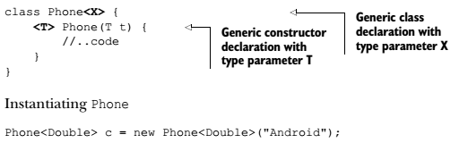

[4 Generics and Collections](#generics-and-collections)

[4.1 Introducing generics](#introducing-generics)

[4.2 Creating generic entities](#creating-generic-entities)

[4.2.1 Creating a generic class](#creating-a-generic-class)

[4.2.2 Working with generic interfaces](#working-with-generic-interfaces)

[4.2.3 Using generic methods](#using-generic-methods)

[4.2.4 Bounded type parameters](#bounded-type-parameters)

[4.2.5 Using wildcards](#using-wildcards)

[4.2.6 Using bounded wildcards](#using-bounded-wildcards)

[4.2.7 Type erasure](#type-erasure)

[4.2.8 İsimlendirme özetleri](#isimlendirme-özetleri)

[4.3 Using type inference](#using-type-inference)

[4.4 Understanding interoperability of collections using raw types and generic types](#understanding-interoperability-of-collections-using-raw-types-and-generic-types)

[4.4.1 Mixing reference variables and objects of raw and generic types](#mixing-reference-variables-and-objects-of-raw-and-generic-types)

[4.4.2 Subtyping with generics](#subtyping-with-generics)

[4.5 Introducing the collections framework: WARM-UP](#introducing-the-collections-framework-warm-up)

[4.6 Working with the Collection interface](#working-with-the-collection-interface)

[4.6.1 The core Collection interface](#the-core-collection-interface)

[4.6.2 Methods of the Collection interface](#methods-of-the-collection-interface)

[4.7 Creating and using List, Set, and Deque implementations](#creating-and-using-list-set-and-deque-implementations)

[4.7.1 List interface and its implementations](#list-interface-and-its-implementations)

[4.7.2 Deque interface and its implementations](#deque-interface-and-its-implementations)

[4.7.3 Set interface and its implementations](#set-interface-and-its-implementations)

[4.7.4 Set implementation classes](#set-implementation-classes)

[4.8 Map and its implementations](#map-and-its-implementations)

[4.8.1 Map interface](#map-interface)

[4.8.2 HashMap](#hashmap)

[4.8.3 LinkedHashMap](#linkedhashmap)

[4.8.4 TreeMap](#treemap)

[4.9 Using java.util.Comparator and java.lang.Comparable](#using-java.util.comparator-and-java.lang.comparable)

[4.9.1 Comparable interface](#comparable-interface)

[4.9.2 Comparator interface](#comparator-interface)

[4.10 Sorting and searching arrays and lists](#sorting-and-searching-arrays-and-lists)

[4.10.1 Sorting arrays](#sorting-arrays)

[4.10.2 Sorting List using Collections](#sorting-list-using-collections)

[4.10.3 Searching arrays and List using collections](#searching-arrays-and-list-using-collections)

[4.11 Using wrapper classes](#using-wrapper-classes)

[4.11.1 Class hierarchy of wrapper classes](#class-hierarchy-of-wrapper-classes)

[4.11.2 Creating objects of the wrapper classes](#creating-objects-of-the-wrapper-classes)

[4.11.3 Retrieving primitive values from the wrapper classes](#retrieving-primitive-values-from-the-wrapper-classes)

[4.11.4 Parsing a string value to a primitive type](#parsing-a-string-value-to-a-primitive-type)

[4.11.5 Difference between using method valueOf() and constructors of wrapper classes](#difference-between-using-method-valueof-and-constructors-of-wrapper-classes)

[4.11.6 Comparing objects of wrapper classes](#comparing-objects-of-wrapper-classes)

[4.12 Autoboxing and unboxing](#autoboxing-and-unboxing)


# Generics and Collections

## Introducing generics

Generics, bir kutuya sadece istenen tipte kalem atmak için kullanılır. Diğer tipler daha compile anında kabul edilmez. Generics, çalışacağın nesnenin tipini belirlemek için kullanılır.Amaç bir sınıfın, arayüzün
veya metodun hangi data tipiyle çalışacağını işaretlemektir. Böylelikle Collection sınıflarına "type safety" eklemek için kullanılır. Bu güvenliği compile time da yapar.

Collections ise kutudaki kalemleri rengine, boyutuna göre sıralamayı sağlayan framework'dür.

Generics'in yararları;

- Explicit cast yapmaya gerek kalmaz.(Mesela bir List den get ile içindeki veriyi çekerken)
- Explicit cast olmayınca kodun okunabililiği artar.
- Generic algoritmalar oluşturmaya olanak sağlar.

## Creating generic entities

{width="4.708333333333333in" height="0.84375in"}

Generic sınıflar yukardaki gibi tanımlanır. T = "type parameter". Parcel sınıfını instante etmek için mutlaka parantez içinde sınıf adı belirtmek zorundayız. type parameter java keywords'lerden biri olamaz. type
parameter isimlendirme kuralı ise tek büyük bir harfdir. Burada type parameter bir sınıf ismi bile olabilir. Ama o sadece bir placeholder'dır.

### Creating a generic class

1. Generic bir class generic bir class'ı extend ediyor ise;

> Extended class "type argument" i base class'a geçebilmelidir.

a.  class GenericBookParcel\<**T**\> extends Parcel\<**T**\> {}

b.  class GenericBookParcel\<**X, T**\> extends Parcel\<**T**\> {}

c.  class GenericBookParcel\<**X**\> extends Parcel\<**Book**\> {}

<!-- -->

2. Non Generic bir class generic bir class'ı extend ediyor ise;

> Extended class generic base class daki bütün type parameter'lara
> argüman pass etmelidir.

d.  class NonGenericPhoneParcel extends Parcel\<Phone\> {}

e.  class NonGenericPhoneParcel extends Parcel\<Phone,Book\> {}

> Burada dikkat edilecek şey extended class'ı instante ederken type
> argument geçilmemelidir. Yoksa compile time hatası oluşur.

### Working with generic interfaces

{width="5.177083333333333in"
height="1.5435378390201224in"}

1. Generic bir class generic bir interface'i implement ediyor ise;

> Extended class "type argument" i base class'a ya geçecek ya da gerçek değerini atayacaktır.

a.  class MapLegendGeneric\<K, V\> implements MyMap\<K, V\> {\
    public void put(K key, V value) { }\
    public V get(K key) { return null; }\
    }

b.  class MapLegendGeneric2\<**V**\> implements MyMap\<**String**, **V**\> {\
    public void put(**String** key, **V** value) {}\
    public **V** get(**String** key) { return null; }\
    }

<!-- -->

2. Non Generic bir class generic bir interface'i implement ediyor ise;

> İnterfacedei bütün type parametreleri gerçek tipler ile değiştirilmeli ve interfacedeki bütün metodlar doğal olarak override edilmelidir.
> 
>class MapLegendNonGeneric implements MyMap\<String, Integer\> {\
> public void put(String s, Integer i) {}\
> public **String** get(String s) { return null; }
> 
>}

"Generic types" = Generic class ve generic interface lerin hepsi generic types olarak geçer.

### Using generic methods

Generic metodlar , generic olan veya olmayan bütün sınıflar içinde tanımlanabilirler.

1. NonGeneric sınıf veya interface içinde tanımlı olan generic metodlar,

"type parameter list" bir metodda Access ve nonaccess modifier'dan sonra ve dönüş tipinden önce yazılır. Aşağıdaki örnekteki gibi public ve void arasına konur.

{width="5.989583333333333in" height="1.375in"}

2. Generic sınıf veya interface içinde tanımlı olan generic metodlar,

{width="5.666666666666667in"
height="0.9166666666666666in"}

Constructor'da generic olabilir..

{width="5.4375in" height="1.6666666666666667in"}

### Bounded type parameters

Buradaki amaç,

- "type argument" olarak kullanılacak tipleri sınırlamak,
- Sınırı tanımlayan tipin method ve değişkenlerine ulaşabilmek,

```java
class Parcel<T extends Gift>
```

 şeklinde tanımlanır.

Bounded type parameter için bound sınıf, arayüz veya enum olabilir. Dizi veya primitive type olamaz. Bound tanımlamak için bütün durumlarda extend keyword'ü kullanılır. [Bound bir interface bile olsa imlements
keyword'ü kullanılmaz. Extend kullanılır.] Sınıf yaratılırken bound tipine uymuyorsa (subtype'ı değil ise) wont compile.

Birden fazla bound da tanımlanabilir. Fakat type argument ler bütün boundların subtype'ı olmalıdır.

```java
class Parcel<T extends Gift, Exchangeble, Wrappable>
```


### Using wildcards

The wildcard = ?

Bilinmeyen tipleri temsil eder. Wildcard'ı bir parametrenin tipini(local, instance veya static değişken) belirtmek için ve Generic tiplerin dönüş değerini belirlemek için kullanabiliriz. [Fakat generic
bir metodu invoke etmek için ve generic bir sınıf yaratmak için kullanamayız.]

Generics kullanırken parantezler içindeki sınıfların tamamen birbirinin aynısı olma zorunluluğu vardır. Çünkü önceki kısımda gördüğümüz gibi mutlaka birbirinin aynı harflerini içermek zorundadırlar. Bu sebepten wildcardlar oluşturulmuştur.

```java
List<Gift> wishList = new ArrayList<Book>();
```

Yukardaki satır hiçbir zaman compile olmaz, çünkü parantezlerdeki sınıflar aynı olmalıdır. Bu durumu aşabilmek için wildcardlar şu şekilde kullanılır.

```java
List<?> wishList = new ArrayList<Book>();
```

Buradaki ? simgesi bilinmeyen bir tipi temsil eder. wishList listesi içinde bilinmeyen türde bir sınıf vardır. Bu yüzden Book sınıfı içeren arrayList bu liste atanabilir. Tersi ise derlenmez. Oluşturduğumuz bu listeye hiçbir nesne eklenemez! Çünkü ? ile her sınıf nesnesi temsil edilebilir ama bizim ArrayList imiz sadece Book sınıfı nesneler içermelidir. Bu sebepten hiçbirşey eklenmesine izin verilmez. Aynı mantıkla get ile okuma yapar iken ise nesneler Object tipinde döner.
Sonuç olarak değişkenlerini veya method parametrelerini wildcard ile belirlersen collectionlara add yapma özelliğini yitirmiş oluruz.

```java
public static void wrapGift(List<?> list) {
    for (Object item : list) {
        System.out.println("GiftWrap - " + item);
    }
}
```


### Using bounded wildcards

| UPPER-BOUNDED WILDCARDS                                      | LOWER-BOUNDED WILDCARDS                                      |
| ------------------------------------------------------------ | ------------------------------------------------------------ |
| <? extends Type>                                             | <? super Type>                                               |
| Type refers to a class, interface, or enum                   | Type refers to a class, interface, or enum                   |
| Bir listin sadece extend edilen sınıfın kendisi ve subClass ları tarafından oluşturulabileceğini belirtir. | Bir listin sadece kendisi veya süper sınıfları tarafından oluşturulabileceğini belirtir. |
| Method parametrelerinde ise metoda sadece o sınıfın kendisi ve subClass larının pass edilebileceğini belirtir. | Yukarının aynısı                                             |
| Collection’a nesne eklenemez.(Eklenince collecton kirlenebilir başka tipdeki nesnelerle, bu sebepten izin verilmez.) | Collection’a nesne eklenebilir. List tanımındaki tipin subClass ları eklenebilir!! |


Bir final olan class şu şekilde derlenemez;		

```java
class MyClass extends String {}
```

Fakat bu sınıflar upper-bounded wildcard olarak tanımlanabilir;

```java
List<? extends String> list
```

{width="5.229166666666667in"
height="1.3333333333333333in"}

### Type erasure

Bir generic class veya interface Java Compiler tarafından derlenirken her parameterized type için farklı bir derlenmiş sınıf oluşturmaz. Onun yerine tek bir sınıf derler ve bu sınıfın tip bilgisini sürekli siler.
Unbounded sınıflarda tip yerine Object sınıfını yazar, bounded sınıflarda ise bound sınıfının kendisini yazar. Örnek olarak aşağıdaki interface tanımını inceleyelim.

```java
interface MyMap<K extends String, V>{
     void put(K key, V value);
            V get(K key);
}
```

Bu interface derleme aşamasında bounded olanlar bound ile, unbounded
olanlar Object sınıfı ile değişir ve şonuç olarak şu hali alır.

```java
interface MyMap {
      void put(String key, Object value);
              Object get(String key);
}
```

Ayrıca type erasure işleminde Java Compiler bazı durumlarda Bridge methodlar oluşturabilir. Bu metodlar type safety sağlar. Mesela aşağıdaki sınıf tanımı için Book sınıfına cast etme işi compiler tarafından Book tan extend olmayan sınıflarda ClassCastException fırlatıması için eklenmiştir.

  {width="3.3645833333333335in" height="2.0833333333333335in"}   Sınıf tanımları

------

  {width="5.09375in" height="2.4166666666666665in"}              Derlendikten sonra

### İsimlendirme özetleri

------

  **Generic types**         A generic type is a generic class or a generic interface, having one or more type
                            parameters in its declaration.

------

  **Parameterized types**   An invocation of a generic type is generally known as a parameterized type. For
                            generic type List\<E\>, List\<String\> is a parameterized type.

  **Type parameter**        You use type parameters to define generic classes, interfaces, or methods.
                            E in List\<E\> is a type parameter.

  **Type argument**         A type argument specifies the type of objects to be used for a type parameter.
                            For List\<String\>, String is a type argument.

  **Wildcard**              A wildcard is represented by a ? (a question mark). It refers to an unknown type.

  **Bounded wildcard**      A wildcard is bounded when it is a base or supertype of a type.

  **Raw type**              The name of a generic class, or a generic class without any type arguments, is a raw type. For List\<E\>, List is a raw type.


## Using type inference

Bilmece çözerken ipuçlarından giderek sonuca ulaşmaya çalışırız. "type inference" de aynı mantıkladır. Mesela javada toplama işlemi en az int tipinde değişken ortaya çıkarır. Bir short ile int i toplayınca sonuç int olur. "type inference" Java Compiler'ın bir deyime geçilen parametrelerden veya metodun tanımı ve çağrılmasını inceleyen bir yeteneğidir.

Generic leri tanımlarken köşeli parantezlerin içini bazı durumlarda boş bırakabiliriz. Bu durumlarda Java compiler argüman tipini tahmin edebilir. Fakat bazen emin olamaz ise bir warning, error veya exception
fırlatabilir. "unchecked warning" compilerın type safety i sağlayamadığını gösterir. Unchecked terimi zaten, işlenen işlemin type safety yi ihlal ettiğini göstermek için kullanılır. Bu durum compiler'ın bütün type check'leri gerçekleştiremediğini ve yeterli type bilgisine sahip olmadığını gösterir.

​	(\<\> == diamond)

Java 7 ile birlikte şu satırlar geçerlidir. Fakat ikinci satırda compilation warning atar.

1\. Parcel\<String\> parcel = new Parcel\<\>();

2\. Parcel\<String\> parcel = new Parcel();

Bu konunun örnek kodu ve kısa bir konu daha = chapter4.s2.TypeInference
ssınıfı içindedir.

## Understanding interoperability of collections using raw types and generic types

"Raw type" Generic sınıfın kendisine denir. Yani Parcel sınıfı bir raw type'dır. Raw type'lar sadece generic sınıflarda olur, nongenericlerde olmaz.

### Mixing reference variables and objects of raw and generic types

```java
Parcel p1 = new Parcel<Phone>();
```

// Aşağıdaki satır derlenir ama warning verir

// Bu şekilde p1 içindeki tip bilgisini kaybederiz.

// p1 generic sınıfın tip bilgisine sahip değil, bilmiyor.

// o yüzden aşağıda set metodunda warning alırız.

// Çünkü bu generic sınıf içinde tanıma göre Phone nesneleri olması
lazım.

// Ama bu örnekte string set edebildik, ki bu bir hata.

```java
p1.set("harry");
```

// Aynı mantıkla p1 generic\'in tip bilgisini bilmediği için p1.get-

// Object sınıfından bir nesne döndürür. Bu sebepten

// aşağıdaki satır WONT compile!

/\*\* Phone phone = p1.get(); \*\*/

```java
Parcel<Phone> p2 = new Parcel();
```

// Burada ise yukardakinin tam tersidir. Referance variable içinde ne
olduğunu biliyor.

// Bu sebepten aşağıdaki kod derlenir ve compiler warning vermez.

```java
p2.set(new Phone());
```

// Ref. variable içinde ne olduğunu bildiği için String tipine izin
vermez.

// Bu sebepten aşağıdaki satır WONT compile

/\*\* parcel.set(new String()); \*\*/

// Aynı şekilde içinde ne olduğunu bildiği için get metodu generic
type\'in

// sınıfından bir nesne döndürür.

// Aşağıdaki satır da compiler warningi vermez.

```java
Phone phone = p2.get();
```

Bir diğer örnek ise;

{width="6.208333333333333in"
height="2.1666666666666665in"}

Burada ClassCastException fırlatılıyor.

### Subtyping with generics

Aşağıdaki örnekte ilk 3 satır derlenir, son satır derlenmez. Genericlerde sub-typing çalışmaz. Yani String sınıfı Object'ten miras alındıysa da buna izin verilmez.

```java
List list = new ArrayList<String>();

Object obj = new String();

List list = new ArrayList<String>();

List<Object> list = new ArrayList<String>();
```


## Introducing the collections framework: WARM-UP

Datayı çeşitli şekillerde gruplayarak tutmamız gerekebilir. Burada tutulacak dataya göre bazı önceliklerimiz de olabilir. Bu önceliklere göre Javada Collections Framework oluşturulmuştur. Bu öncelikler collection içindeki datanın sıralı, alfabetik sıralı veya çift değerlere izin verebilen veya boyutu değiştirilemez gibi birçok yönden değişiklik gösteren türleri vardır. Collection içindeki her bir nene element olarak adlandırılır. Collection framework şunlarda oluşur.

- [Interfaces]---Multiple interfaces like List, Set, Deque, and Map model the data structures used for storing, accessing, and manipulating a collection of data.
- [Implementations]---Concrete classes like ArrayList, HashSet, and TreeMap implement the interfaces.
- [Algorithms]---Classes like Collections and Arrays contain utility methods like sort() and search() for sorting and searching List objects or arrays

NOT: Collection bütün sınıfların base'i olan bir interfacedir. Collections sınıfı ise collection ları sıralamak vb için utility
metodlar içeren bir utility sınıftır.

{width="5.180555555555555in"
height="5.263888888888889in"}

## Working with the Collection interface

Collection bir interface dir ve bütün diğer Collection Framework sınıfları bu interfaceden türemiştir. Bu interface'i doğrudan implemente eden discrete sınıf yoktur. Bu interface'i daha spesifik interface'ler extend eder. Tanımı şu şekildedir.

```java
public interface Collection<E> extends Iterable<E>
```

Tanımdan da görüleceği üzere Bütün Collection sınıfları Generic'tir ve type parameters alır!!!

NOT: Map interface'i collection interface'ini extend etmez.

### The core Collection interface

Collection interface'i iterable interface'ini extend eder. Iterator interface'inde ise iterator metodu bulunur ve bütün collection dan türeyen sınıfların iterator tanımlaması gereklidir. Ayrıca dikkat ederseniz her collectioni uygulayan sınıfın 2 tür constructor'ı vardır. Biri no argument olanı, diğeri ise Collection tipinde nesne alanı. İlki boş bir collection yaratır, ikincisi ise aynı collection'ı yaratır ve boyutu sığmayanları siler.

Collection interface'i syncronized değildir. Bu performans artışı sağlar. Java 5 de HashTable ve vektör sınıfları vardı ve bunlar syncronized idi. Java 6 da ise aynı işlevselliği HashMap ve ArrayList sınıfları ile daha performanslı bir biçimde elde edebiliriz.

NOT: Collection interface'ini implemente eden her sınıfın bütün medotları gerçekleştirmesi zorunlu değildir. Bu durumda implemente eden sınıf UnsupportedOperationException hatası fırlatmayı seçebilir.

### Methods of the Collection interface

{width="4.875in" height="3.3541666666666665in"}

Collection interface'ini implemente eden Çoğu sınıf doğal olarak yukardaki metodlara sahip olacaktır. Fakat uygulamaları sınıfa göre değişebilir.

Collection larla çalışmaya başladıkça iterator'ın fail-fast olduğunu göreceksiniz. Bir collection'ı iterator oluştuktan sonra bir nesne ekleyip çıkarır isek ConcurrentModificationException hatası alırız. Bunu önlemek için Iterator sınıfının add ve remove metodlarını kullanmalıyız. Bu özellik Collection'a concurent ulaşma sırasında rastgele değerler dönmesini engeller.

## Creating and using List, Set, and Deque implementations

  Ordered   Düzenlenmiş, sıraya konmuş   Eklenme sırasını korumak anlamına geliyor.

------

  Sorted    Sıralamak                    Mesela alfabet olarak sıralama anlamında.
                                         

### List interface and its implementations

{width="5.229166666666667in"
height="5.090277777777778in"}

- List interface'i eklediğin elementlerin eklenme sırasını korur.
- Duplicate kayıtlara izin verir.
- Null eklenmesine izin verir.
- Örnek List : Pizza dağıtım siparişi listesi gibi.
- Bir elementin hangi pozisyona kaydedileceğini belirtebiliriz. Bu sebepten add, remove ve retrieve fonksiyonlarının overloaded hali bulunur.
- İterator fonksiyonun yanında ListIterator fonksiyonu bulunur. Bu bütün listeyi veya bir kısmının içinte dönmeyi sağlar.

__**ArrayList Sınıfı**__


- List interface'inin değişken uzunluklu dizi uygulamasıdır. İçerde listeyi saklamak için bildiğimiz dizi kullanır.
- Constructorları şöyledir;{width="4.916666666666667in"
  height="1.125in"}
- Position belirterek çağrılan add ile set farkı, add diğer elemanları ittirir, set ise o pozisyondaki eleman ile yerini değiştirir, eskiyi döndürür.
- Get(7) olmayan bir elemanı çağırır ise IndexOutOfBoundsException alırız.
- Remove(ilk bulduğu eşleşmeyi siler) ve contains(sırayla arar ve ilk bulduğuna bakar) aramak için equals metodunu kullanırlar.
- ArrayList içindeki sınıfın equals metodu doğru bir şekilde override edilmelidir. Çünkü remove ve contanins metodları tamamen bu metoda göre eşitliği kontrol ederler. Arama işi sırayla ve bulduğu ilk değere uygulanır.
- Add ve remove işlemlerinde array sürekli sağa ve sola kayar.
- İterator sınıfının hasNext() 'i iterator daha başka verilere ulaşabilir mi, next() ise bir sonraki değere ulaşır ve değerini
  döndürür.
- ArrayList size değişkeninde sürekli boyunutu tutar. Eğer boyutu aşar ise yeni bir dizi oluşturur ve eskiyi yeniye kopyalar.
- Clear() ArrayList teki bütün elemanları siler.
- removeAll(c) ArrayList teki elemanları Collection içinde ne varsa o elemanları siler.
- retainAll(c) metodu,collection içindeki nesneler hariç geri kalan nesneleri siler.

### Deque interface and its implementations

- Queue doğrusal nesneler koleksiyonudur. (Kuyruk, sıra).
- Deque ise çift sonu queue' dur. Başına ve sonuna nesne ekleme ve çıkarma yapılabilir.
- Queue interface  ---  Deque interface
- Deque Çift taraflı sıra olduğu için queue veya stack olarak çalışabilir.
  - Queue = ilk giren nesne ilk olarak işlenir. (FIFO) Mesela bilet gişesindeki insanlar
  - Stack = son giren ilk işlenir (LIFO). Mesela üst üste konmuş yıkanacak tabaklar.
- - {width="4.0in"
    height="3.048611111111111in"}
- - {width="4.972222222222222in"
    height="2.5972222222222223in"}
- Yukarıda Deque nun stack olarak kullanılmasının data yapısı bulunmaktadır. Stack de nesneler sadece tek taraftan işlenir, o da kuyruğun başıdır.
- Deque her iki yapı içinde kullanıldığı için aynı işi yapan mükerrer metodlar olabilir. Mesela stack için pop,push,peek metodları sadece queue un başına işlem yapmak için kullanılır. Queue için ise add ve offer metodları vardır. Fakat bu işlemlerler sona mı başa mı ekleme yapacağını belirtmediği için bu interface'e addFirst, addLast gibi metodlar da konmuştur.
- - {width="5.159722222222222in"
    height="7.194444444444445in"}
- Deque implemantasyonları null değerler eklememize izin verir ama bunu mutlaka engellemelisin. Çünkü bazı deque sınıfları listenin boş olduğunu belirtmek için null değer döndürürler.

{width="3.9791666666666665in"
height="1.5416666666666667in"}


__**ARRAYDEQUE Sınıfı**__

- Deque interface'inin değişken uzunluklu array implementasyonudur.


|  | ArrayDeque | LinkedList |
| ---- | ---- | ---- |
| İmplemets | Deque | Deque ve List |
| Constructor | ArrayDeque() (Default size = 16) | LinkedList() |
|  | ArrayDeque(Collection<? extends E> c) | LinkedList(Collection<? extends E> c) |
|  | ArrayDeque(int numElements) |  |
| Adding null | İzin vermez.Derlenir ama runtime’da | İzin verir. |
|  | NullPointerException atar. |  |
| Push() | İlk sıraya nesneyi ekler. | - |
| Offer() | En sona nesneyi ekler. | - |
| Pop() | İlk sıradaki elemeti döndürür ve siler. | - |
| Remove() | İlk sıradaki elemeti döndürür ve ilki siler. | - |
| Peek() | Sıranın en başındaki elemanı listeler.(element) | - |
| Offer() | Sıranın en sonuna ekler. Add ile aynı |  |
| Element() | Sıranın en başındaki elemanı listeler. Peek den farkı liste boş ise NoSuchElementException fırlatır. |  |
| addFirst | Sıranın en başına ekler. |  |
| addLast | Sıranın en sonuna ekler. |  |
| Poll() | İlk sıradaki elemeti döndürür ve ilki siler. |  |


__**LINKEDLIST Sınıfı**__

- LinkedList sınıfı listedeki her bir elementin içinde next ve prev değerleri bulundurur. Bunlar listede kendinden önceki ve sonraki nesnenin referansını gösteren değerleri tutar.
- ArrayList ve ArrayDeque sınıflarının tersine araya bir eleman eklenmek istendiğinde bütün elemanlar kopyalanıp yerleri değiştirilmez. Sadece next ve prev değişkenlerinin gösterdiği değerler değişir.
- Sınavda hangi sınıfın hangi durumda daha kullanışlı olduğu sorulabilir. Mesela LinkedList ekleme ve çıkarmada ArrayList'e göre daha hızlıdır ama iteration'da daha yavaştır.
- LinkedList List, Queue, and Deque interface'lerini implemente ettiği için bunların bütün metodlarını implemente ederler.

### Set interface and its implementations

Set matematikteki Kümeler kavramı ile aynı olarak düşünebiliriz. İki önemli özelliği vardır;

Birincisi **aynı eleman bulunamaz.**

İkincisi ise **sıralı değildir.**

{width="5.25in" height="3.423611111111111in"}

Aynı eleman tespitini eklenen nesnenin equals motodu ile beriller. Eğer equals true döner ise set'e eklenmesine izin vermez.

Collection dan miras aldığı için Iterator'ü vardır ve toArray fonksiyonu da bulunur. toArray Object\[\] tipinde nesne döndürür.

### Set implementation classes

{width="1.9652777777777777in"
height="2.3541666666666665in"}


__**HASHSET Sınıfı**__

- Aynı elemanların eklenmesine izin vermez.(hiçbir hata vermiyor.) Ekleme sırasını korumaz. HashSet sınıfı arka planda HashMap sınıfını kullanır. Elemanları saklama ve getirmek için nesnelerin hashCode ve equals metodlarını kullanır. Hatırlarsanız hashCode nesneleri bir algoritma ile kovalara ayırıyor, kova içinde ise equals metodu ile doğru nesne bulunuyordu. HashSet de aynı bu şekilde çalışmaktadır. Tabii bu yöntemin hızı için Set içine konan nesnelerin hashCode fonksiyonları verimli bir şekilde yazılmalıdır.
- HashSet'e nesne eklenirken önce hashCode metodu çağrılır, eğer hashCode değerleri farklı ise direk bu nesneler aynı değil denip set'e eklenir. HashCode değerleri aynı ise o zaman equals metodu çağrılır ve bunun sonucunda aynı olup olmadığına kesin bir şekilde karar verilmiş olur.
- HashSet içine sadece bir adet null eklenebilir. Diğer eklemeleri ignore eder.

__**LINKEDHASHSET Sınıfı**__

- HashSet ile LinkedList sınıfları birleşmiş halidir. Set'e eklenme sırasını koruyabilir. HashSet gibi saklama ve getirme için Hashing algoritmaları kullanır.
- LinkedHastSet içine birden fazla null eklenebilir.
- Eğer set içine eklenen sınıf equals metodunu override etmiyorsa iterator, contains gibi metodlar çalışmaz!!!

__**TREESET Sınıfı**__

- TreeSet arka planda black-red binary tree kullanarak elemanlarını saklar.
- TreeSet eklenen nesnelerini sıralayarak içinde saklar. Bunu 2 şekilde yapar. compareTo() (for the Comparable interface) or compare() (for the Comparator interface) metodlarını override ederek. Eğer bu iki yöntemden birini yapmazsak TreeSet'e nesne eklersek runtime'da exception fırlatacaktır.
- Bu iki metod ayrıca equals metodu ile de uyumlu olmalıdır. Yoksa set kararsız hale gelebilir.
- Constructorları şu şekildedir. {width="6.3in"
  height="1.1254899387576554in"}
- - In the absence of passing a Comparator instance to a TreeSet constructor, the objects that you add to a TreeSet must implement Comparable. In the preceding example, String (which implements Comparable) objects are added to the TreeSet. Watch out for storing objects of wrapper classes, Enum and File in a TreeSet; they all
    implement Comparable. The natural order of enum constants is the order in which they're declared. StringBuffer and StringBuilder don't implement Comparable.
- Set sınıfını imlemente eden sınıflarda addAll(c collection) metodu ile bir set'e List veya Deque komple eklenebilir. (Çünkü ikiside Collection interface'inden miras alıyor.) Fakat her set'in özelliğine göre bazı elemanları eklemeyebilir.

## Map and its implementations

> {width="1.8958333333333333in"
> height="2.2916666666666665in"}

### Map interface

Map aynı key'in eklenmesine izin vermez. (Daha doğrusu eklediğin zaman aynı keyin değerini güncelliyor.)Eklenme sırasını da korumaz.

Key olarak HashMap and LinkedHashMap null eklenmesine izin verirken, TreeMap izin vermez.

### HashMap

HashMap key değerlerini hash'leyerek saklayan bir Map implementasyonudur. (hashCode fonksiyonu ile) Bu keyler sıralı değildir. HashMap metodları syncronized değildir. Bu sebepten multhreaded ortamlarda kullanılması uygun değildir.

Constructorları;

```java
Map<String, Double> salaryMap = new HashMap<>();
Map<String, Object> copySalaryMap = new HashMap<>(salaryMap);
```

Yukarda ikinci tipteki gibi yani Map oluştururken başka bir map'den yararlanarak bir Map oluşturulduğu durumlarda; eğer salaryMap den bir nesne silinir veya eklenir ise copySalaryMap nesnesi içindekiler [değişmez, aynı kalır.]

Constructorlar oluşturulurken Generic constructorları oluşturma kuralları aynen geçerlidir. Aşağıdaki örnekler derlenmez.

```java
Map<String, List<Double>> salaryMap = new HashMap<<>, List<>>();
Map<String, List<Double>> salaryMap = new HashMap<String, List<>>();
Map<String, List<Double>> salaryMap = new HashMap<String, ArrayList<Double>>();
```


| Metod | Açıklama |
|---|---|
| Put(key, value) | Map içine yeni bir key,value çifti ekler. |
| Get(key) | Map içindeki bir keyin değerini döndürür. |
|  | Bulamaz ise null döndürür. Bulur ise değeri döndürür. |
| containsKey() | Map içinde ilgili key var mı, boolean döndürür. |
| containsValue() | Map içinde ilgili value var mı, boolean döndürür. |
|  | Get ve containsKey metodları sadece Map’in key sınıfı equals ve hashCode fonksiyonları doğru bir şekilde uygulanırsa çalışır. String ve diğer wrapper sınıfları halihazirda bu fonksiyonları override ettikleri için sorun yaşanmaz. |
|  | containsValue metodu sadece Map’in value sınıfı equals fonksiyonunu kullanarak value değerini arar. Bu yüzden hashCode fonksiyonu tanımlanmasa da çalışır. |
|  | containsKey metodu ise her ikisine bakar. Eğer key sınıfının hashCode’u tanımlanmadı ise containsKey metodu her zaman false döner. |

 

Map’de key değeri için arama ve sorgulama yapılacak ise key sınıfının equals ve hashCode metodları kullanılır.


HashMap'e aynı key tekrar eklenir ise hata vermez ve bu key'in value'su eklenen son değer olur.

HashMap'e aynı null key tekrar eklenir ise hata vermez ve bu key'in value'su eklenen son değer olur.

  Remove(key)   Map içindeki keyi bulursa değerini döndürür, bulamaz ise null döndürür. (Yalnız değer olarak null saklandıysa da null döndürme ihtimali vardır..)
  Clear()       Map içindeki bütün nesneleri siler, void döndürür.
  Size()        Map içindeki key-value çifti sayısını int olarak döndürür.
  isEmpty()     Map'in içinde key-value çifti olup olmadığını boolean olarak döndürür.
  putAll()      Map'i koplayamak için kullanılır. Eğer aynı key ler var ise aynı keylerin value'ları güncellenir.
  Keyset()      Map içindeki key değerlerini Set interface'i şeklinde döndürür.
  Values()      Map içindeki value değerlerini Collection interface'i şeklinde döndürür.
  entrySet()    Map içindeki key-value çiftlerini Map.Entry sınıfı şeklinde döndürür.

### LinkedHashMap

LinkedList benzeri bir HashMap'dir. Map'e eklenme sırasını korur. Kendinden önceki ve sonraki elemanı bilir. HashMap gibi metodları senkronize değildir.

Metodlarının hepsi HashMap'de anlatılanların aynısıdır.

### TreeMap

TreeMap key'ini doğal sıralamasına göre veya constructor'ına tanımlanan comparator interface'ine göre nesnelerini ayırarak saklar. SortedMap interface'ini implemente ederek yazılmıştır. Metodları senkronize değildir.

Key-value çiftleri sınıflandırılmış olarak saklandığı için diğer Map imlemantasyonlarına göre daha hızlı get ve containsKey metodları çalışır. Diğer gördüğümüz nesnelerin aksine keylerinin eşitliğini compare() veya compareTo() metodları ile kontrol eder.

TreeMap oluştururken key'lerin nasıl sıralanacağını belirtmek zorundasın. Bunu keyin kendi doğal yöntemi(Comparable) ile veya constructor'ına Comparator göndererek yapmalıyız.

Enum, Wrapper classes ve String sınıfı doğal yolla Comparable interface'ini implemente ederler. Bu sebepten bu sınıfları TreeMap'in key değeri olarak kullanabiliriz. Mesela Enum 'un doğal sıralaması, Enum'a nesnelerin tanımlanma sırasıdır. Bu şekilde her key eklenme sırasına göre TreeMap içinde dizilir. Ayrıca value değerleri sıralanmaz, sadece key'ler sıralanır, diğerleri sadece değer gösterir.

Key olarak kendi yazdığımız sınıfı kullanırsak ve bu sınıf Comparable interfaceini implemente etmez ise; Sınıf tanımında hata alınmaz ama TreeMap'e eleman **eklediğimiz anda runtime'da ClassCastException alırız.** TreeMap'i oluştururken ya Comparator nesnesi göndereceğiz Constructor'a ya da key olarak kullandığımız sınıfın Comparable interface'ini implemente etmesini sağlayacağız.

Eğer bu iki karşılaştırma metodu da uygular ise sonuç ne olur ? Her zaman constructor'da gönderilen Comparator nesnesinin tanımladığı şekilde sıralama yapılır. Natural olan ignore edilir.

```java
Map<String, String> map = new SortedMap<String, String>();
```

// Dikkat derlenmez, SortedMap interfacedir .

## Using java.util.Comparator and java.lang.Comparable

Nesne sıralamaları aşağıdaki interface'ler yardımı ile yapılmaktadır.

java.lang.Comparable (Nesnelerin doğal sırasını belirlemek için kullanılır.)

java.util.Comparator (Bir arayüz implemente etmeden nesneleri sıralayabilmek için)

### Comparable interface

Comparable interface'i onu uygulayan sınıfların doğal sırasını belirlemek için kullanılır. Generic bir interface'dir ve sadece 1 metodu bulunur, o da int compareTo(T Object). Sonuç olarak negatif, sıfır veya pozitif bir sayı döndürebilir. Tanımı ;

```java
package java.lang;
public interface Comparable<T> {
	public int compareTo(T o);
}
```

Bir sınıfın implemente etme örneği ise;

```java
class Person implements Comparable<Person> {
    String name;
    int age;

    public int compareTo(Person person) {
    	return (this.age-person.age);
    }
    public String toString() {
    	return name;
    }
}

```

Some collection classes, like TreeSet and TreeMap, store their elements in a sorted order.

Yukarıdaki gibi Person türünde bir TreeMap yapıp nesneler ekler isek, bütün listeyi yaşa göre sıralayarak bize döndürecektir. CompareTo burada sıralama kriterini belirler.

CompareTo ile equals metodlarının sonuçlarının birbiri ile uyumlu olması tavsiye edilir. Eğer a.compareTo(b) sıfır döndürürse a.equals(b) true döndürmesi gerekir, ama şart değildir. Mesela yukardaki person sınıfında compareTo sürekli 0 dönsün diye kodu değiştirelim. Bir TreeSet oluşturalım. Buna ilk nesne eklenir ama sonraki nesneler eklenemez. Çünkü TreeSet eklemeden önce compareTo() ile nesne eşit mi diye bakar, eşit olduğunu görür, TreeSet de aynı değerlerine izin vermediği için hiçbiri Set'e eklenmez.

### Comparator interface

Comparator interface'i nesnelerin "sort order" ını belirlemek için kullanılır. Bunu yaparken compare() ve equals() metodlarını kullanır. Bu interface'i TreeSet, TreeMap gibi sınıflara ve Arrays.sort ve Collections.sort gibi metodlara geçebiliriz. Bu interface'i şu sınıflar için kullanabiliriz;

1. Doğal sıralama yöntemine ihtiyaç duymayan,
2. Alternatif bir sıralama düzenine ihtiyaç duyan,
3. Kaynak kodunu değiştiremeyeceğimiz sınıflarda(Comparator interface'ini implemente edemeyenler)

Bu sınıfın kaynak kodu şöyledir;

```java
package java.util;
public interface Comparator<T> {
	int compare(T o1, T o2);
	boolean equals(Object obj);
}
	// Kullanımı ise; 

TreeSet<Person> set = new TreeSet<>(
new Comparator<Person>(){
    public int compare(Person p1, Person p2) {
        return (p1.age-p2.age);
    }
}
);

```


Eğer bir sınıf her iki yöntemi de uyguluyor ise sonuç ne olur ? Her zaman Comparator önceliği alır. Natural order'a bakılmaz.

Compare ile equals metodlarının sonuçlarının birbiri ile uyumlu olması tavsiye edilir. Eğer compare(a,b) sıfır döndürürse a.equals(b) true döndürmesi gerekir, ama şart değildir.

## Sorting and searching arrays and lists

> Bir telefon rehberi isme veya numaraya göre sıralı saklanabilir.
> Günümüz dünyasında sıralı listeler önemlidir. Sebebi sıralanmış
> listelerde arama yapmak her zaman sırasızlara göre hızlıdır!

### Sorting arrays

Collections Framework içindeki Arrays sınıfı dizileri(primitive ve object den oluşan diziler) sıralamak için birçok method sunar. Bu metodlarla dizinin tamamını veya bir kısmını sıralayabiliriz. Bu metodların bir kısmı şu şekildedir;

{width="5.236111111111111in"
height="2.3194444444444446in"}{width="5.215277777777778in"
height="1.4722222222222223in"}

Burada kısmı sıralama yaparken fromIndex sıralanır fakat toIndex sıralamaya dahil edilmez.

Arrays class'ı sort yaparken nesnelerin natural sort order'ını kullanır. Eğer sınıf tanımlamamış ise Comparator kullanan overloaded sort metodları kullanılır. String ve Wrapper class'ları kendi doğal sıralamalarına sahiptirler. Mesela String sınıfının doğal sıralaması alfabetik sıralamadır. Bu sıralamada karakterlerin ASCII değerleri kullanılır. Buradaki öncelik;

Boşluk karakteri ASCII değeri \< sayı \< büyük harflerin ASCII değeri \< küçük harflerin ASCII değeri

Eğer sıralanacak bir sınıfın Natural order'ı tanımlı değilse ve Comparator da yollanmaz ise Arrays.sort() satırında runtime Exception fırlatır(ClassCastException Person cannot be cast to java.lang.Comparable) Bu örnekteki hata compareTo sınıfı tanımlı ama Person sınıfı Comparable interface'ini implemente etmiyordu! [Bu olasılıkları dene. Doğru Comparator ve Comparable oluşturma işi.]

### Sorting List using Collections

Collections sınıfı sıralama için bize 2 adet method sunar. Biri List içindeki nesnenin Natural order'ına göre, diğeri ise gönderilen Comparator nesnesine göre.

```java
static <T extends Comparable<? super T>> void sort(List<T> list)		//Listi natural’a göre
static <T> void sort(List<T> list, Comparator<? super T> c)				//Listi Comparator’a göre
```

Eğer sıralama yapıldıktan sonra bir nesne eklenir ise nesne sıralanmaz!

Collections.reverse(c) metodu, collection'ı sıralamadan tersine çevirir sadece.

### Searching arrays and List using collections

Arrays ve Collections sınıfları sıralanmış bir dizi veya List içinde arama yapmak için binarySearch() metodunu tanımlarlar. Paarametre doğal sırası veya Comparator vasıtasıyla sıralanmalıdır, yoksa sonuçlar tanımsız olur. Eğer aranan birden fazla var ise listede herhangi biri dönebilir. Bu method [arananı bulur ise listedeki index'ini döndürür]. Bulamaz ise (-(insertion point) - 1) döner. Burada ekleme noktası aranan key değerinin listede eklenebileceği olası indexi belirtir. Bu şekilde insertion point her zaman ilk elemenadan veya list.size dan büyük olur. Bu şekilde binarySearch ile aranan elemanın bulunması durumunda metodun dönüşü her zaman sıfırdan büyük olması garanti edilmiş olur.

```java
static int binarySearch(byte[] a, byte key)
static int binarySearch(int[] a, int key)
static int binarySearch(Object[] a, Object key)
static <T> int binarySearch(T[] a, T key, Comparator<? super T> c)
```

Burada Object nesnesi ile sıralama yapılırken List içindeki elemanların sıralı olması beklenir. Yoksa sonuç tanımsız olur. Ayrıca farklı tipteki nesneler konur ise aranan key değerine cast yapılırsa uyumsuz bir sınıf var ise listede ClassCastException fırlatılır.

## Using wrapper classes

Java her primitive data type için Wrapper class tanımlar. Wrapper class primitive'leri object'e dönüştürür ve böylece Collection'larda primitive'leri kullanabiliriz.

### Class hierarchy of wrapper classes

Wrapper class'ları değiştirilemez! (immutable) . Aşağıdaki hiyaraşi ile tanımlanmıştır. Hepsi Comparable interface'ini tanımladığı için hepsinin Natural Order'ı vardır. Serializable'i da implement ettiği için hepsi bir stream'e serialize edilebilir.

{width="6.3in" height="2.336881014873141in"}

### Creating objects of the wrapper classes

Wrapper class'lar aşagıdaki gibi 3 şekilde tanımlanabilir. Autoboxing, constructors ve static metodları kullanarak;

{width="3.826388888888889in"
height="2.1180555555555554in"}

Wrapper classların no-argument constructorı yoktur. İlgili Veri tipi değerinde veya String alan constructor'ı vardır. String alan constructorda ise sadece Character sınıfında yoktur, diğerlerinde vardır. Yukardaki örnekte görülebilir. Bir primitive type'ı direk olarak Wrapper sınıfı referance variable'a atayabiliriz. Buna AutoBoxing denir. Tersi ise unboxing 'dir.

### Retrieving primitive values from the wrapper classes

Bütün wrapper classlar içinteki veriyi primitive olarak döndürmek için metodları vardır. Bunlar;

{width="6.3in" height="1.2565168416447945in"}

### Parsing a string value to a primitive type

Bütün wrapper classlar String değişkeni ilgili primite olarak pars edebilir. Burada dikkat edilecek husus String değişkenin formatı düzgün olmalıdır. Geçersiz stringler runtime'da NumberFormatException fırlatılmasına sebep olur. Ayrıca buradaki stringler case-sensitive değildir. Bu yüzden şu satır geçerlidir :

```java
Boolean.parseBoolean("TrUe");
```

{width="6.3in"
height="2.006007217847769in"}{width="6.3in"
height="0.916266404199475in"}

### Difference between using method valueOf() and constructors of wrapper classes

ValueOf() metoduna primitive type'ı veya bu değeri string olarak da gönderebilir ve sonucunda istediğimiz tipteki Wrapper nesneyi alabiliriz. Ayrıca sınıfı wrapper'ın constructor'ı ile de oluşturabiliriz. Bu iki yöntemin farkı nedir? ValueOf metodu değeri -127 ve 128 arasındaki Character, Byte, Short, Integer, and Long **değerlerini Cahce 'e alırlar**. Bu sayede bu aralıktaki bir nesne oluşturulurken tekrar bellekte yaratılmaz.

### Comparing objects of wrapper classes

Wrapper sınıfların hepsi hashCode() ve equals() metodlarını doğru bir şekilde implemente ederler. Bu sebepten wrapper sınıfı nesneleri Map'lerin key leri olarak kullanılabilirler. (HashMap)

Integer literal değerler dolaylı olarak Integer nesnelerine, decimal literal değerler dolaylı olarak Double nesnelerine dönüştürülürler.

Değerleri aynı bile olsa Double ve float gibi wrapper class'lar birbirlerine eşit değildirler.

Wrapper sınıflar Comparable interface'ini doğru bir şekilde implement ederler. Böylelikle compareTo kullanan TreeSet gibi veri yapılarında kullanılabilirler.

Boolean nesnesini sıralarken önce false gelir sonra true !

## Autoboxing and unboxing

{width="4.868055555555555in"
height="1.9722222222222223in"}

Aşağıdaki örnekte Java runtime da primitive olan değişkeni autoBoxing yaparak Double nesnesine otomatikman değiştirdi ve kodu aslında ikinci satırdaki gibi değiştirdi.

```java
d1.compareTo(21.68)
d1.compareTo(Double.valueOf(21.68D))
```

Unboxing de ise;

```java
total += d;
total = total.doubleValue() + d.doubleValue();
```

Burada total değişkeni Double'dır. Double immutable idi. Buradaki toplama işleminde ise her toplamada total nesnesi yeni bir Double nesnesi oluşur. Unboxing de değişkene null atarsak ve compiler unbox yapmaya çalışır ise null.intValue() çağırır ve NullPointerException fırlatılır.