[5 String Processing](#string-processing)

[5.1 Regular expressions](#regular-expressions)

[5.1.1 What is a regular expression?](#what-is-a-regular-expression)

[5.1.2 Character classes](#character-classes)

[5.1.3 Predefined character classes](#predefined-character-classes)

[5.1.4 Matching boundaries](#matching-boundaries)

[5.1.5 Quantifiers](#quantifiers)

[5.1.6 Java's regex support](#javas-regex-support)

[5.2 Searching, parsing, and building strings](#searching-parsing-and-building-strings)

[5.2.1 Searching strings](#searching-strings)

[5.2.2 Replacing strings](#replacing-strings)

[5.2.3 Parsing and tokenizing strings with Scanner and StringTokenizer](#parsing-and-tokenizing-strings-with-scanner-and-stringtokenizer)

[5.3 Formatting strings](#formatting-strings)

[5.3.1 Formatting classes](#formatting-classes)

[5.3.2 Formatting methods](#formatting-methods)

[5.3.3 Defining format strings](#defining-format-strings)

[5.3.4 Formatting parameter %b](#formatting-parameter-b)

[5.3.5 Formatting parameter %c](#formatting-parameter-c)

[5.3.6 Formatting parameters %d and %f](#formatting-parameters-d-and-f)

[5.3.7 Formatting parameter %s](#formatting-parameter-s)


# String Processing

Bu chapter'da String, StringBuilder, Scanner, StringTokenizer, Formatter sınıflarını ve data formatlamayı öğreneceğiz.

## Regular expressions

Regex, bir data içinde belirli bir *pattern'a* uyan verileri bulma işidir. Pattern oluşturulurken kullanılan özel karakterlere
*metacharacter* denir. Regex bunu yaparken ayrıca *character classes* ve *quantifiers* da kullanılır.

### What is a regular expression?

Regex çok büyük bir dünyadır. Bir dil olarak tanımlanabilir. Çünkü hedef datayı sadece tarif eder. Normal aramada tam değer kullanılır ama regex pattern lar kullanarak datayı tarif eder.

### Character classes

Bu sınıflar Character sınıfı değildir, regex tanımındaki \[\] işaretleri arasındaki deyimdir. Java bu deyimi harf harf inceler. Mesela organized kelimesini arayacağız. Ama bu organised de yazılmış olabilir. Bunun için organi\[zs\]ed yazar isek z veya s harfi geçen kelimeleri bulur. Regex kullanmak için Pattern and Matcher sınıfları kullanılır. Örneği [chapter5.s1.HelloRegex] sınıfında inceleyebilirsin.

| Metod | Açıklama |
|---|---|
| matcher.find() | Pattern bulduğu sürece true döner. |
| matcher.group() | Matcher’in bulduğu String’i döner. |
| matcher.start() | Matcher’in bulduğu String’in ilk harfinin indexini döner. |
| matcher.end() | Matcher’in bulduğu String’in son harfinin indexini + 1 döner. |
|  | Yani string bu karaktere kadar anlamında. |
| matcher.replaceAll() | Matcher’in bulduğu sonuçları method parametresindeki string ile değiştir ve sonuç olarak yeni oluşan bütün string’i döndürür. (STRING=IMMUTABLE) |


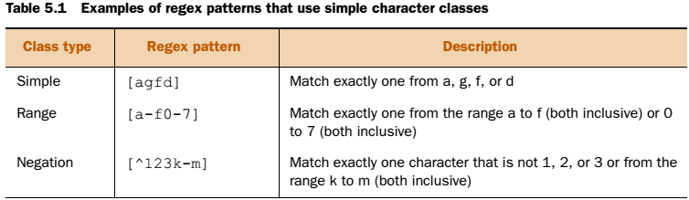{width="5.236111111111111in"
height="1.5208333333333333in"}

\[A-Za-z\] Bu da sadece bir adet harf ekler.

Buradaki ^ karakteri \[\] arasında ise deyimin tersi oluyor. Aşağıda göreceklerimizde ise sayfa başı demek oluyor! Ayrıca Character sınıfı içinde sadece ^ ve - işaretleri işleniyor, diğerleri (+,?,\*) normal karakter gibi işlem görüyor. Ayrıca değili işaret eden ^ sadece başta olabilir. Yoksa normal karakter oluyor yine.

**\[\] parantezler** sadece bir karakterdir. İçindeki her yan yana olan karakter or koşulunu temsil eder.

**() parantezler** birkaç karakter olabilir.

Eğer pattern doğru bir şekilde tanımlanamaz ise runtime'da PatternSyntaxException fırlatılır.

### Predefined character classes

Java'da ön tanımlı character sınıfları bulunur. Bunları patterde kullanabilmek için \\ ile kaçılması gerekebilir. Ayrıca listenin en başındaki nokta sadece bir karakter yerine geçer.

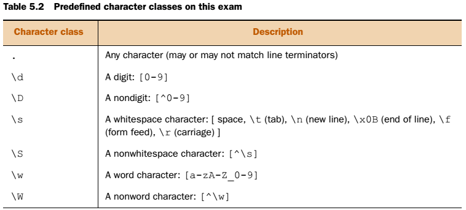{width="5.263888888888889in"
height="2.3819444444444446in"}

### Matching boundaries

Arama yaparken aramaya sınırlama koymak isteyebiliriz. Mesela at kelimesini arıyoruz ama Murat içindeki at kelimesini istemiyoruz. Bu durumda kullanılırlar.

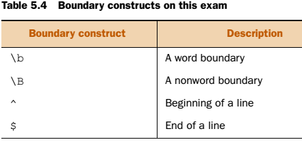{width="3.0625in" height="1.4444444444444444in"}

Burada "\\bthe" pattern'ı the ile başlayan kelimeleri arar. "the\\b" the ile biten kelimeleri arar.

"\\Bthe" pattern'ı the ile başlamayan kelimeleri arar. "the\\B" the ile bitmeyen kelimeleri arar.

Pattern yazarken logical operatörler kullanılabilir. \| & gibi.

Eğer Word boundary bir Character Class'ın içine yazılır ise Unicode karşılığı olan bacspace aranmış gibi olur. Yani içinde çalışmaz.

### Quantifiers

Quantifier = miktar belirleyici.

Şu ana kadar tek kelime aradık. Birden fazla kelime aramak için Quantifiers kullanılır. Pattern'in **arama sonucunda kaç kere bulunduğunu belirlemek** için kullanılır. 3 çeşit quantifier vardır. Greedy(açgözlü), possessive(sahiplik) ve reluctant(isteksiz). Sadece Greedy sınav konusudur.

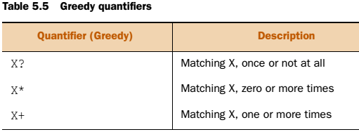{width="3.548611111111111in"
height="1.3055555555555556in"}

(Not at all = hiç)

Açgözlü denmesinin sebebi, aranan pattern'ı bulmak için input string'i önce sonuna kadar okur.? Burada bu belirleyilerin sadece önündeki parametreler aranır veya parametre grupları \-\-- ()

| Regex | Searches for |
|---|---|
| colou?r | colour or color |
| Aug(ust)? | August and Aug |
| [bmf]?all | ball, mall, fall, and all |
| fo*d | food, fod, foood, fd |
| [A-Za-z]\d*[A-Za-z] | Bir harf ile başlayıp biten ayrıca bunların arasında sıfır veya daha fazla numara olan stringler. |
|  | b234a, A6Z, and ab |
| [A-Za-z][1-5]*[A-Za-z] | b234a and ab |
| fo+d | food, fod, foood |
| [A-Za-z]\d+[A-Za-z] | b234a and A6Z |


Regex en son harfe de bakıyor!

Regex bulunan karakteri tekrar aramaya katmaz. Devam eder.

Kolayca hatırlamak için;

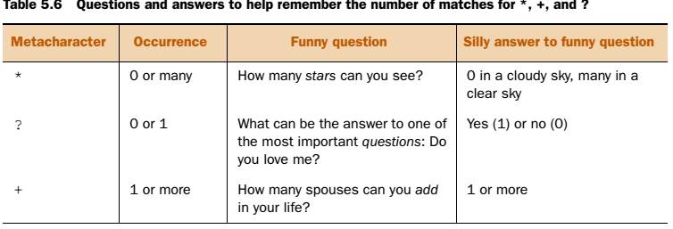{width="5.236111111111111in"
height="1.7847222222222223in"}

### Java's regex support

Java regex package'ı ile CharSequence nesneleri içinde Unicode arama yapmayı sağlar. Pattern ve Matcher sınıfları ile arama yapılır. Pattern sınıfı kurucusu factory method ile sağlanır. (Pattern.compile(\"a\*b\");) Matcher sınıfı da aynı şekilde şu method ile instante edilir. (p.matcher(\"aaaaab\"))

Matcher sınıfı pattern nesnesi kullanarak CharSequence nesneleri içinde arama yapan bir motordur. String sınıfının da matcherin match özelliğini kullanan bir metodu vardır. (String.matches(regex[)])

## Searching, parsing, and building strings

Bu kısımda Scanner, StringTokenizer, StringBuilder, String, ve Formatter sınıfları ile Java'da String arama, parse etme ve oluşturma işlemlerini göreceğiz.

### Searching strings

Arama için String class'ının index ve indexOf metodları vardır. Syntax
ise şöyledir.

```java
int a = String.lastIndexOf(int ch, int fromIndex)
```

```java
int a = String.indexOf(int ch, int fromIndex)
```

- İlgili string'i bulamaz ise -1 döndürür.
- fromIndex değeri negatif veya size dan büyük ise hata vermez.
- Arama şekilleri farklıdır, biri baştan başlar, biri sondan.

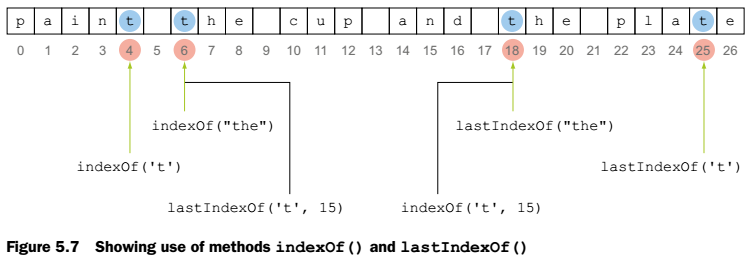{width="5.208333333333333in"
height="1.7916666666666667in"}

Contains metodu string içinde string arar ve boolean döndürür. Parametre olarak CharSequence interface'i ister. String, StringBuilder ve StringBuffer sınıfları CharSequence interface'ini implement ettiği için parametre olarak geçilebilirler.

subSequence ve substring metodları ise aşağıdaki gibi kullanılabilirler. Aslında subSequence içerde substring'i çağırır. [endIndex değerlerindeki karakterler sonuca dahil değildirler]. Ayrıca indexOf daki gibi olmayan bir index yazılır ise runtime da StringIndexOutOfBoundsException fırlatırlar.

```java
CharSequence subSequence(int beginIndex, int endIndex)
String substring(int beginIndex)
String substring(int beginIndex, int endIndex)
```

Split metodu ise string'i regex tanımındaki gibi String dizisi halinde parçalara böler. Split etme işlemi Tokenizing olarak geçer. Ayırma için aranan kelime seperator, ayrılan parçalar ise token olarak isimlendirilir. Ayırma işleminde istenilen sayıda token ortaya çıkmasını istiyorsak, limit ile sınır konabilir. Limite ulaşılınca ayırma işlemi eşleşme olsa dahi yapılmaz, geri kalan string o şekilde kalır. Tanımı şu şekildedir;

```java
String[] tokens = sentence.split(String regex, int limit);
```

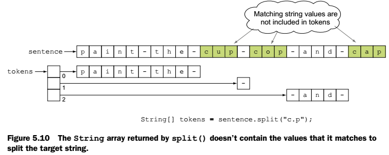{width="5.270833333333333in"
height="2.111111111111111in"}

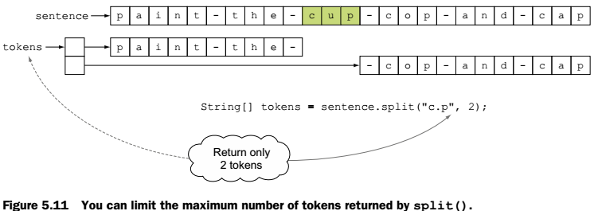{width="5.215277777777778in"
height="1.8402777777777777in"}

### Replacing strings

String sınıfının replace için tanımladığı metodlar aşağıdaki gibidir.

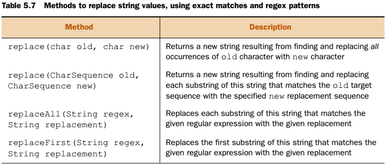{width="5.208333333333333in"
height="2.2430555555555554in"}

ReplaceAll eğer bir eşleşme bulamaz ise orijinal string'i geri döndürür.( Replace gibi CharSequence alan parametreli metodu yoktur. Bu yüzden sınavda StringBuilder alan sorulara dikkat et. ) Replace ile ReplaceAll farkı da biri ararken literal string kullaınr diğeri regex kullanır. Biri sadece string argüman alır diğeri CharSequence(String, StringBuilder ve StringBuffer ) alır.

String sınıfının diğer metodları ise;

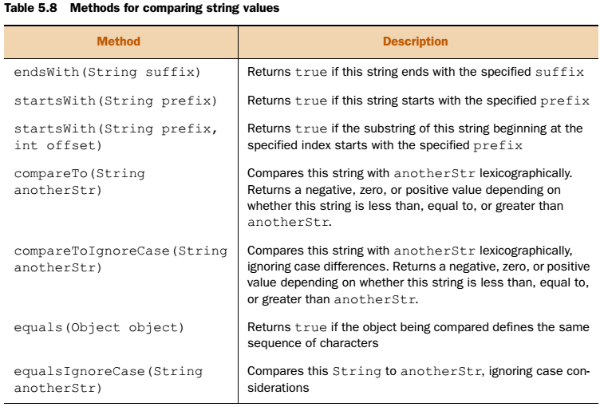{width="5.222222222222222in"
height="3.5416666666666665in"}

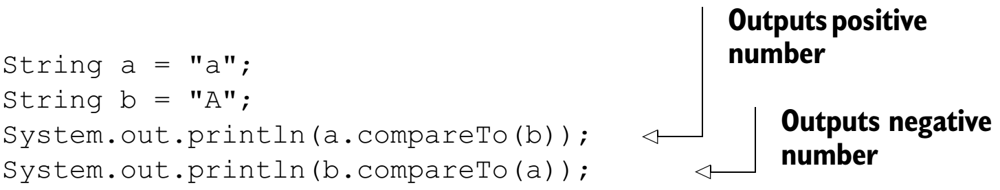{width="6.3in" height="1.19958552055993in"}

### Parsing and tokenizing strings with Scanner and StringTokenizer

Parse etmek bir string içinde token veya item arayarak analiz etme işlemine verilen addır.

**Scanner Sınıfı**

Scanner sınıfı Stream'leri parse ve tokenize etmek için kullanılır. Giriş string'ini alıp belirtilen kurala göre token'larına ayırır. Default ayırıcısı "White space" lerdir. Yapıcıları şu şekildedir;

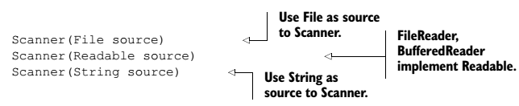{width="4.472222222222222in"
height="0.9166666666666666in"}

Delimiter belitmek için scanner.useDelimiter("String") kullanılır.

------

  scanner.hasNext()       		Sonraki string değer varmı

  Scanner.hasNextInt()    		Sonraki int değer varmı

  scanner.next()          		String döndürür.

  scanner.nextInt()       		int döndürür.

  scanner.nextBoolean()  	 Boolean döndürür.

  scanner.findInLine()   		 tries to match the specified\

##                           pattern with no regard to delimiters in the input

Yukardaki next'lerde uygun veri tipi kullanılmaz ise [InputMismatchException] hatası fırlatılır.

**StringTokenizer Sınıfı**

Scanner sınıfı ile aynı görevi yapar. Demiliter belirlenmemiş ise aynı şekilde default olarak White space'dir. Metodları;

| Metod | Açıklama |
|---|---|
| st.hasMoreTokens() | Başka token varmı? Boolean döndürür. |
| st.hasMoreElements() |  |
| st.nextToken() | Var ise sıradaki token’ı döndürür. nextToken String döndürürken, nextElement Object döndürür. |
| st.nextElement() |  |


Delimiter null atanır ise runtime da **NullPointerException** fırlatır.

```java
StringTokenizer st = new StringTokenizer("start your startup", null);
System.out.println(st.hasMoreElements());
```


## Formatting strings

OutputStream, File ve StringBuilder sınıfları ile Stringleri biçimlendirmeyi işleyeceğiz.

### Formatting classes

String formatlama için java.util.Formatter ve PrintStream, PrintWriter gibi I/O classes sınıfları vardır. Formatter sınıfı formatladığı stringleri bir dosyaya, stream'e veya StringBuilder a yazabilir. C dilinin printf metodundan esinlenerek yazılmıştır.

You can use class System to access the standard input, standard output, and error output streams. The standard output in class System is made accessible using a static variable, out, which is of type PrintStream (remember using System.out.println()). Class PrintStream defines methods to output formatting strings

### Formatting methods

Formatter sınıfı belirtilen hedefe belirtilen Locale kullanarak yazmak için overloaded format metoduna sahiptir. PrintStream sınıfı da hem format metoduna hemde printf metoduna sahiptir. Zaten printf arka planda format metodunu kullanır. Bu 2 sınıfın metodları ve parametreleri şöyledir.

```java
format(String format, Object... args)				// Formatter ve PrintStream
format(Locale l,String format, Object... args)		// Formatter ve PrintStream
printf(String format, Object... args)				// PrintStream
printf(Locale l, String format, Object... args)		// PrintStream

```

> NOT: System.out.println() formatlanmış string'leri standard output'a yazamaz fakat System.out.format() ve System.out.printf() yazabilirler.

Bu örneklerde %s yerine name değişkeninin değeri dosyaya, consola yazılır.

```java
formatter.format("My name is %s", name);
System.out.printf("My name is %s", name);
```


### Defining format strings

Format ve printf de şu sıra kullanılır.;

\%\[argument\_index\$\]\[flags\]\[width\]\[.precision\]conversion\_char

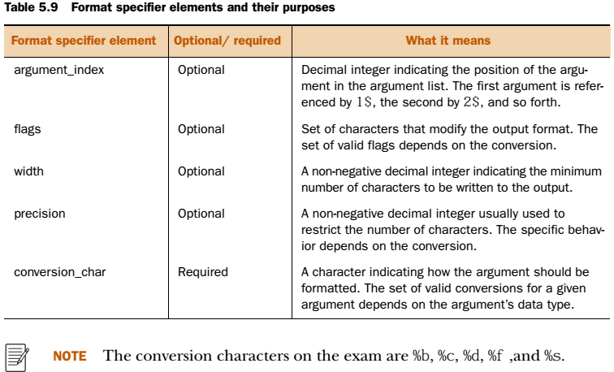{width="5.25in" height="3.1805555555555554in"}

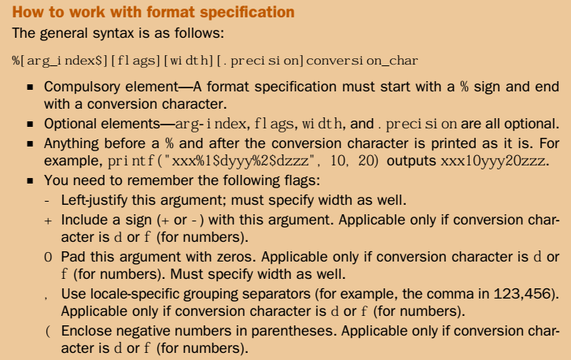{width="5.041666666666667in"
height="3.173611111111111in"}

### Formatting parameter %b

\%b boolean değeri yazdırır. Bütün veri tipleri ve nesneler parametre olarak gönderilebilir. Parametre boolean veya Boolean ise sonuç String.valueOf() fonksiyonu sonucu olan bir String'dir. Diğer bütün hallede true döner. Eğer gönderilen null ise false döner.

Parametre sayıları uyuşmadığı durumlarda; Eğer %b sayıları fazla ise ignore edilir, ama az ise MissingFormatArgumentException hatası fırlatılır. Birinci satır OK, ikinci ise hata fırlatır.

```java
System.out.format("Name %b", name, age, isShort);
System.out.printf("Name %b, age %b", name);
```


### Formatting parameter %c

\%c karakteri Unicode değerini basar. Eğer Unicode karşılığı yok ise runtime'da IllegalFormatConversionException hatası fırlatır. Bu parametre char, byte, short, int, Character, Byte, Short ve Integer alır, boolean, long, float, Boolean, Long, Float, or any other class alırsa yukardaki hatayı fırlatır.

### Formatting parameters %d and %f

\%f double ve float sayı tiplerini formatlamak için kullanılır.( float, double, Float, and Double) Default olarak notkadan sonra 6 digit yazdırır ve 6 dan sonrasını da yuvarlar. İnt tipi için hata verir!!

System.out.printf(\"\[%,f\]\", 12345); // Bu satır runtime'da IllegalFormatConversionException hatası fırlatır.

%d ise integer'lar için kullanılır. Bu parametreye byte, short, int, long, Byte, Short, Integer, or Long veri tipleri geçilebilir, diğer veri tiplerinin hepsi için runtime'da hata verir.

Ayrıca bu iki parametre için flag'ler tanımlanabilir. Bu flagler = +, 0, (, ve ,(comma) 'dır. Diğerleri için runtime'da hata alırız.

### Formatting parameter %s

%s ise genel amaçlı bir formatter'dır. Primitive'ler için değerini, nesneler için ise toString() metodunun sonucunu yazdırır. Bütün veri tipleri ve nesneler parametre olarak gönderilebilir.