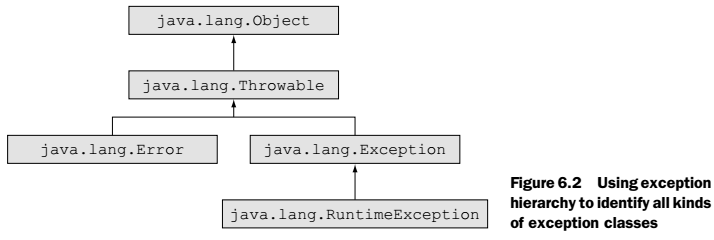
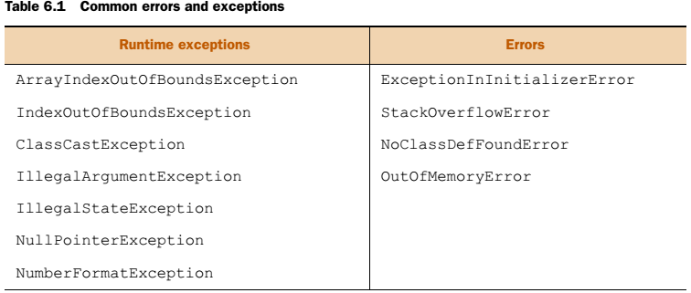
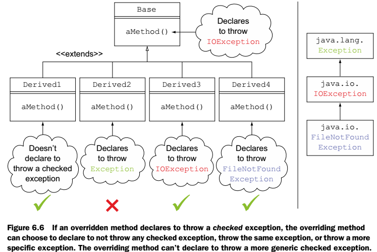
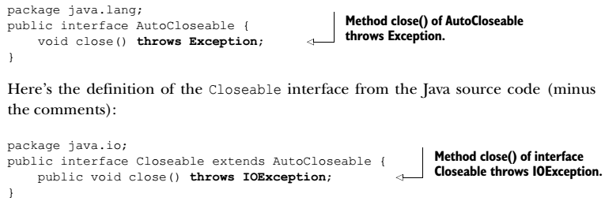

[6 Exceptions and assertions](#exceptions-and-assertions)

[6.1 Using the throw statement and the throws clause](#using-the-throw-statement-and-the-throws-clause)

[6.1.1 Creating a method that throws a checked exception](#creating-a-method-that-throws-a-checked-exception)

[6.1.2 Using a method that throws a checked exception](#using-a-method-that-throws-a-checked-exception)

[6.1.3 Creating and using a method that throws runtime exceptions or errors](#creating-and-using-a-method-that-throws-runtime-exceptions-or-errors)

[6.1.4 Points to note while using the throw statement and the throws clause](#points-to-note-while-using-the-throw-statement-and-the-throws-clause)

[6.2 Creating custom exceptions](#creating-custom-exceptions)

[6.2.1 Creating a custom checked exception](#creating-a-custom-checked-exception)

[6.2.2 Creating a custom unchecked exception](#creating-a-custom-unchecked-exception)

[6.3 Overriding methods that throw exceptions](#overriding-methods-that-throw-exceptions)

[6.4 Using the try statement with multi-catch and finally clauses](#using-the-try-statement-with-multi-catch-and-finally-clauses)

[6.4.1 Comparing single-catch handlers and multi-catch handlers](#comparing-single-catch-handlers-and-multi-catch-handlers)

[6.4.2 Handling multiple exceptions in the same exception handler](#handling-multiple-exceptions-in-the-same-exception-handler)

[6.5 Auto-closing resources with a try-with-resources statement](#auto-closing-resources-with-a-try-with-resources-statement)

[6.5.1 How to use a try-with-resources statement](#how-to-use-a-try-with-resources-statement)

[6.5.2 Suppressed exceptions](#suppressed-exceptions)

[6.5.3 The right ingredients](#the-right-ingredients)

[6.6 Using assertions](#using-assertions)

[6.6.1 Exploring the forms of assertions](#exploring-the-forms-of-assertions)

[6.6.2 Testing invariants in your code](#testing-invariants-in-your-code)

[6.6.3 Understanding appropriate and inappropriate uses of assertions](#understanding-appropriate-and-inappropriate-uses-of-assertions)


# Exceptions and assertions

Bu chapterda Exceptions ve Assertions öğreneceğiz.

## Using the throw statement and the throws clause

- **Exception classes** --- Refers to Throwable class and all its subclasses
- **Error classes **--- Refers to Error class and all its subclasses
- **Runtime exception classes **--- Refers to RuntimeException class and all its subclasses
- **Unchecked exception classes(Runtime)** --- Refers to runtime exception classes and error classes
- **Checked exceptions classes **--- Refers to all exception classes other than the unchecked exception classes. Class Throwable and any of its subclasses that aren't a subclass of either **Error** or **RuntimeException** are checked
  exceptions.

{width="4.958333333333333in"
height="1.6666666666666667in"}

{width="6.3in"
height="3.7604516622922133in"}

### Creating a method that throws a checked exception

Metod imzasına throws yazarak veya bir üst metodda yakalayarak hata fırlatılabilir. "runtime exceptions" ve "errors" u metod imzasında tanımlamaya gerek yoktur. Bir metod bunlar tanımlanmasa bile bu hata tiplerini fırlatabilir.

### Using a method that throws a checked exception

Bir Checked Exception'ı ya yakalamalı ya da metod imzasında tanımlamalıyız. Bu kurala "handle-or-declare" kuralı denir. Bu kural "unchecked exception" larda geçerli değildir.

Bir metodda bu kuralın her ikiside tanımlanabilir. Metod kesinlikle hata fırlatmıyor olsa bile handle etmemiz şarttır.

### Creating and using a method that throws runtime exceptions or errors

Runtime Exception'ları ve error ları yakalamak zorunda değiliz. Method imzasına da yazabiliriz ama hiçbir etkisi olmamaktadır. Unchecked Exceptionlar tanımlansada tanımlanmasada metod tarafından fırlatılabilir. Aşağıdaki liste genel Unchecked Exceptionları göstermektedir.

{width="5.25in" height="2.2291666666666665in"}

### Points to note while using the throw statement and the throws clause

1. **Bir metod throws da tanımlanan Checked Exception 'ın SubClass'ını fırlatabilir, SuperClass'ını fırlatamaz!**

```java
public void readFile(String file) throws FileNotFoundException {
    throw new IOException("Missing file");					// BU SATIR DERLENMEZ!!
}

public void readFile(String file) throws IOException {
	throw new FileNotFoundException("Missing file");		// BU SATIR DERLENİR!!!
}
```

Bu kural error ve runtime Exception'larda geçerli değildir.

2. **Bir metod Exception'ı handle edip tekrar fırlatmayı seçebilir.**

```java
void useReadFile(String name) throws FileNotFoundException {
	throw new FileNotFoundException("Missing file");
}
```


3. **Checked Exception fırlatmayı tanımlayan bir metod bu Exception'ı hiç fırlatmamayı seçebilir.** Biraz önce degindiğim gibi metod imzasında throws var ama içinde hiçbirşey yok. Bu durumda bir sorun çıkmaz.
4. **YOU CAN RETHROW EXCEPTIONS WITH [MORE-INCLUSIVE TYPE CHECKING**. Java 7 ile yeni bir özellik geldi. Birinci maddede belirtilen özellik eğer exception'u yeniden oluşturmuyor isek geçersizdir. Yani java fırlatılan hatadan emin ve içindekini biliyor ise bu kuralı uygulamaz. Örneği;

public static void main(String args\[\]) throws **IOException**,
**SQLException** {

```java
public static void main(String args[]) throws IOException, SQLException {
try {
    if (source.equals("DBMS"))
       throw new SQLException();
    else
       throw new IOException();
}
catch (Exception e) {
        throw e;		// Bu satır hata vermez. JVM içindekinin tipini bilir…
        throw new Exception();	// Bu satır hata verirdi!
}
```


5. **Bir metod içinde tanımlı olmadığı halde throws Exception ile tanımlanmayı seçebilir.** Fakat bir try bloğu Catch bloğunda Checked Exception fırlatıyor ise try içinde ya bunu fırlatmalı veya fırlatan bir metodu çağırmalıdır.

```java
void method9() {
   try {}
   catch (RuntimeException e) {}	// Bu metod derlenir!
}

void method10() {
   try {}
   catch (FileNotFoundException e) {}	// Bu Method Derlenmez!
}
```


## Creating custom exceptions

```java
FileNotFoundException extends IOException extends Exception
```


{width="6.3in" height="3.839876421697288in"}

### Creating a custom checked exception

Checked Exception'ımızı kendimiz tanımlamak için java.lang.Exception sınıfı ve alt sınıflarından extend etmeliyiz.(Runtime hariç) Burada throwable dan da extend edebiliriz ama tavsiye edilmez. Çünkü OutOfMemoryError da dahil her hatayı yakalamış oluruz bu şekilde.

### Creating a custom unchecked exception

Aynı şekilde java.lang.RuntimeException sınıfından extend ederek RunTimeException, java.lang.Error dan extend ederek de Error oluşturabiliriz. Ama error oluşturma tavsiye edilmez.

## Overriding methods that throw exceptions

{width="5.1875in" height="3.4652777777777777in"}

Bu kurallar tabiiki sadece Checked Exception'lara uygulanır.

1. Base class metodu Checked Exception fırlatmayı tanımlamamış ise Extended Class'da Exception fırlatılamaz. Kod derlenmez.

```java
class Base {
   public void aMethod() {}
   public void noRuntimeException() {}
}
class Derived extends Base {
   public void aMethod() throws Exception {}						// DERLENMEZ!
   public void noRuntimeException() throws RuntimeException {}		// DERLENİR!
}
```


2. Base class metodu Checked Exception fırlatmayı tanımlamış ise Extended Class tanımlamamayı seçebilir. Kod derlenir!

```java
class Base {
   public void aMethod() throws IOException {}
   public void withRuntimeException() throws RuntimeException {}
}
class Derived1 extends Base {
   public void aMethod() {}				
   public void withRuntimeException() {}
}
```


3. Base class metodu Checked Exception fırlatmayı tanımlamış ise Extended Class bu Exception'ın SuperClass'ını fırlatamaz. Kod derlenemez.

```java
class Base {
   public void aMethod() throws IOException {}
   public void withRuntimeException() throws NullPointerException {}
}
class Derived2 extends Base {
   public void aMethod() throws Exception {}			// BU SATIR DERLENMEZ!
   public void withRuntimeException() throws RuntimeException{}
}
```


4. Base class metodu Checked Exception fırlatmayı tanımlamış ise Extended Class bu Exception'ın aynısını fırlatabilir.

```java
class Base {
   void aMethod() throws IOException {}
   void methodUncheckedEx() throws Error {}
}
class Derived3 extends Base {
   void aMethod() throws IOException {}
   void methodUncheckedEx() throws NullPointerException {}
}
```


5. Base class metodu Checked Exception fırlatmayı tanımlamış ise Extended Class bu Exception'ın Derivated Class'ını fırlatabilir.

```java
class Base {
   void aMethod() throws IOException {}
}
class Derived4 extends Base {
   void aMethod() throws FileNotFoundException {}
}
```


## Using the try statement with multi-catch and finally clauses

Java 7 ile birlikte catch içinde birden fazla hata yakalanmasına izin verilmiştir.

```java
catch (IOException | SQLException ex)
```


### Comparing single-catch handlers and multi-catch handlers

Tek satırda birbiri ile alakasız Exception sınıfları yakalanabilir;

```java
catch (FileNotFoundException | MyCustomException | NumberFormatException e){
         //process exception
}
```


### Handling multiple exceptions in the same exception handler

Burada dikkat edilecek konu yukardaki satırda 3 adet exception yakalanır ve ayrıca bu exception'ların alt sınıfları da yakalanır.

Multi-catch bloklarında subClass'lar hiçbir şekilde yanyana yazılamaz, yazılırsa kod derlenemez.

```java
	catch (IOException | FileNotFoundException | SQLException e)	// BU SATIR DERLENMEZ!
   catch (FileNotFoundException | IOException | SQLException e)		// BU SATIR DERLENMEZ!
   catch (IOException | SQLException e) 							// DERLENİR!
```

Multi-catch ile single-catch kombine edilebilir.

```java
catch (FileNotFoundException e) {}
catch (IOException | SQLException e) {}		//FileNotFoundException ve altını yakalar. 
```

Multi-catch bloğunda e sadece bir tane olabilir. Bu e değişkeni Final dır. Tekrar atama yapılmaz. Aşağıdaki satır derlenmez.

```java
catch (IOException| SQLException e) {
    e = new FileNotFoundException();
}
```

Multi-catch bloğunda e değişkenin referance variable'ı "Exception" dır! Yukarıdaki örnekte e değişkeni IO veya SQL exception değil, Exception dır. Bunun sadece bir istisnası vardır. *intersection type* özelliği ile Exception sınıfının metodlarına ulaşabiliriz. Örnek kod chapter6.s4 içinde var.

**Exception sınıfları toString() metodu sınıf ismini ve hata mesajını yazdırırlar! **

( Exception toString() == **java.io.FileNotFoundException**: Hata mesajı(varsa) )

## Auto-closing resources with a try-with-resources statement

Java 7 ile gelen try-with-resources özelliği içindeki kaynakları otomatik olarak kapatmaktadır.

### How to use a try-with-resources statement

Bu try blokları java.lang.AutoCloseable interface'ini implemente eden sınıfları try'ın son satırında ilgili nesnenin close() metodunu çağırarak otomatikman kapatır. Try içinde tanımlanması şu şekildedir;

```java
try (FileInputStream fin = new FileInputStream(file)){
    
}catch (IOException e) {
   	System.out.println(e.toString());
}
// veya
try (FileInputStream fin = new FileInputStream(file);){

```

Try içindeki satır **FileNotFoundException** hatası fırlatabilir. Ama catch içinde sadece **FileNotFoundException** tanımlar isek çalışmaz! Sebebi ise try'ın otomatik olarak close() metodunu çağırması ve close metodunun da hata olduğu zaman IOException fırlatmasıdır. Her ikisini sağlayacak yukardaki gibi bir catch yazar isek sorun yaşanmayacaktır.

### Suppressed exceptions

try-with-resources özelliğinde try içinde(initalizion kısmı hariç) bir hata fırlatılıyor ve o sırada try'in son metodu olan close() 'da da hata alınıyor ise; try içinde hata alındıktan sonra close metodu içi çağrılır. Burada da hata alınıyor ise bu hatalar supress edilir ve try içindeki hata fırlatılır. Bunun örneği chapter6.s5 içinde var.

Bu suppress edilen hatalara ise fırlatılan Exception içinde getSuppressed() metodundan ulaşabiliriz. Bu metod bize Throwable nesne dizisi döndürür. Aynıca bu metod asla null döndürmez. İçi boş ise size'ı 0 dır.

### The right ingredients

try-with-resources özellikleri;

1. Try içinde kaynaklar initalize edilmelidir. Edilmiyorsa kod derlenemez! Bu değişkenler **Final'dır**!! İnitalize etmiyorsan
   null'a eşitleyebilirsin ama Try içinde tekrar nesne ataması yaparsan kod yine derlenmez. Null'a eşitlemenin hiçbir önemi yoktur.
2. Try içindeki kaynaklar sadece Try bloğu içinde geçerlidir. Catch ve Finally'den bile ulaşamayız.
3. Try içindeki kaynaklar arasında noktalı virgül olmalıdır ama en son nesne sonrasında noktalı virgül şart değildir. Olsa da olur olmasada.
4. Try içindeki kaynaklar java.lang.AutoCloseable interface'ini veya alt class'larını implemente etmelidirler. Bu interface'de java.io.Closeable dan extend edilmiştir. Eğer kendi sınıflarımızın Try with resources ile kullanılmasını istiyor isek sınıflarımız AutoClosable interface'ini implemente etmelidirler. Bu interface içindeki close() metodunu override etmek zorundalardır.

{width="5.3125in" height="1.7708333333333333in"}

5. Try içindeki kaynaklar tanımlanma sırasının tersi istikametinde close fonksiyonları çağrılır.

## Using assertions

Uygulamalarımızı test ve debug etmek için bazen varsayımları düşünürüz. Bu varsayımları javada uygulamak için assertions ları kullanırız. Assert fonksiyonu bu iş için kullanılır. Bu fonksiyon true veya false döner. Biz varsayımımızın her zaman doğru olmasını isteriz. Ama gerçekleşmez ise burada AssertionError fırlatılır. Assertions lar disable edilmiştir,
bü yüzden performans kaybına yol açmazlar. Açmak için Eclipse'de VM Arguments kısmına "-ea" parametresi yazılır.

### Exploring the forms of assertions

Assertion tanımlamak için iki yöntem vardır, kısa ve uzun. Kısa yöntem;

```java
assert expression; 			( assert false; )
```

Uzun yöntem ise ;

```java
assert expression : Ezpression ; ( assert false : "Testing Assertions"; )
```

şeklindedir. Her iki yöntemde expression false olursa AssertionError fırlatılır. Her iki expression'ının da boolean dönmesi gerekir. Fakat uzun yöntemdeki Expression herhangi bir primitive veya nesne dönebilir. Ama dönmek zorundadır. Yoksa derlenmez! Nesne döndüğü durumlarda ise ilgili nesnenin toString() metodu çağrılarak sonucu yazdırılır.

### Testing invariants in your code

Değişmezleri kodda test etmek için 3'e ayıralım.

- Internal invariants(Kodun içinde kodun ulaşmaması gereken yerlere assertion koyarak bunları belirtebiliriz. Sadece kodun ulaşmaması gereken yerlere. Unreachable code ise farklı bir durumdur. Ulaşılamaz kod zaten derlenmez, hata verir. )
- Control-flow invariants(Mesela 2 tane if var. Gelen veri iki koşula da uymak zorunda, ama uymayan gelir ise if'lerin sonuna assertion konabilir. )
- Class invariants (Mesela her metodunu önüne assert ile hazırmı fonksiyonu konabilir. Bu şekilde sistem hazır değil ise assertion Exception fırlatılabilir.)

### Understanding appropriate and inappropriate uses of assertions

1. Public metodların parametrelerini kontrol etmek için assertion kullanmayınız. Assertion'lar kapatılabildiği için hiçbir işe yaramazlar.
2. Private metodların parametrelerini kontrol etmek için assertion kullanınız. Private metodlara valide edilmiş değerler geldiği için bunları assert yapabiliriz. Ancak assert ile değerlerini değiştirme!
3. Kodun düzgün çalışması için assertion'ları kullanma! Kapatılabildiği için assertions kullanmak tavsiye edilmez.
4. Asertion'ları asla olmayacak diyebileceğin yerlere koy.(Public metodlarda bile). Bu şekilde kolayca test ortamında gerekli incelemeyi bir parametre değişikliği ile yapabilirsin ve production'da performans kaybı yaşanmaz.

Assertions'lar bir sınıf ve bir package için ayrıca kapatılabilir;

```sh
java --ea DemoAssertion
java --enableassertions DemoAssertion

java --da DemoAssertion
java --disableassertions DemoAssertion
```

