[8 Java file I/O (NIO.2)](#java-file-io-nio.2)

[8.1 Path objects](#path-objects)

[8.1.1 Multiple ways to create Path objects](#multiple-ways-to-create-path-objects)

[8.1.2 Methods to access Path components](#methods-to-access-path-components)

[8.1.3 Comparing paths](#comparing-paths)

[8.1.4 Converting relative paths to absolute paths](#converting-relative-paths-to-absolute-paths)

[8.1.5 Resolving paths using methods resolve and resolveSibling](#resolving-paths-using-methods-resolve-and-resolvesibling)

[8.1.6 Method relativize()](#method-relativize)

[8.2 Class Files](#class-files)

[8.2.1 Create files and directories](#create-files-and-directories)

[8.2.2 Check for the existence of files and directories](#check-for-the-existence-of-files-and-directories)

[8.2.3 Copy files](#copy-files)

[8.2.4 Move files and directories](#move-files-and-directories)

[8.2.5 Delete files and directories](#delete-files-and-directories)

[8.2.6 Commonly thrown exceptions](#commonly-thrown-exceptions)

[8.3 Files and directory attributes](#files-and-directory-attributes)

[8.3.1 Individual attributes](#individual-attributes)

[8.3.2 Group of attributes](#group-of-attributes)

[8.3.3 Basic attributes](#basic-attributes)

[8.3.4 DOS attributes](#dos-attributes)

[8.3.5 POSIX attributes](#posix-attributes)

[8.3.6 AclFileAttributeView interface](#aclfileattributeview-interface)

[8.3.7 FileOwnerAttributeView interface](#fileownerattributeview-interface)

[8.3.8 UserDefinedAttributeView interface](#userdefinedattributeview-interface)

[8.4 Recursively access a directory tree](#recursively-access-a-directory-tree)

[8.4.1 FileVisitor interface](#filevisitor-interface)

[8.4.2 Class SimpleFileVisitor](#class-simplefilevisitor)

[8.4.3 Initiate traversal for FileVisitor and SimpleFileVisitor](#initiate-traversal-for-filevisitor-and-simplefilevisitor)

[8.4.4 DirectoryStream interface](#directorystream-interface)

[8.5 Using PathMatcher](#using-pathmatcher)

[8.6 Watch a directory for changes](#watch-a-directory-for-changes)

[8.6.1 Create WatchService object](#create-watchservice-object)

[8.6.2 Register with WatchService object](#register-with-watchservice-object)

[8.6.3 Access watched events using WatchKey interface](#access-watched-events-using-watchkey-interface)

[8.6.4 Processing events](#processing-events)


# Java file I/O (NIO.2)

NIO.2 = New Input/Output version 2

## Path objects

java.nio.file.Path interface'i nesneleri dosya sistemindeki klasör ve dosyaların path'larını temsil eder. Bu interface path'a giden yolu hiyaraşik olarak platformun delimiter'ına göre ayrılmış şekilde tutar. Java 7 den önceki java.io.File sınıı da aynı işi yapar ama birçok eksileri olduğu için Java7 ile beraber NIO.2 gelmiştir.

Bir dosyanın yolu 2 şekilde temsil edilir. Rootdan itibaren yazılırsa Absolute Path, sadece dosya ismi yazılır ise Relative Path şeklinde. Bu path nesnesi system-specific 'dir. Yani Windows'daki hello.txt dosyası aynı klasördeki solarisdeki hello.txt dosyası ile asla eşit değildir.

Bir Path nesnesi gerçek bir dosyaya bağlı olmayabilir, sanal da olabilir. Yani olmayan bir klasör veya dosyayı da temsil edebilir. Dolayısıyla bu sınıf gerçek dosyalar ile işlem yapacak metodlar içermez. Gerçek dosyalar ile çalışmak için java.nio.file.Files sınıfı kullanılır.

"Symbolic link" başka bir dosyayı gösteren özel bir dosyadır ve Path sınıfı bu özel dosyaları da gösterebilir. Sembolik linkin gösterdiği dosyaya "target" denir. Sembolik linke yapılan bütün işlemler target'a kanallanır. Yani bir sembolik linki okuyup yazar isek, sembolik linkin gösterdiği dosyaya işlem yapmış oluruz. Fakat sembolik linki silersen hedef dosya silinmez! NIO sembolik linklerle çalışabilir hatta başka bir sembolik linki gösteren dairesel referansları da tespit edebilir.

### Multiple ways to create Path objects

Path nesneleri aşağıdaki şekillerde yaratılabilir.

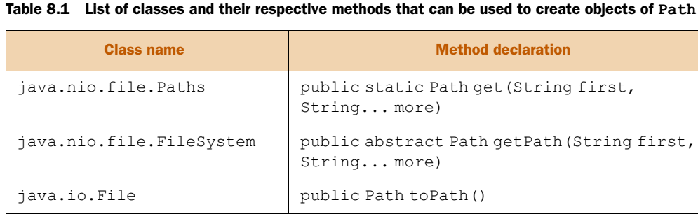{width="6.3in" height="2.000648512685914in"}

Paths sınıfı Path nesneleri döndüren fabrika bir sınıfıdır. Get(...) metodu ise Path nesneleri yaratan ve birçok string alabilen bir metoddur. Parametre olarak dosya veya klasör alır ve Path nesnesi döndürür. String parametrelerde forward slash(/) kullanabiliriz. Bazı örnekler;

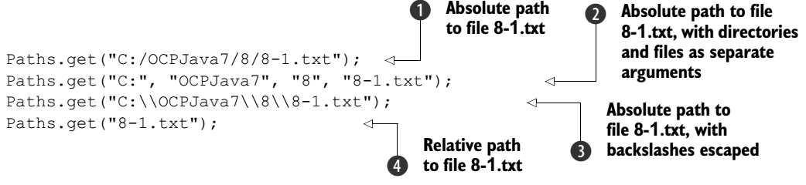{width="6.3in" height="1.450754593175853in"}

  "/" (7 tuşunun üstündeki)       		  Forward slash    		 No need to escape

  "\\" (? İşareti çaprazındaki)   			Backward slash   		Must escape !

**FileSystem Class kullanarak Path nesneleri oluşturma;**

FileSystem sınıfı abstract bir sınıftır. FileSystems sınıfı implemente eder. Bu sınıf içindeki getDefault metodu ile nesne alınarak, bu nesneden getPath çağrılarak Path nesnesi elde edilir. Örnekleri;

```java
FileSystems.getDefault().getPath("/home/OCPJava7/8/8-1.txt");
FileSystems.getDefault().getPath("/home", "OCPJava7", "8", "8-1.txt");
FileSystems.getDefault().getPath("\\home\\OCPJava7\\8\\8-1.txt");
FileSystems.getDefault().getPath("8-1.txt");
```

**NOT:** Bir Path nesnesi fiziksel olarak olmayan bir dosya veya klasörü gösterebilir. Bu nesneler geçerlidirler.

**File Class kullanarak Path nesneleri oluşturma;**

Java 7 ye kadar java.io.File sınıfı dosya ve klasörleri göstermek için kullanılıyordu. Java 7 ile birlikte File sınıfına toPath() metodu eklenerek nio sınıfları ile arasındaki boşluk dolduruldu. Şöyle dönüşüm yapılabilir.

```java
File file = new File("Hello.txt");
Path path = file.toPath();
```

Bu şekilde File nesnesi java.nio.file.Path nesnesine dönüştürülmüş olur.

```java
Path path = Paths.get("");
```

Yukardaki satırda ise içinde bulunduğu dizini temsil eder. Path.toString bir şey döndürmez iken path.getAbsolutePath() ise absolute path dizinini döndürür.

**NOT:** Paths.get() ve File.toPath()arka planda FileSystems.getDefault().getPath() metodunu çağırır.

Path nesnelerini gerçek dosyalar ile ilişkilendirmeden önce aşağıdaki konuları açıklığa kavuşturalım.

**INTERFACE JAVA.NIO.FILE.PATH VERSUS CLASS JAVA.NIO.FILE.PATHS**

Path bir interface, Paths ise bir sınıftır. Paths sınıfı Path interface'i tarafından temsil edilebilecek ve bu nesneleri yatarabilecek statik metodlara sahip bir utility sınıfıdır.

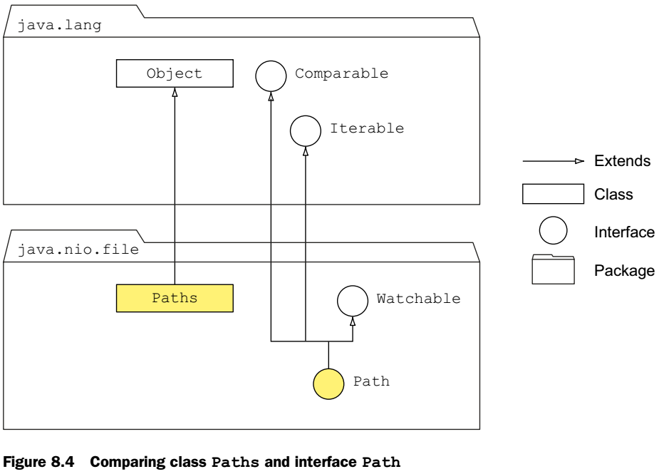{width="6.3in" height="4.529189632545932in"}

Birçok Path metodu syntactic işlemler gerçekleştirir. Yani bir dosyayı dosya sistemine ulaşmadan bellekte değiştirirler.

### Methods to access Path components

Path nesneleri ile dizin yapısı hakkında bilgi alabiliriz. 

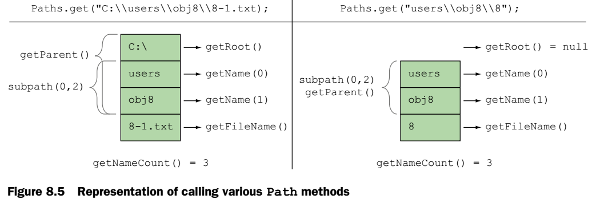{width="6.3in" height="2.1225492125984253in"}

getRoot metodu relative ler için null döndürür. getName(), getNameCount(), and subpath() metodları ise dizinin root klasörünü kullanmazlar. Bu metodlar geçersiz konumlar için IllegalArgumentException fırlatır.

### Comparing paths

Path interface'inin compareTo(Path), startsWith(String), startsWith(Path), endsWith(String) ve endsWith(Path) metodları bulunur. Bunlar string karşılaştırmaz dosyaların konumlarını karşılaştırırlar. Bu metodlarlar birbirlerinin overloaded halidir, bu yüzden null ile çağırması durumunda kod derlenemez.

### Converting relative paths to absolute paths

Bulunduğun klasörde bir dosya oluşturmak için;

```java
Path file = Paths.get("8-1.txt");
Path path = file.toAbsolutePath();
// Bulunduğun klasörün bir üstünde bir dosya oluşturmak için;
Path file = Paths.get("..\\8-1.txt");
Path path = file.toAbsolutePath();
```

Dikkat et burada toAbsolutePath(); ile getAbsolutePath() farklı metodlardır. Yukarıdaki örnekte dosya şöyle oluşur;
"E:\\OCPJavaSE7\\FileNIO\\..\\8-1.txt." Buradaki fazlalığı silmek için Path nesnesi üzerinde normalize() metodunu çalıştırabilirsin. Sonuç şu olur; "E:\\OCPJavaSE7\\8-1.txt"

```java
Path file = Paths.get("..\\8-1.txt");
Path path = file.toAbsolutePath();
path = path.normalize();
System.out.println(path);
```

Dikkat edersen path nesnesi immutable'dır ve normalize fonksiyonu değerini değişiremediği için yeniden atadık son satırda. Aynı şekilde bulunduğun klasörde ./8-1.txt. ile de dosya tanımlayabilirdik, bu da aynı şekilde normalize fonksiyonu ile 8-1.txt ye dönüşür.

**NOT:** Normalize metodu dosyanın gerçekten olup olmadığını kontrol etmez.


### Resolving paths using methods resolve and resolveSibling

İki dizini birleştirme işlemi Path interface'inin overload edilmiş resolve(String) ve resolve(Path) metodları ile yapılır.

Bir dosyayı rename etmek için aynı klasördeki path 'ini elde etmek isteyelim. Bunun için de overload edilmiş resolveSibling(String) and resolveSibling(Path) metodları kullanılır.

### Method relativize()

İki dizin arasında birbirlerine göre path'larını elde etmek istersek bu metodu kullanabiliriz. Bu metod aynı tip path'ler üzerinde çalışır. Relative ise relative ile absolute ise absolut ile. Eğer farklı tiptekileri kullanırsak veya kök dizini farklı olan iki absolute path kullanır isek runtime da IllegalArgumentException fırlatılır. Resolve gibi relativize de dosyların gerçekte olup olmadıklarını kontrol etmez.


## Class Files

Dosya ve klasör işlemleri yapmak için java.nio.file.Files sınıfı tamamen statik metodlar içerir.

### Create files and directories

Dosya ve klasör oluşturmak için Files sınıfı şu metodları içerir;

```java
public static Path createFile(Path path, FileAttribute<?>... attrs) throws IOException
public static Path createDirectory(Path dir, FileAttribute<?>... attrs) throws IOException
public static Path createDirectories(Path dir, FileAttribute<?>... attrs) throws IOException
```

(FileAttribute optional!)

createFile metodu atomik olarak parh değişkeninde aynı isimde dosya olup olmadığına bakar, yoksa oluşturur.! Eğer aynı isimde dosya veya klasör varsa, parent klasör yoksa veya file attribute'larını set edemez ise exception fırlatır.

createDirectory metodu da aynı şekilde klasörün olup olmadığına bakar ve yoksa yaratır. (sadece klasörü yaratır, parent klasör yok ise oluşturmaz. ) Eğer aynı isimde dosya veya klasör varsa, parent klasör yoksa veya file attribute'larını set edemez ise exception fırlatır.

createDirectories metodu da parenttan itibaren bütün klasörleri yaratır. Klasör var ise hata fırlatmaz! Eğer aynı isimde bir klasör var ama klasör değil ise ve file attribute'larını set edemez ise exception fırlatır.

**NOT:** İlk 2 metodda aynı dosya var ise FileAlreadyExistsException fırlatılır. 3. Metodda ise olmayan parentlar yaratılır, olanlarda hata alınmaz.

### Check for the existence of files and directories

Path türünden bir nesnenin (dosya veya klasörün) sistemde fiziksel olarak olup olmadığını;

```java
public static boolean exists(Path path, LinkOption... options)
public static boolean notExists(Path path, LinkOption... options)
```

metodları ile kontrol ederiz. Exists dosya yok veya tespit edilemiyor ise false döndürür. notExists ise exists'in tersi değildir. Hedef yok ise true döndürür, tespit edilemiyor ise yine false döndürür. Default olarak bu metodlar sembolik linkleri takip eder. Override etmek için LinkOption.NOFOLLOW\_LINKS parametresi geçilebilir. (java.nio.file.LinkOption is an enum).

Bu iki ömetod hiçbir zaman aynı değeri döndürmez. Sadece dosya durumu tespit edilemiyor ise ikiside false döner.

### Copy files

Dosya kopyalamak için Files sınıfının statik copy metodu kullanılır. Klasör kopyalayamaz. Eğer kaynak bir klasör ise hedefte boş bir klasör oluşturulur.

```java
public static long copy(InputStream in, Path target, CopyOption... options)
public static long copy(Path source, OutputStream out)
public static Path copy(Path source, Path target, CopyOption... options)
```

Görüldüğü üzere boolean döndürmez! Long veya Path nesnesi döndürür. Kopyalanıp kopyalanmadığını buradan anlayabiliriz.

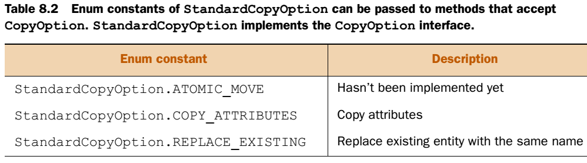{width="6.3in" height="1.7488090551181101in"}

Yukarıda ise CopyOption parametreleri bulunmaktadır. Bu parametreler ile kopyalayabiliriz. Copy metodu dosya append etmez, bu seçilen parametreye göre kopyalamaz veya dosyayı yenisi ile değiştirir.

Kopyalarken dosyaların relative path lerini de kullanabiliriz. Eğer hedef bir relative Path ise dosya .class dosyasının bulunduğu klasörde oluşturulur, .java dosyasının bulunduğu klasörde değil!

Overload edilmiş copy metodu şu tipler arasında okuma yazma yapabilir;

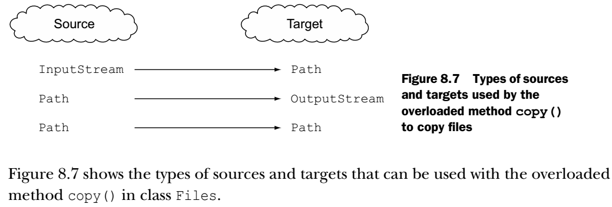{width="6.3in" height="2.1346052055993in"}


### Move files and directories

Files.move() metodu dosya ve klasör taşımak ve rename etmek için kullanılır.

```java
	public static Path move(Path source, Path target, CopyOption... options)
        
//	Dosya rename etmek için şu şekilde kullanılabilir,
	Path source = Paths.get("notes.txt");
	Files.move(source, source.resolveSibling("copy-notes.txt"));

// Aynı dosya isminde move etmek için ise;
	Path source = Paths.get("notes.txt");
	Path target = Paths.get("/home/myNotes/");
	Files.move(source, target.resolve(source.getFileName()), StandardCopyOption.REPLACE_EXISTING);

```

Files.move ile sadece boş klasörleri move edebilirsin. Ayrıca dolu klasörü de renam edebilirsin. Fakat olmayan bir klasöre dosya veya klasörü move edemezsin.

### Delete files and directories

Dosya ve boş klasörleri silmek için ise;

```java
public static void delete(Path path)
public static boolean deleteIfExists(Path path)
```

kullanılır. Bu iki metodda klasör boş ise siler. Dolu ise DirectoryNotEmptyException fırlatır. Olmayan bir Path nesnesini silmeye çalışır isen ise NoSuchFileException hatası fırlatırlır. deleteIfExists metodu ise bulamaz ise hata fırlatmaz, sadece false döndürür. Dosya kullanılıyor ise de silinemeyebilir.

### Commonly thrown exceptions

IOException (checked exception)--- JVM kontrolünde olmadığı için bütün bu işlemler her zaman I/O hatalarından ötürü nu hatayı fırlatabilirler.

NoSuchFileException (runtime exception)---Bu işlemleri yapacak bir dosya veya klasör bulunmadığı zamanlarda da her zaman bu hata gelebilir.

## Files and directory attributes

Java 7 ile gelen java.nio.file.attribute package'ı ile dosya özellikleri değiştirilebilir hale geldi. Bunlar dosyanın ne zaman oluşturulduğu, ne zaman değiştirildiği vb... Attibutelar dosyanın metadatasıdır yani data hakkında datadır.

### Individual attributes

Dosya hakkında bilgileri Files sınıfında bulunan birçok statik metod ile elde edebiliriz, bunlar;

```java
Path path = Paths.get("MyAttributes.java");
System.out.println("size:" + Files.size(path));
System.out.println("isDirectory:" + Files.isDirectory(path));
System.out.println("isExecutable:" + Files.isExecutable(path));
System.out.println("isHidden:" + Files.isHidden(path));
System.out.println("isReadable:" + Files.isReadable(path));
System.out.println("isSameFile:" + Files.isSameFile(path, path));
System.out.println("isDirectory:" + Files.isDirectory(path));
System.out.println("isSymbolicLink:" + Files.isSymbolicLink(path));
System.out.println("isWritable:" + Files.isWritable(path));
System.out.println("getLastModifiedTime:" + Files.getLastModifiedTime(path));
System.out.println("getOwner:" + Files.getOwner(path));
```

Bu bilgilere aynı zamanda Files.getAttribute() metodna attribute ismini geçerek de elde edebiliriz. Bu değerleri değiştirmek için ise Files.setAttribute() metodunu kullanabiliriz.

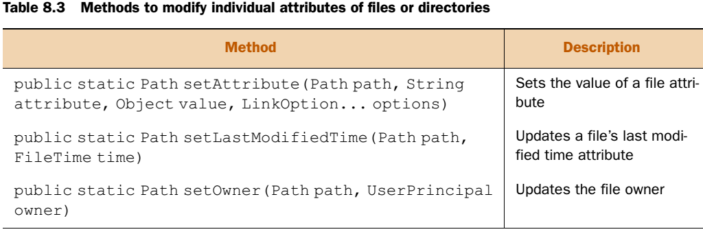{width="6.3in" height="2.0977668416447943in"}

Aşağıda bu metodlara bir örnek görebiliriz;

```java
System.out.println("creationTime:" + Files.getAttribute(path, "creationTime"));
FileTime newTime = FileTime.fromMillis(System.currentTimeMillis());
Files.setAttribute(path, "creationTime", newTime);
```


### Group of attributes

Her dosya için tek tek attribute bakmak sistemi yorabilir. Bu yüzden belli grup bir dosyanın attribute'larına bakmak için
Files.getFileAttributeView() veya Files.readAttributes() metodları kullanılabilir.

Farklı dosya sistemleri farklı attribute setleri destekleybilir. Java bunları sistemine göre veya dosya sahibi ile ilgili özellikler gibi farklı şekillerde ayırabilir. Bu gruplar interface'ler olarak ayrılmıştır ve sınavda şu türler çıkabilmektedir;

- BasicFileAttributes and BasicFileAttributeView ( Bütün sistemlerin desteklemesi gereken attribute setidir. View olanlarla modify edebiliriz.)
- DosFileAttributes and DosFileAttributeView ( BasicFileAttributes'dan extend olmuştur. Windows sistemler içindir.)
- PosixFileAttributes and PosixFileAttributeView ( BasicFileAttributes'dan extend olmuştur. Posix sistemler(Unix veya
  Linux) içindir.)
- AclFileAttributeView (Sadece Windows için. Dosya ACL'i kontrol etmek içindir.)
- FileOwnerAttributeView ( Bütün sistemlerin desteklemesi gereken attribute setidir. Dosya sahip bilgilerine ulaşmak içindir.)
- UserDefinedFileAttributeView (Kullanıcı tanımlı metadatayı modifiye etmek içindir.)

> 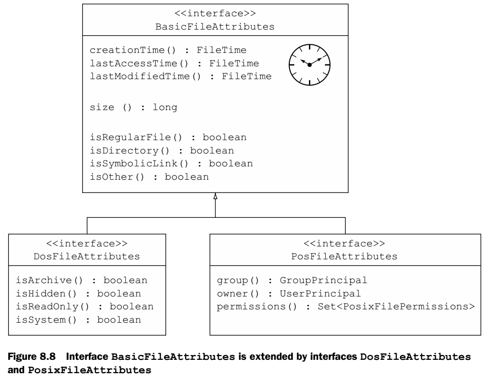{width="6.3in" height="4.8666601049868765in"}

Grup bir dosyanın attibute'una sadece erişmek için File.readAttributes() kullanılır. Hem erişip hem modify etmek için ise
File.getFileAttributeView() ile attribute view'a ulaşılır. Örnek;

```java
Path path = Paths.get("pathToaFile");
PosixFileAttributeView view = Files.getFileAttributeView(path,PosixFileAttributeView.class);
PosixFileAttributes attr = view.readAttributes();
PosixFileAttributes attr2 = Files.readAttributes(path, PosixFileAttributes.class);
```

Eğer işletim sistemi attibute set'i desteklemiyor ise Files.getFileAttributeView() metodu null döner! Bu durumda File.readAttributes() exception'da fırlatmaz.

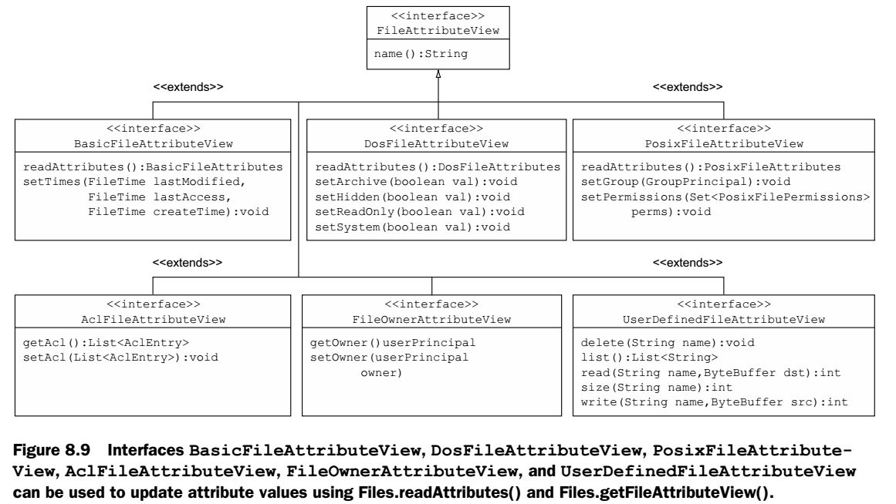{width="6.3in" height="3.5485225284339457in"}

### Basic attributes

Dosyanın basic özlliklerine erişmek için ;

```java
BasicFileAttributes attr = Files.readAttributes(file, BasicFileAttributes.class);
FileTime fileCreationTime = attr.creationTime();
```

kullanılır. Ve aşağıdaki şekilde uptade ederiz.

```java
BasicFileAttributeView view = Files.getFileAttributeView(file, BasicFileAttributeView.class);
long now = System.currentTimeMillis();
FileTime creation = FileTime.fromMillis(now - 60000);
FileTime lastModified = FileTime.fromMillis(now - 50000);
FileTime lastAccess = FileTime.fromMillis(now - 30000);
view.setTimes(lastModified, lastAccess, creation);
```

Basic özellikleri okumanın bir başka yolu ise;

```java
static Map<String,Object> readAttributes(Path path, String attributes, LinkOption... options)
throws IOException
```

Buradaki attributes string'i formatı \[view name:\]attribute-list dir.

\[view name:\]	 		isteğe bağlıdır. basic, dos, and posix olabilir. Belirtilmezse basic'dir.

attribute-list 			  ise virgülle ayrılmış attribute isimleridir. \* işarteti konar ise grubun bütün attribute'ları döner.

Kullanımı;

```java
Map<String,Object> values = Files.readAttributes(file, "*");
//Veya 
Map<String,Object> values = Files.readAttributes(file, "lastModifiedTime,isDirectory");

for (String attribute:values.keySet()) {
	System.out.println(attribute + " : " + values.get(attribute));
}
FileTime newTime = FileTime.fromMillis(System.currentTimeMillis());

Files.setAttribute(file, "lastModifiedTime", newTime);
//Veya 
Files.setLastModifiedTime(file, dayOldFileTime);
```

NOT: Files.setAttribute() ve Files.getAttribute() metodları yanlış veya desteklenmeyen bir attribute gönderildiğinde IllegalArgumentException veya UnsupportedOperationException hatası fırlatırlar.

### DOS attributes

Bunlar archive, hidden, readonly, system 'dir. Unix platformlarında koşturulurlar ise RunTimeException fırlatırlar. Kullanımı;

```java
Path file = Paths.get("name-of-a-file");
DosFileAttributeView dosView = Files.getFileAttributeView(file,
DosFileAttributeView.class);
DosFileAttributes dosAttrs = dosView.readAttributes();
if (dosAttrs.isReadOnly()) {
	dosView.setHidden(true);
	dosView.setArchive(false);
	dosView.setReadOnly(false);
	dosView.setSystem(true);
}else
	System.out.println("Don't modify the attributes");

```

Files sınıfı ile de DOS attribute'lara ulaşabiliriz; ikinci satırdaki gibi bütün DOS attribute'ları okur isen bütün basic Attribute'ları da okumuş olursun.

```java
Map<String,Object> values = Files.readAttributes(file, "dos:archive,hidden");
Map<String,Object> values2 = Files.readAttributes(file, "dos:*");
DosFileAttributes attr = Files.readAttributes(file, DosFileAttributes.class);
```

DOS attribute set etmek için ise;

```java
Files.setAttribute(file, "dos:hidden", true);
```

Kullanılır. Burada DOS prefix'i zorunludur.

NOT: Eğer geçersiz bir değer yazıp okumak ister isek ClassCastException fırlatılır.

### POSIX attributes

Bunlar group,owner,permissions 'dir. Windows platformlarında koşturulurlar ise RunTimeException fırlatırlar. Kullanımı;

```java
PosixFileAttributeView posixView = Files.getFileAttributeView(file, PosixFileAttributeView.class);
PosixFileAttributes posixAttrs = posixView.readAttributes();
if (posixAttrs.owner().getName().equals("admin"))
	posixView.setPermissions(PosixFilePermissions.fromString("rwxrwxrwx"));
else
	posixView.setPermissions(PosixFilePermissions.fromString("rwxr-x---"));

// Ayrıca Files kullanılarak;

Map<String,Object> values = Files.readAttributes(file, "posix:*");
PosixFileAttributes attr = Files.readAttributes(file, PosixFileAttributes.class);

```


### AclFileAttributeView interface

Windows sistemlerde dosyanın Access Listine ve dosya sahibi bilgilerine ulaşmamızı sağlar. getAcl() ve setAcl() metodları ile bu işi gerçekleştirir.

### FileOwnerAttributeView interface

Bütün sistemlerde dosya sahibi bilgilerine ulaşmak ve değiştirmek için kullanılır. getOwner() and setOwner(UserPrincipal) metodları ile bu işi geçekleştirir. Sahip bilgilerine AclFileAttributeView, FileOwnerAttributeView, and PosixFileAttribute interface'leri ile de ulaşabiliriz.

### UserDefinedAttributeView interface

Bu view bir dosya veya interface'e kullanıcı tanımlı yeni attribute'lar eklemek için kullanılır. Bu interface'in delete(String), list(), read(String, ByteBuffer), size(String), and write (String, ByteBuffer) metodları bulunur.

## Recursively access a directory tree

Bir klasöre nonrecursive Access klasörün hemen bir alt veya bir üst dizinine erişmektir. Recursive Access ise klasörün bütün alt dizinlerinin hepsine erişmektir. Klasöre ulaşmanın birçok yolu vardır. En sık kullanılanları ise *breadth-first* ve *depth-first* 'dir.

### FileVisitor interface

FileVisitor interface'i Generic bir interface'dir. Klasör yapısı içinde dolaşırken bir klasöre bakmadan önce ve baktıktan sonra veya dosyaya bakarken hata alınması durumunda ne yapılacağını bu interface ile belirtebiliriz. Metodları;

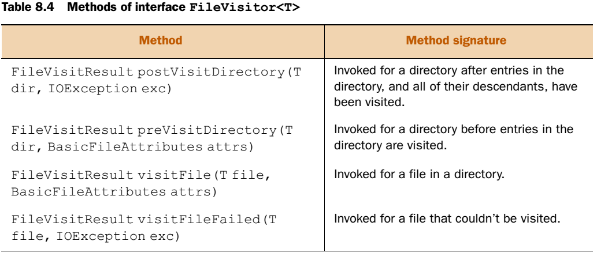{width="6.3in" height="2.7079418197725285in"}

Dir. Bu metodlar görüldüğü üzere FileVisitResult nesnesi döndürüyor. Bu bir sabit enum sınıfıdır. Klasör içinde dolaşırken dolaşmanın devam edip etmeyeceğini belirtirler. Değişkenleri şu şekildedir;

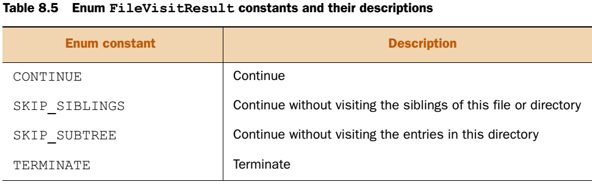{width="6.3in" height="2.0200721784776903in"}


### Class SimpleFileVisitor

Yukarıdaki örnekteki gibi FileVisitor interface'i implemente etmek yerine Java API bize FileVisitor interface'ini implemente eden SimpleFileVisitor sınıfını yazmıştır. Bu sınıf klasörleri tanımlanan default özellik ile arar. Kullanımı;

```java
class ListFileNames extends SimpleFileVisitor<Path>

//	ile bu sınıfı extend ederek kullanabiliriz. Veya şu şekilde;
Path path = Paths.get("E:/OCPJavaSE7");
ListFileNames listFileNames = new ListFileNames();
Files.walkFileTree(path, listFileNames);
```


### Initiate traversal for FileVisitor and SimpleFileVisitor

Yukarda gördüğümüz Files sınıfını **walkFileTree metodu imzası şu şekildedir.**

```java
public static Path walkFileTree(Path start, FileVisitor<? super Path> visitor) throws IOException

public static Path walkFileTree(Path start, Set<FileVisitOption> options, int maxDepth, FileVisitor<? super Path> visitor) throws IOException
```

Bu metod klasörler arasında depth-first yöntemi ile dolaşır.(Önce hangi dizine bakacağı tahmin edilemez.) Dolaşım bütün dizin yapısı bitince, FileVisitor'un herhangi bir metodu FileVisitResult.TERMINATE döndürünce veya hata alınınca durur.

```java
MyFileVisitor fileVisitor = new MyFileVisitor();
Files.walkFileTree(Paths.get("E:\\OCP"), fileVisitor);
```


### DirectoryStream interface

**DirectoryStream** interface'i ile bir dosya içindeki bütün dosya ve klasörleri listeleyebiliriz. Dönen listenin sıralaması belirsizdir. Dönen liste içinde for-each veya Iterator ile dönebiliriz. Kullanımı;

Path dir = Paths.get(\"E:/OCPJavaSE7\");

```java
DirectoryStream<Path> stream=Files.newDirectoryStream(Path))
```

Burada giriş değişkeni klasör olmalıdır. Eğer dosya verir isek Runtime da NotDirectoryException hatası fırlatır. Diğer kullanımı ise;

```java
DirectoryStream<Path> stream = Files.newDirectoryStream(Path, "*.{txt,java}"))
```

Şeklindedir. İkinci parametre glob dur. Diğer chapterda inceleyeceğiz.

## Using PathMatcher

Dosya ve klasör aramak için regex ceya glob kullanılabilir. Glob regex'e benzeyen fakat daha basit bir pattern'dır. Regex'ten farkı substrig matchleri bulamaz.

  Asteriks (\*)           				  Herhangi bir şey veya hiçbirşey (Regex te ise (.\*))

  The question mark (?)   		Tek herhangi bir karakter
                          

Kullanmak için java.nio.file.PathMatcher interface'ini kullanırız. İçinde tek bir metod vardır. O da matches() dır. Method imzası;

```java
boolean matches(Path path)
```

dir. Java API kullanımı için FileSystem.getPathMatcher() metodunu yazmıştır. Kullanımı ise;

```java
public abstract PathMatcher getPathMatcher(String syntaxAndPattern)
```

Buradaki string'in şablonu syntax:pattern şeklindedir. Syntax yerine regex yazılarak regex'de kullanılabilir. Bazı parametreleri gösteren tablo şu şekildedir.

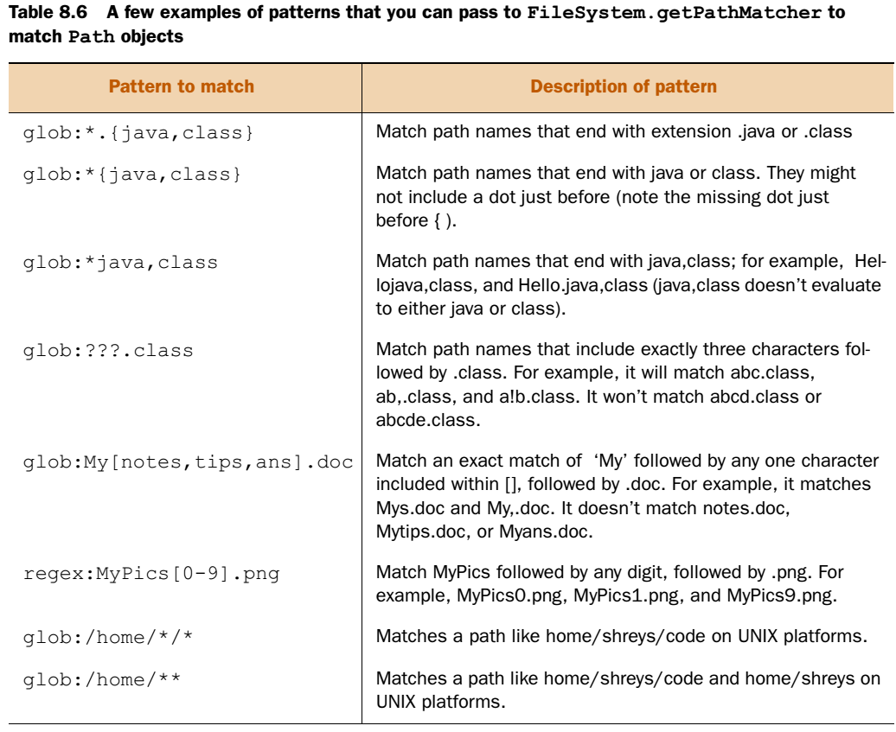{width="6.3in" height="5.1506485126859145in"}

Örnek kod;

```java
PathMatcher matcher = FileSystems.getDefault().getPathMatcher("regex:[1-9]*[0-9]?-[1-9]?.txt");
Path file = Paths.get("12-1.txt");
if (matcher.matches(file)) {
	System.out.println(file);
}

```


## Watch a directory for changes

Bir klasörü değişikliklerini izlemek için Java 7 ile beraber gelen *WatchService API* kullanılır. Bir dosya içindeki dosyaların birinde değişiklik olursa bunu tespit edebilir. Thread-safe 'dir.

### Create WatchService object

Bu özelliği kullanmak için FileSystems sınıfı kullanılır. Bu sınıfın WatchService() özelliği kullanılır. Bu sınıf dosya sistemi ile kod arasında bir interface sağlar. Şu şekilde oluşturulur;

```java
WatchService watchService = FileSystems.getDefault().newWatchService();
```


### Register with WatchService object

Servis oluşturulduktan sonra izlemek istenen klasör bu servise register olması gerekir. Parametre olarak dosya verir isek runtime da NotDirectoryException fırlatılır. Ayrıca parametre olarak klasör verildikten sonra alt klasör değişiklikleri izlenmez. Register olurken hangi olayları izleyeceğimizi belirtmemiz gerekir. Bu özellikler şunlardır;

- StandardWatchEventKinds.ENTRY\_CREATE--- This event occurs when a new file or directory is created, moved, or renamed in the directory being watched.
- StandardWatchEventKinds.ENTRY\_DELETE---This event occurs when an existing file or directory is deleted, moved, or renamed in the directory being watched.
- StandardWatchEventKinds.ENTRY\_MODIFY---This event is platform-dependent. It usually occurs when contents of an existing file are modified. It can also occur if the attributes of a file or directory (in the directory being watched) are modified.
- StandardWatchEventKinds.OVERFLOW---This indicates that an event has been lost.

Birden fazla klasör izlenmek için kaydettirilebilir, ayrıca birden fazla olay da izlenmek için kaydettirilebilir. Kullanımı;

```java
WatchKey regWatchKey = dir1.register(watchService,
	StandardWatchEventKinds.ENTRY_MODIFY,
	StandardWatchEventKinds.ENTRY_DELETE,
	StandardWatchEventKinds.ENTRY_CREATE);

```


### Access watched events using WatchKey interface

Yukarda register metodu sonucunda WatchKey nesnesi döner. Bu bize register işleminin durumunu bildirir. Bu durumlar şunlardır;

- Ready---A WatchKey is initially created with a ready state.
- Signaled---When an event is detected, the WatchKey is signaled and queued. It can be retrieved using WatchService's methods poll() or take().
- Cancelled---Calling method cancel() on a WatchKey or closing the WatchService cancels a WatchKey.
- Valid---A WatchKey in a ready or signaled state is in a valid state.

### Processing events

Bir WatchService olay olduğunda register olan metodları sorgular ve onlara WatchKey döndürebilir. WatchService interface'i WatchKeyleri sorgulamak için take() ve overload edilmiş poll() metodlarını sunar. Bir key işlendiğkten sonra reset() metodu çağrılır ve diğer olaylar izlemeye devam edilir.

Bir olayı beklemek için sonsuz bir döngüye ihtiyacımız vardır. Bunun yerine take() metodu sıradaki WatchKey'i alır, işler, siler ve diğerinin oluşmasını bekler. Poll() metodu alır ve siler, sırada WatchKey yok ise null döndürür yani beklemez. Poll metoduna poll(long timeout, TimeUnit unit) şeklinde bekleme süresi verebiliriz.

Bu iki metod sıraki WatchKey'i alır ve bize WatchKey nesnesini döndürür. Bu nesne içinde birden fazla olay olabilir. Biz bu nesnenin pollEvents() metodu ile gerçekleşen olayların listesini alabiliriz. Bu liste bize WatchEvent nesneleri döndürür. Bu nesne ile de olayın kaynağı, türü gibi olay ile ilgili bilgilere ulaşırız.

