[9 Building database applications with JDBC](#building-database-applications-with-jdbc)

[9.1 Introduction](#introduction)

[9.1.1 JDBC API overview](#jdbc-api-overview)

[9.1.2 JDBC architecture](#jdbc-architecture)

[9.1.3 JDBC drivers](#jdbc-drivers)

[9.2 Interfaces that make up the JDBC API core](#interfaces-that-make-up-the-jdbc-api-core)

[9.2.1 Interface java.sql.Driver](#interface-java.sql.driver)

[9.2.2 Interface java.sql.Connection](#interface-java.sql.connection)

[9.2.3 Interface java.sql.Statement](#interface-java.sql.statement)

[9.2.4 Interface java.sql.ResultSet](#interface-java.sql.resultset)

[9.3 Connecting to a database](#connecting-to-a-database)

[9.3.1 Loading JDBC drivers](#loading-jdbc-drivers)

[9.3.2 Use DriverManager to connect to a database](#use-drivermanager-to-connect-to-a-database)

[9.3.3 Exceptions thrown by database connections](#exceptions-thrown-by-database-connections)

[9.4 CRUD (create, retrieve, update, and delete) operations](#crud-create-retrieve-update-and-delete-operations)

[9.4.1 Read table definition and create table](#read-table-definition-and-create-table)

[9.4.2 Mapping SQL data types to Java data types](#mapping-sql-data-types-to-java-data-types)

[9.4.3 Insert rows in a table](#insert-rows-in-a-table)

[9.4.4 Update data in a table](#update-data-in-a-table)

[9.4.5 Delete data in a table](#delete-data-in-a-table)

[9.4.6 Querying database](#querying-database)

[9.5 JDBC transactions](#jdbc-transactions)

[9.5.1 A transaction example](#a-transaction-example)

[9.5.2 Create savepoints and roll back partial transactions](#create-savepoints-and-roll-back-partial-transactions)

[9.5.3 Commit modes and JDBC transactions](#commit-modes-and-jdbc-transactions)

[9.6 RowSet objects](#rowset-objects)

[9.6.1 Interface RowSetFactory](#interface-rowsetfactory)

[9.6.2 Class RowSetProvider](#class-rowsetprovider)

[9.6.3 An example of working with JdbcRowSet](#an-example-of-working-with-jdbcrowset)

[9.7 Precompiled statements](#precompiled-statements)

[9.7.1 Prepared statements](#prepared-statements)

[9.7.2 Interface CallableStatement](#interface-callablestatement)

[9.7.3 Database-stored procedures with parameters](#database-stored-procedures-with-parameters)


# Building database applications with JDBC

Java uygulamaları ile bir veritabanına bağlanmak için birçok teknoloji vardır. Bunlardan bazıları, EJB Entity Beans, Java Persistence API (JPA), Java Database Objects (JDO) ve diğerleri. Hibernate is a popular JPA implementation. Hibernate is an Object Relational Mapping (ORM) framework for the Java language. Bu yaklaşımların hepsinin kendine özgü avantaj ve dezavantajları vardır.

Bu bölümde veritabanlarına Java Database Connectivity (JDBC) teknolojisi ile nasıl bağlanılacağını öğreneceğiz.

## Introduction

JDBC bir JAVA API'dir. Endüstri standartıdır ve veri tabanlarına, düz dosyalara ve çalışma sayfalarına bağlantı sağlar. JDBC API sürücü olarak sağlanır, birçok arayüz sağlar ve bu arayüzler veritabanı üreticisi veya 3. Parti firmalarca implemente edilir. Yani driver implementation ile beraber çalışır ve bağlantı sağlar. JDBC API sadece ne yapılacağının
arayüzünü sağlar, implementasyon driver'ı ise nasıl yapılacağını tanımlar.

Java 7 JDBC 4.1 ile beraber gelir. JDBC sınıfları java.sql and javax.sql paketleri ile başlar.

### JDBC API overview

JDBC API ile veri kaynağına bağlanıp SQL cümleleri koşturabilir ve sonuçlarını üretebiliriz. JDBC bize üretici bağımsız bir abstraction layer sunar. Eğer üreticiye özel çözümler kullanmıyorsak veri tabanımızı kolayca değiştirebilme imkanı sunar.

### JDBC architecture

JDBC API ile lokalde veya uzaktaki bir veritabanına direk olarak veya bir uygulama sunucusu üzerinden bağlanabiliriz. Two-tier ve n-tier modelleri destekler.

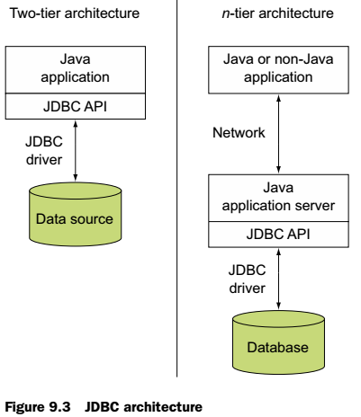{width="2.7847222222222223in"
height="3.2222222222222223in"}

Two-tier model ile veri tabanına JDBC ile direk olarak bağlanırız. N-tier de ise Java ve harici bir dille yazılmış uygulama uygulama sunucusuna bir komut gönderir. Uygulama sunucusundaki JDBC destekli java uygulaması da veri tabanı ile haberleşerek istenen veriyi döndürür.

### JDBC drivers

JDBC API iki ana interface seti içerir;

- A JDBC API for application developers
- A lower-level JDBC driver API for writing drivers

Driver'ların nasıl implemente edildiği aşağıdaki gibi sınıflandırılır.

- Type 4---pure Java JDBC driver
- Type 3---pure Java driver for database middleware
- Type 2---native API, partly Java driver
- Type 1---JDBC-ODBC bridge

Aşağıdaki şema bilgi içindir, sınavda sadece type-4 çıkacaktır.

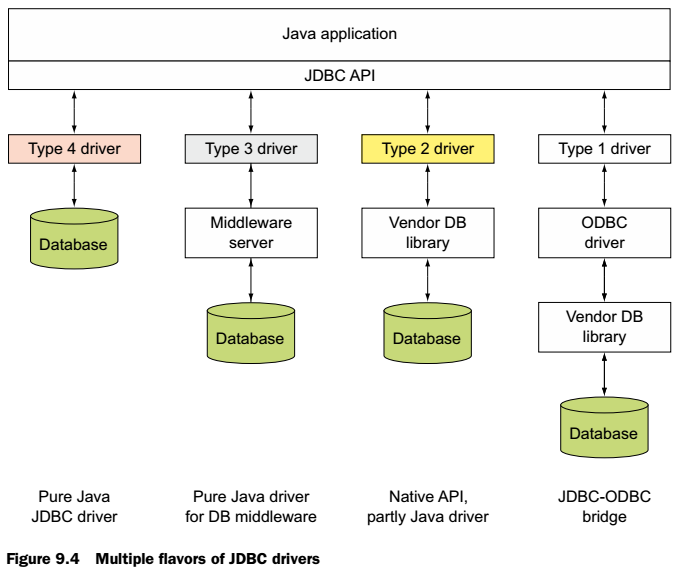{width="4.736111111111111in"
height="3.9583333333333335in"}

## Interfaces that make up the JDBC API core

JDBC API üretici tarafından implemente edilen birçok interface içerir. Bu imterface'leri üretici driver'ları implemente eder. Java uygulamasından yapılan JDBC çağrıları driver tarafından veri tabanı çağrılarına dönüştürülür. Her driver'ın JDBC speclerini sağlamak için uygulama zorunluluğu olduğu bazı interface'ler vardır. Bunlardan biri java.sql.Driver

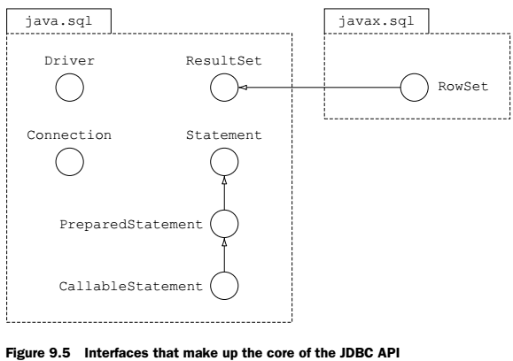{width="4.020833333333333in"
height="2.8333333333333335in"}

### Interface java.sql.Driver

Bir üretici driver yazdığı zaman bu sınıfı implemente etmek zorundadır. Bu arayüzü implemente eden bir sınıf memory'ye yüklendiği zaman kendini DriverManager sınıfına register ettirmek zorundadır. Bu işlemi static initaliazer bloğu ile yapar. Bir java uygulaması veri tabanı ile bağlantı isteği yaptığında, DriverManager sınıfı kendine register olmuş sınıf listesine bakar ve uygun bir sınıf arar.

Driver'ı manüel olarak yüklemek ve register etmek istiyorsak java.lang.Class sınıfının forName() metodunu, yüklemek istediğimiz sınıfın ismini vererek yükleyebiliriz.

```java
Class.forName("com.mysql.jdbc.Driver");
```

Yükleyebilmemiz için doğal olarak bu sınıfın java.sql.Driver arayüzünü implemente etmesi gerekmektedir.

Manual yükleme JDBC 3.0 a kadar gerekliydi. 4.0 ile beraber gelen Service Provider Mechanism (SPM) özelliği ile bu zorunluluk kalkmıştır. Driver jar'ı içindeki META-INF/services/ klasörü içinde java.sql.Driver dosyasında driver implemantasyon sınıfı ismi yazılıdır. DriverManager bu dosya ile sürücüyü yükler.

### Interface java.sql.Connection

Connection nesnesi veri tabanına yapılan bağlantı oturumunu temsil eder. SQL cümleleri oluşturmaya yarar. (Statement, PreparedStatement, ve CallableStatement) Ayrıca transaction içinde savepoint oluşturmaya ve bu noktaya kadar commit ve roll-back yapmaya yarar.

Ayrıca bu nesne ile veri tabanı metadata'sına da ulaşabiliriz.

### Interface java.sql.Statement

Statement static sql cümleleri oluşturmaya, çalıştırmaya ve sonucunu elde etmeye yarar. Dönüş değerleri ResultSet veya etkilenen satır sayısını döndüren int değerler olabilir.

Bu arayüzü java.sql.PreparedStatement ve java.sql.CallableStatement arayüzleri extend etmişlerdir. Bu arayüzlerin nesneleri öntanımlı SQL cümleleri içerirler. Bunlar diğerlerine göre daha hızlı çalışırlar. Ayrıca ? kullanarak parametreli SQL yazmamızı sağlarlar.

CallableStatements veri tabanındaki stored-procedures çalıştırabilir.

### Interface java.sql.ResultSet

Bir SELECT cümlesi sonucunda döndürülür. ResultSet read-only, scrollable, or updatable dır. Sadece tek bir yöne scroll yapabiliriz. Her iki yöne gidebilen ve edit edilebilen bir Resultset'i statement nesnesi oluşturulurken belirterek yaratabiliriz.

## Connecting to a database

Veri tabanına bağlanmak için DriverManager sınıfına bir kez ihtiyacımız olur. Bu sınıfı çağırdığımızda gidip uygun sürücüyü arar, veri tabanına yeni bir bağlantı açar ve bize Connection nesnesi döndürür. Bir diğer veritabanı işlemlerimizde artık bu senaryoyu kullanmayız, sadece connection nesnesi kullanarak işlemlerimizi yaparız.

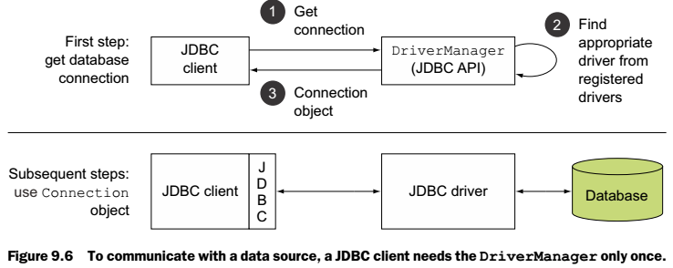{width="5.125in" height="2.0416666666666665in"}

### Loading JDBC drivers

JDBC sürücüleri iki şekilde yüklenir,

- Manual (JDBC API version 3.0 and before)
- Automatic (JDBC API version 4.0 and later)

İlk yöntemde java.sql.Driver arayüzünü implemente eden sınıfın adını forName metoduna geçiyoruz. Eğer bu sınıfı bulamaz ise ClassNotFoundException(Checked) hatası fırlatılır.

```java
Class.forName("com.mysql.jdbc.Driver");
```

Yukardaki kod memory'de com.mysql.jdbc.Driver sınıfını arayıp, eğer bulursa com.mysql.jdbc.Driver sınıfının static initaliazier'larını kullanarak kendini yükleyecektir(Kendini DriverManager'a register ettirecek). Aşağıda bu statik kodun örneği vardır.

```java
static {
	try {
		java.sql.DriverManager.registerDriver(new Driver());
	} catch (SQLException E) {
		throw new RuntimeException("Can't register driver!");
	}
}
```

İkinci yöntem ise sürücünün kendini otomatik yüklemesidir. forName metodunu kullanmadan driver yüklenebilmektedir. SPM özelliği ile driver jar'ı içinde META-INF/services klasörü içindeki java.sql.Driver dosyası aranır. Bu dosya içinde jdbc.sql.Driver sınıfını implemente eden driver sınıfının ismi yazar. DriverManager bağlantı isteği geldiğinde bu dosya
içini okur ve sınıf ismini buradan alır.

| Versiyon | Açıklama |
|---|---|
| JDBC 3.0 and before | Step 1 (Load and register driver)        Class.forName("----"); |
|  | Step 2 (Establish DB connection)       DriverManager.getConnection("----"); |
| JDBC 4.0 and later | Step 1 (Load and register driver and establish DB connection)          DriverManager.getConnection("----"); |
|  |  |


### Use DriverManager to connect to a database

DriverManager sınıfı JVM 'e register olmuş bütün JDBC implementasyonlarını yönetir. Memory'ye yüklendiği anda static
initaliazer bloğu sayesinde jdbc.drivers system değişkeni tarafından refere edilen bütün driver'ları yüklemeye çalışır. getConnection metodu çağrılınca DriverManager register edilen driver'lardan uygun olanını bulur, veri tabanına bağlantı yapar ve bağlantı nesnesini döndürür. OverLoad edilmiş bazı metodlar şunlardır;

```java
public static Connection getConnection (String url) throws SQLException
public static Connection getConnection (String url, Properties info) throws SQLException
public static Connection getConnection (String url, String user, String pwd) throws SQLException
```

Burada url parametresi formatı her zaman şu şekildedir;

> jdbc:subprotocol://\<host\>:\<port\>/\<database\_name\>

Bunun bir örneği şöyledir;

```java
DriverManager.getConnection
("jdbc:mysql://localhost/feedback?user=sqluser&password=sqluserpw");

jdbc:mysql://data.ejavaguru.com:3305/examDB
jdbc:mysql://localhost:3305/mysql?connectTimeout=0
jdbc:mysql://127.0.0.1:3306/examDB

java.util.Properties prop = new java.util.Properties();
prop.put("user", "test");
prop.put("password", "test");
```

Yukarıdaki kullanımda prop içindeki key değerleri çok önemlidir. Başka bir isim kullanılır ise anlaşılmaz ve SQLException hatası fırlatılır.

Bilgi: DataBase'e bağlanmanın 2 yolu vardır. Birincisi java.sql.DriverManager ile ikinci ise javax.sql.DataSource ile. Java
SE'de ilk yöntemi kullanınız. Çünkü ikinci yöntem Java Naming and Directory Interface (JNDI) destekler. Bu özellik ise Java EE sunucularındaki container ortamlarında desteklenir.

### Exceptions thrown by database connections

Driver bulunamaz ise;

> java.sql.SQLException: No suitable driver found for jdbc:mysql://localhost/\
> BookLibrary?user=test&password=test

Kullanıcı şifre yanlış ise;

> java.sql.SQLException: Access denied for user \'test\'@\'test\' (using password: YES)

## CRUD (create, retrieve, update, and delete) operations

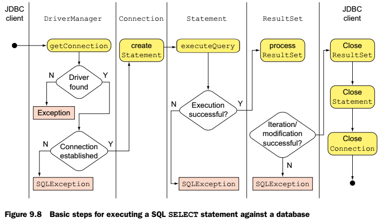{width="5.215277777777778in"
height="3.0347222222222223in"}

Bu API'nin amacı Java sınıflarından Relational datalara ulaşmaktır. Bu bölümde temel CRUD işlemlerini göreceğiz. SELECT sorguları ResultSet, diğer üçü ise etkilenen satır sayısını gösteren int döndürürler.

SQL cümleleri iki ana kategoriye ayrılır;

- DDL (Data Definition Language)
- DML (Data Manipulation Language)

DDL, Database nesnelerini(örneğin bir tablo) oluşturmak, değiştirmek, silmek

DML, Database içindeki verileri oluşturmak, değiştirmek, silmek

### Read table definition and create table

Java ile bir tablo yaratmak için; Connection nesnesi ile Statement nesnesi oluşturulur ve bu Statement nesnesi üzerinde executeUpdate() metodu SQL cümlesi geçilerek çağrılır.

```java
con = DriverManager.getConnection(url, username, password);

statement = con.createStatement();

int result = statement.executeUpdate("CREATE TABLE book " +
	" (id INT PRIMARY KEY, " +
	" title VARCHAR(1000), " +
	" author CHAR(255), " +
	" publication_year INT, " +
	" unit_price REAL)");

```

Statement nesnesinin bir de executeQuery() metodu vardır. Yukarıdaki SQL'i bu metodla çağırırsak ne olurdu ? SQLException fırlatırdı. (java.sql.SQLException: Can not issue data manipulation statements with executeQuery())

> **NOT:** executeUpdate() metodu veri ekleme, değiştirme silme için, ayrıca DDL cümleleri koşturmak için kullanılır! Bu işlemler için executeQuery() metodu kullanır isek SQLException hatası alırız.
> 
> executeQuery() ise SELECT cümleleri için kullanılır.

### Mapping SQL data types to Java data types

Veritabanı kolon tipleri ve ilişkileri aşağıdadır. Sınavda yoktur, hangi veri java olarak nasıl saklanabilir bunu bilsen kafidir.

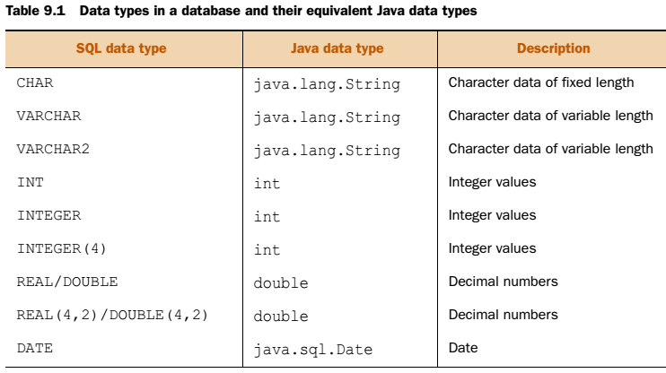{width="5.152777777777778in"
height="2.888888888888889in"}

### Insert rows in a table

Tabloya yeni bir satır eklemek için Statement nesnesinin executeUpdate() metodu kullanılır.

İnsert 2 şekilde yazılabilir;

- INSERT INTO book (id, title, author, publication\_year, unit\_price) VALUES (1, \'Expert In Java\', \'Mantheakis\', 2009, 59.9)

- INSERT INTO book VALUES (1, \'Expert In Java\', \'Mantheakis\', 2009, 59.9)


NOT: Connection, Statement, ve ResultSet arayüzlerinin hepsi AutoCloseable arayüzünü extend ettiği için try-with-resources yapılarında kullanılabilirler.

executeUpdate() metodu imzaları da şu şekildedir. Parametreler SQL koştuktan sonra o değişkenleri çekmek için hazırla demektir.

```java
int executeUpdate(String sql)
int executeUpdate(String sql, int autoGeneratedKeys)
int executeUpdate(String sql, int[] columnIndexes)
int executeUpdate(String sql, String[] columnNames)
```


### Update data in a table

Tabloye edit etmek için Statement nesnesinin executeUpdate() metodu kullanılır.

Normalde sorgudan sonra önce Statement sonra Connection kapatılır. Veya try-with-resources cümlesi ile otomatik olarak kapatılmasını sağlayabiliriz.

​	UPDATE book SET unit\_price = 99.9 WHERE title = \'Expert In Java\'

### Delete data in a table

Tablodan bir satır silmek için Statement nesnesinin executeUpdate() metodu kullanılır.

​	DELETE FROM book WHERE publication\_year \< 1900

### Querying database

Select cümleleri executeQuery() ile kullanılır ve sonuç olarak ResultSet döndürürler. Aşağıdaki tablodan da görüleceği üzere SELECT sonrası kursör ilk kaydın önünde durur. ResultSet üzerinde next() metodu çağrılır ise değer olup olmadığını boolean olarak döndürür ve kursor ilk kaydı gösterir.

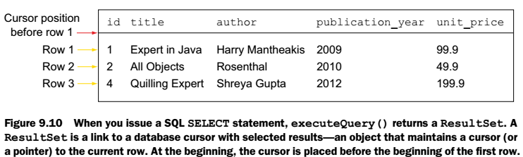{width="5.152777777777778in"
height="1.5486111111111112in"}

Ardından rs içindeki bilgileri de ilgili getString(), getInt() metodları ile çekeriz. Burada parametre olarak kolon ismi veya numarası verilebilir. Aşağıda overloaded halleri vardır.

```java
String getString(int columnLabel)
String getString(int columnIndex)
```

**NOT:** ResultSet içindeki kolonlar 1 den başlar!

ResultSet üzerindeki diğer metodlar ise şöyledir.

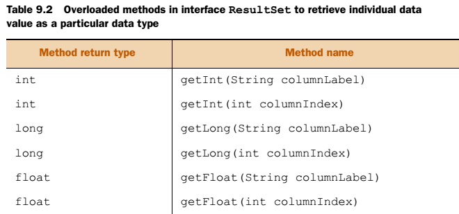{width="4.583333333333333in"
height="2.1458333333333335in"}
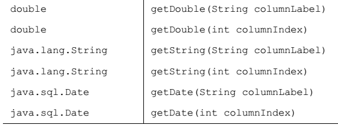{width="3.9791666666666665in"
height="1.5069444444444444in"}

ResultSet sonucu bir kayıt dönmez ise rs hiçbir zaman null olmaz!

Veri tabanı metadatası ise şöyle alınır; (rs oluşması için sanırım herhangi bir SQL yazılması lazım..)

```java
ResultSetMetaData rsmd = rs.getMetaData();
System.out.println(rsmd.getColumnLabel(1));
System.out.println(rsmd.getColumnLabel(2));
System.out.println(rsmd.getColumnLabel(3));
```


## JDBC transactions

Banka bir hesapdan diğerine para gönderiyor. Bu senaryoda herhangi bir yerdeki hata paranın çelişkili olmasına sebep olur. Bu gibi durumlarda veritabanı işlemlerinin hepsi tek transaction'da yapılmalıdır.

### A transaction example

Default bir bağlantıda bütün SQL cümleleri verdiğimiz anda gerçekleşir çünkü default olarak *auto-commit özelliği* açıktır. Bu özelliği yukardaki örnekteki gibi durumlarda açıp kapatarak bir hata durumunda veritabanının karmaşıklığını önlemiş oluruz.

```java
con.setAutoCommit(false);

con.rollback();
```

Commit etmesek bile executeUpdate() metodu etkilenen kayıt sayısını döndürür. Aslında veritabanında işlem gerçekleştiriliyor ama commit edince kalıcı oluyor. Sadece DDL cümleleri kayıt sayısını 0 döndürür, çünkü tablo yapısı değişiyor, satır etkilenmiyor.

### Create savepoints and roll back partial transactions

Bir transaction içinde birden fazla savePoint koyarak sadece belli bir kısmı roll-back etmek isteyebiliriz. Tanımlanması şu şekildedir;

```java
Savepoint sp5555 = con.setSavepoint();

Savepoint sp7777 = con.setSavepoint("CrSalaryFor7777");

con.rollback(sp7777);
```

Son cümle işletildiği anda cümleden geriye doğru sp7777 bulunana kadar geri gidilir ve bulduğu yere kadar olan transaction'lar roll-back edilir. Diğerleri commit edilir.

### Commit modes and JDBC transactions

JDBC iki otomatik commit özelliği vardır. Transaction'larla çalışmak için auto-commit'i false yapmalıyız yoksa rollback() ve commit() SQLException fırlatır! Aynı şekilde transaction içinde auto-commit'i true yapıp bu metodları çağırmaya çalışırsan da SQLException fırlatır!

## RowSet objects

Diyelim ki bir uygulamanız var, database in bazı kayıtlarını ekranda gösteriyor. Fakat bu değerlerden herhangi biri değiştiğinde ekranı güncellemek istiyorsunuz. Bu gibi durumlarda RowSet kullanılabilir. RowSet nesnesini bir veri tabanına bağlanıp istediğimiz verileri çekmesini daha sonra bu nesneye listener register edebileceğimizi ve bu
listerları değiştirebileğimizi isteyebiliriz.

RowSet nesneleri *connected* veya *disconnected* çalışabilirler. Connected olan JdbcRowSet nesnesi veri tabanına sürekli bağlıdırlar. Disconnected olan CachedRowSet ise veritabanına bağlanıp istediği verileri çeker, bağlantıyı kapatır, sonra tekrar bağlanıp veri çekebilir.

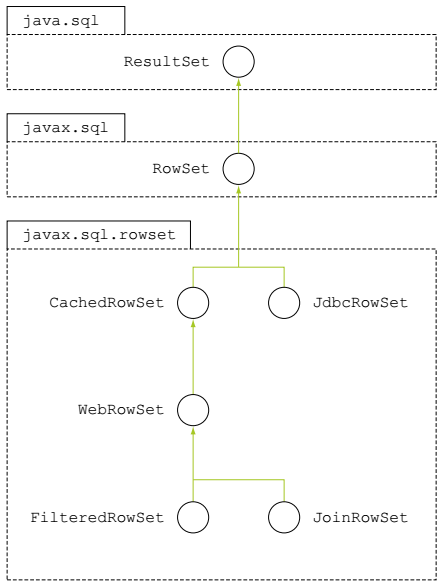{width="3.0694444444444446in"
height="4.076388888888889in"}

### Interface RowSetFactory

javax.sql.rowset.RowSetFactory interface'i RowSet implementasyonları sağlamaktadır. Bu interface'e erişmek için ise RowSetProvider kullanılır.

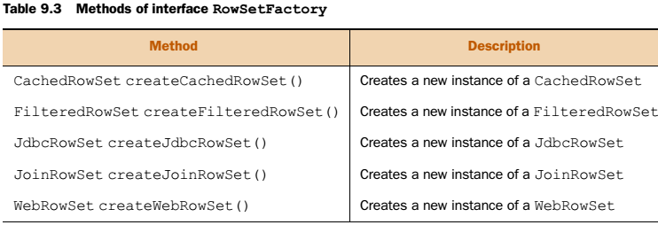{width="5.152777777777778in"
height="1.7638888888888888in"}

### Class RowSetProvider

javax.sql.rowset.RowSetProvider sınıfı yukardaki RowSetFactory implementasyonları elde etmek için factory metodları sağlar. Kullanımı;

```java
RowSetFactory rowsetFactory = RowSetProvider.newFactory();
JdbcRowSet crs = rowsetFactory.createJdbcRowSet();
// Veya
RowSetFactory rowsetFactory = RowSetProvider.newFactory("com.ejava.sql.rowset.CustomRowSetFactory", null);

// RowSetFactory constructor’ları ise;
static RowSetFactory newFactory()
static RowSetFactory newFactory(String factoryClassName, ClassLoader cl)
```


### An example of working with JdbcRowSet


## Precompiled statements

Statement interface'inin aksine PreparedStatement ve CallableStatement interface'leri ön tanımlı SQL cümleleri sunar. Bu cümleler database sisteminde derlenmişlerdir. Bu yüzden daha hızlı çalışırlar. Diğer en önemli avantajları ise "?" ile parametreli SQL yazmaktır. En kritik görevleri ise SQL injection'ları önlerler!

### Prepared statements

java.sql.PreparedStatement, java.sql.Statement arayüzünden extend olmuştur. Kullanımı;

```java
PreparedStatement stmt = con.prepareStatement ("SELECT * FROM book WHERE unit_price > 47.5");

// veya

PreparedStatement bookUpdStmt = con.prepareStatement("UPDATE book SET unit_price = ? WHERE id = ?");
bookUpdStmt.setDouble(1, bookNewPrRs.getDouble("unit_price"));
bookUpdStmt.setString(2, bookNewPrRs.getString("id"));
bookUpdStmt.executeUpdate();

```

Burada Statement'dan farkı SQL cümlesini nesne yaratılırken set etmemizdir. Çalıştırma ise aynı execute metodlarıdır. Ayrıca "?" kullanarak parametre set edebiliriz. Set etme işi de PreparedStatement'ın aşağıdaki ilgili metodları ile gerçekleştiriliyor.

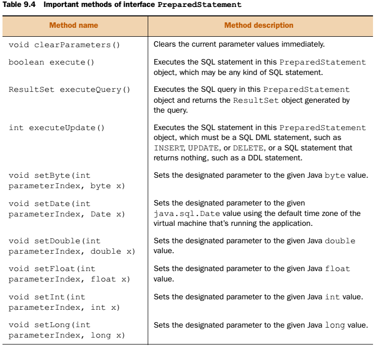{width="5.222222222222222in"
height="4.840277777777778in"}

PreparedStatement SQL çalıştırmak için 3 metod sunar, bunlar; execute(), executeQuery(), ve executeUpdate() 'dir. execute() her tür SQL cümlesini çalıştırır ama dönüş olarak boolean SQL çalıştı veya hata oluştur döner. Diğer ikisi ise Statement gibi aynı şekildedir. Yani executeQuery sadece SELECT çalıştırır. executeUpdate ise DDL (sonuç sınıf) veya
insert,update,delete (sonuç etkilenen sayısı) dır.

### Interface CallableStatement

Stored-procedure 'lar java'daki metodlar gibidir. Server tarafında birden fazla SQL cümlesi içeren yapılardır. Bu yapılar database sorgularını daha hızlı yapabilirler. Birden fazla SQL gönderecek isek SP ile bu işi yapmak Java uygulaması ile yapmaktan çok daha hızlıdır.

JDBC API içinde CallableStatement ile SP'ler çağrılır. Oluşturulması ise PreparedStatement veya Statement ile yapılabilir. 

```java
PreparedStatement statement = con.prepareStatement
("CREATE PROCEDURE book_details_new_prices() BEGIN SELECT A.id, A.author, B.unit_price FROM book A, new_book_price B WHERE A.id = B.id; END;");

// Çalıştırma ise;
CallableStatement cs = con.prepareCall("{call book_details_new_prices()}");
CallableStatement cs = con.prepareCall("{call book_details_new_prices}");
ResultSet rs = cs.executeQuery();
```


### Database-stored procedures with parameters

Yukarıdaki örnekte parametresiz bir SP çağırdık. Bu sebepten parametre parantezleri şart değildi. Parametreli SP şöyle tanımlanır;

```java
PreparedStatement statement = con.prepareStatement
	("CREATE PROCEDURE proc_author_row_count (IN author_name CHAR(50), OUT count INT) "+
		"BEGIN "+
			"SELECT COUNT(*) INTO count FROM book WHERE author = author_name; " +
		"END;");

```

Burada IN, OUT ve INOUT keyword'leri parametre tipini belirler. Yukarıdaki SP string olarak yazar ismini alır ve bu yazarın kitap sayısını int olarak geri döndürür. INOUT ise hem giriş hem çıkış parametresi olarak kullanılabilir. Bu SP yi çağırma ise;

```java
CallableStatement cs = con.prepareCall("{call proc_author_row_count(?, ?)}");
int rowCount = 10;
String authorName = "Shreya";

cs.setString(1, authorName);
cs.registerOutParameter(2, Types.NUMERIC);
cs.setInt(2, rowCount);

cs.execute();
System.out.println("rowCount = " + rowCount);

```

